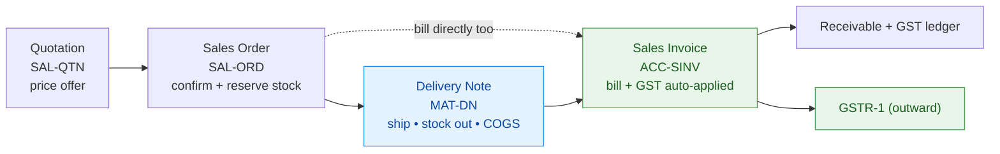
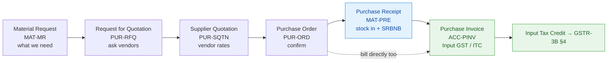
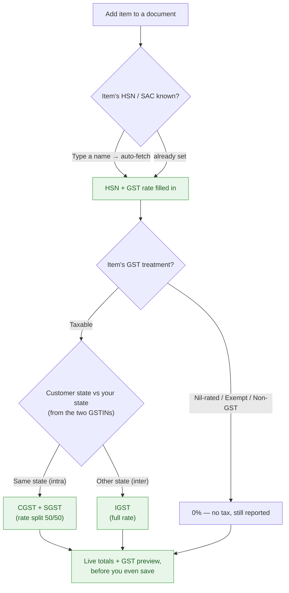
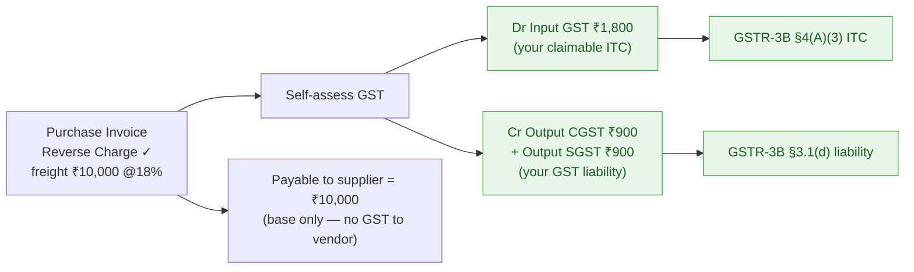
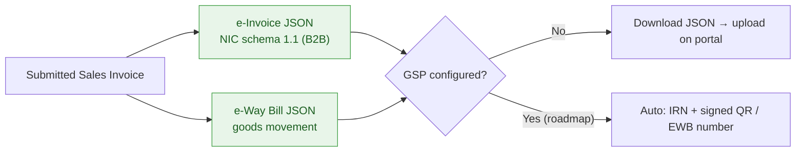
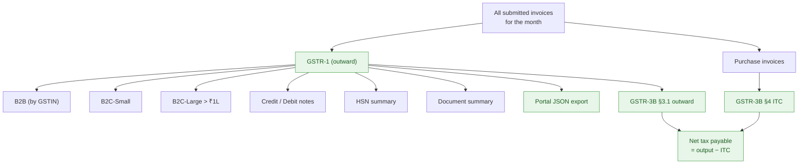

# OptiReach ERP — The Complete Business & GST Journey

### *From a customer enquiry to a filed GST return — one connected flow, GST handled for you.*

**Who this is for:** Indian MSME owners, their accountants/CAs, and anyone evaluating OptiReach.
**The promise:** you run your business — raise quotes, confirm orders, ship goods, send bills, pay
suppliers — and **the GST takes care of itself**: the right tax on every document, the monthly returns
computed for you, and the e-invoice / e-way-bill files ready to upload.

> Every number and document code in this guide is **real, from the running demo company** *Mango
> Appliances Demo* (GSTIN `27AAEPM1234C1Z5`, Maharashtra). You can open the app and see them.

---

## Table of contents
1. [The big picture (one map)](#1-the-big-picture)
2. [The sell-side journey — quote → deliver → bill](#2-the-sell-side-journey)
3. [The buy-side journey — request → receive → pay](#3-the-buy-side-journey)
4. [The GST brain — how tax is decided automatically](#4-the-gst-brain)
5. [Every GST case, with real examples](#5-every-gst-case-with-worked-examples)
6. [Reverse charge (RCM) — self-assessed GST, done for you](#6-reverse-charge-rcm)
7. [E-Invoice & E-Way Bill](#7-e-invoice--e-way-bill)
8. [The filing finish line — GSTR-1 & GSTR-3B](#8-the-filing-finish-line)
9. [A full month-end, start to finish](#9-a-full-month-end-start-to-finish)
10. [What's built today vs the roadmap](#10-whats-built-today-vs-roadmap)
11. [Why MSMEs love it](#11-why-msmes-love-it)

---

## 1. The big picture

Two everyday journeys — **selling** and **buying** — both feed **one GST engine**, which produces your
**returns** and **e-documents**. Nothing is re-keyed; nothing is calculated twice.

```
                    ┌──────────────────────────────────────────────────────────┐
                    │                     OPTIREACH  ERP                         │
                    │      quote ▸ confirm ▸ ship ▸ bill ▸ pay ▸ file GST        │
                    └──────────────────────────────────────────────────────────┘

  ══════════════════  SELL SIDE  (you ▸ customer)  ═══════════════════
                                                                              ┌─────────────┐
   Quotation ───▶ Sales Order ───▶ Delivery Note ───▶ Sales Invoice ─────────▶│             │
   SAL-QTN        SAL-ORD          MAT-DN             ACC-SINV                 │  GST ENGINE │
   price offer    confirm +        ship goods,        bill customer,          │             │
                  reserve stock    stock out, COGS    GST auto-applied        │  auto picks │
                                                                              │  CGST+SGST  │
  ══════════════════  BUY SIDE  (supplier ▸ you)  ════════════════════        │  (same      │
                                                                              │  state) OR  │
   Material     Request for    Supplier                                       │  IGST       │
   Request ──▶  Quotation ──▶  Quotation ──▶ Purchase ──▶ Purchase ──▶ Purchase│ (other      │
   MAT-MR       PUR-RFQ        PUR-SQTN      Order        Receipt      Invoice │  state),    │
   need         ask vendors    vendor rates  PUR-ORD      MAT-PRE      ACC-PINV│  from HSN + │
                                                          stock in     Input   │  GSTIN      │
                                                          + SRBNB      GST/ITC │             │
                                                                              └──────┬──────┘
                                                                                     │
                       ┌─────────────────────────────────────────────────────────────┤
                       ▼                          ▼                          ▼        ▼
                ┌────────────┐            ┌────────────┐            ┌──────────────┐ ┌──────────────┐
                │  GSTR-1    │            │  GSTR-3B   │            │  e-Invoice   │ │  e-Way Bill  │
                │  outward   │            │  summary   │            │  JSON (IRN)  │ │  JSON        │
                │  supplies  │            │  + ITC     │            │  per invoice │ │  per dispatch│
                └─────┬──────┘            └─────┬──────┘            └──────────────┘ └──────────────┘
                      │                         │
              ┌───────┴────────┐        (ties back to GSTR-1
              ▼                ▼         and the GST ledger)
        Portal JSON       Auto-push
        (upload)          via GSP  ← roadmap
```

> **Under the hood:** every stage is a real submittable document with a naming series
> (`SAL-QTN-.YYYY.-`, `PUR-ORD-.YYYY.-`, …). Documents are linked by per-line foreign keys and a single
> bound-checker (`app/services/cycle_links.py`) that stops you over-delivering or over-billing — at both
> save and submit. Stock and ledger postings happen **only** where they should (Delivery Note, Purchase
> Receipt, and the Invoices), never on quotes or orders.

---

## 2. The sell-side journey

**Quotation → Sales Order → Delivery Note → Sales Invoice.** Each step carries the last one forward, so
you enter details once.



| Step | What you do | What OptiReach does automatically | GST? |
|---|---|---|---|
| **Quotation** `SAL-QTN` | Offer a price to a customer | Prices from your price list / pricing rules; shows a **live GST preview** | ✅ preview |
| **Sales Order** `SAL-ORD` | Customer confirms | **Reserves stock**, soft credit-limit check, marks the quote *Ordered* | ✅ preview |
| **Delivery Note** `MAT-DN` | Ship the goods | **Stock out** at moving-average cost; posts **COGS** (Dr COGS / Cr Inventory) | — (logistics) |
| **Sales Invoice** `ACC-SINV` | Bill the customer | **GST auto-applied**, HSN snapshotted per line, posts AR + Output GST | ✅ **final** |

**Real full chain in the demo (open these and follow the links):**
`SAL-QTN-2026-00002` → `SAL-ORD-2026-00001` → `MAT-DN-2026-00001` → `ACC-SINV-2026-00030`
(Globex Retail, Maharashtra). The invoice: *Mixer Grinder X200* (HSN `85094000`) 10 × ₹2,565 = ₹25,650
and *Electric Kettle 1.8L* (HSN `85167100`) 12 × ₹1,150 = ₹13,800 → **net ₹39,450**, CGST ₹3,550.50 +
SGST ₹3,550.50 → **grand total ₹46,551**.

> **Under the hood:** the Sales Invoice line carries both `sales_order_item_id` and
> `delivery_note_item_id`; on submit the system accrues *billed* and *delivered* trackers and rolls the SO
> to *Completed* only when everything is delivered **and** billed. You can also invoice **directly** (no SO/DN)
> — the links are optional. The Delivery Note deliberately carries **no GST** (GST is an accounting event,
> so it lands on the invoice).

---

## 3. The buy-side journey

**Material Request → Request for Quotation → Supplier Quotation → Purchase Order → Purchase Receipt →
Purchase Invoice.** Same idea, mirrored — and it produces your **Input Tax Credit (ITC)**.



| Step | What you do | What OptiReach does automatically |
|---|---|---|
| **Material Request** `MAT-MR` | Flag a need | Tracks how much is later ordered against it |
| **Request for Quotation** `PUR-RFQ` | Ask several suppliers | Collects each supplier's quote status |
| **Supplier Quotation** `PUR-SQTN` | Record vendor rates | Marks the RFQ line *Received* |
| **Purchase Order** `PUR-ORD` | Place the order | Updates on-order stock; **auto Input GST** from HSN |
| **Purchase Receipt** `MAT-PRE` | Goods arrive | **Stock in** at cost; Dr Inventory / Cr *SRBNB*; landed-cost apportioned |
| **Purchase Invoice** `ACC-PINV` | Vendor bills you | Clears SRBNB, books **Input GST (ITC)**, TDS if applicable |

**Real example in the demo:** `ACC-PINV-2026-00017` (Vandelay Industries, Maharashtra) — *Copper Motor
Winding 750W* (HSN `85030000`) 100 × ₹663.48 and *Control PCB v4* (HSN `85340000`) 150 × ₹519.40 →
**net ₹1,44,258**, **Input GST @18% ₹25,966.44**, grand total ₹1,70,224.44. That ₹25,966.44 becomes
claimable ITC in GSTR-3B.

> **Under the hood:** buying tracks fulfilment in **stock units** (receipts) but billing in **amount**, and
> the same bound-checker prevents receiving/billing more than you ordered. "Bill-before-receipt" on a stock
> item posts to **SRBNB** (Stock Received But Not Billed) to avoid double-counting cost — proper accrual
> accounting, automatic.

---

## 4. The GST brain

The moment you add a line to any sales/purchase document, OptiReach decides the correct GST **by itself**.
You never pick "CGST vs IGST" — it's derived from **where the customer is** and **what the item is**.



**Three superpowers that make this effortless:**

1. **Type a name → get the HSN + rate.** Start typing "fridge" or "kettle" and OptiReach suggests the right
   HSN code and GST rate (curated trade-name aliases + full-text search over the HSN master), then fills the
   item and picks its GST slab.
2. **State-aware split.** Your GSTIN starts `27` (Maharashtra). A `27` customer → **CGST+SGST**; a `29`
   (Karnataka) customer → **IGST**. Decided from the first two GSTIN digits — no manual choice.
3. **Live preview = what you'll be billed.** The draft screen shows the exact CGST/SGST/IGST and grand total
   *before you save*, because the preview runs the identical calculation as the final save.

> **Under the hood:** the pipeline is *resolve a tax template by GSTIN → else derive per-line GST from the
> HSN master → apply any per-item slab override → run the ported ERPNext taxes engine*. Endpoints:
> `GET /api/v1/hsn-codes?search=` (HSN lookup) and `POST /api/v1/{doc}/preview` (live totals). A single
> invoice can even mix slabs (an 18% line next to a 5% line) — each line keeps its own rate.

---

## 5. Every GST case, with worked examples

All amounts below are **real demo invoices** you can open in the app.

### 5.1 Intra-state B2B (same state) → CGST + SGST
**`ACC-SINV-2026-00021` → Wayne Distributors (GSTIN `27…`, Maharashtra)**

| Line | HSN | Qty × Rate | Net |
|---|---|---|---|
| Electric Kettle 1.8L | 85167100 | 8 × ₹1,150 | ₹9,200 |
| Wet Grinder 2L | 85094000 | 4 × ₹6,100 | ₹24,400 |
| | | **Net** | **₹33,600** |
| | | CGST @9% | ₹3,024 |
| | | SGST @9% | ₹3,024 |
| | | **Grand total** | **₹39,648** |

### 5.2 Inter-state B2B (other state) → IGST
**`ACC-SINV-2026-00029` → Stark Electricals (GSTIN `29…`, Karnataka)**

| Line | HSN | Qty × Rate | Net |
|---|---|---|---|
| Air Fryer 4.5L | 85167900 | 4 × ₹5,200 | ₹20,800 |
| Hand Blender Turbo | 85094000 | 4 × ₹1,320.50 | ₹5,282 |
| | | **Net** | **₹26,082** |
| | | IGST @18% | ₹4,694.76 |
| | | **Grand total** | **₹30,776.76** |

*Same 18% rate, same goods — the only difference is the customer's state, and OptiReach flips CGST+SGST to
a single IGST line by itself.*

### 5.3 B2C — retail / walk-in customer (no GSTIN)
A customer without a GSTIN is **B2C**. GST is still applied (from the place of supply), and at filing time
it lands in the right bucket automatically:
- **Intra-state or small inter-state** → **B2C-Small** (consolidated by state × rate).
- **Inter-state above ₹1,00,000** → **B2C-Large** (reported invoice-by-invoice).

*In the demo, "Pied Piper Mart" is a walk-in with no GSTIN — GST is charged from its Maharashtra place of
supply.*

### 5.4 Nil-rated / Exempt / Non-GST lines
Mark an item's treatment and OptiReach charges **0%** but still reports it correctly (so your returns are
complete). *(GSTR-3B captures these in §3.1(c)/(e); a dedicated GSTR-1 nil/exempt section is on the roadmap.)*

### 5.5 Purchase with Input Tax Credit
See `ACC-PINV-2026-00017` above — **₹25,966.44 Input GST** becomes claimable ITC.

### 5.6 Reverse charge (RCM) — see the next section.

---

## 6. Reverse charge (RCM)

Some inward supplies (e.g. **goods transport / freight**) are **reverse-charge**: the *supplier doesn't
charge GST — you self-assess it*. This trips up a lot of small businesses. In OptiReach you just tick
**Reverse Charge** on the Purchase Invoice, and it does the accounting correctly.



**Worked example — freight ₹10,000 @ 18%, intra-state:**

```
On submit, OptiReach posts:
   Dr  Freight / Expense        10,000
   Dr  Input GST (ITC)           1,800     ← you can claim this back
       Cr  Output CGST (RCM)        900     ← self-assessed liability
       Cr  Output SGST (RCM)        900
       Cr  Creditors / Supplier  10,000     ← you pay the vendor the BASE only
   (Debits 11,800 = Credits 11,800 — balanced)
```

The GST **nets to zero in your cash** (liability = credit you can claim) but is **reported on both sides**
— §3.1(d) liability and §4(A)(3) ITC in GSTR-3B — exactly as the law requires. No journal entries, no
spreadsheets.

> **Under the hood:** RCM is modelled as an *Input-GST "Add"* row plus *Output "Deduct"* rows so the payable
> lands at the base, reusing the existing tax engine and GL — **no bolted-on posting logic**
> (`accounts_common.reverse_charge_tax_rows`).

---

## 7. E-Invoice & E-Way Bill

For every dispatched invoice, OptiReach generates the **government-ready JSON** — one click, no portal
re-keying. (Enable them per company in **GST Settings**.)



- **e-Invoice** (`GET …/e-invoice`) — a valid **NIC schema 1.1** B2B payload: seller & buyer GSTINs, per-line
  HSN + CGST/SGST/IGST, and totals that match the invoice to the paisa. *(Real: for `ACC-SINV-2026-00003`
  the file's `TotInvVal` = ₹64,270.48, the invoice's grand total.)*
- **e-Way Bill** (`GET …/e-way-bill`) — from/to states, HSN, values; transporter & vehicle (Part-B) are
  optional inputs added at dispatch.
- **Smart gating:** e-Invoice is **B2B-only** — try it on a no-GSTIN customer and it politely refuses
  ("the customer needs a GSTIN"), so you never file an invalid document.
- **Push with graceful fallback:** the `…/push` endpoints send to your GSP if one is configured; if not,
  you simply get the JSON to upload — **nothing ever blocks**.

---

## 8. The filing finish line

Month over? Your returns are already computed from the invoices you submitted — **you don't assemble
anything**.



- **GSTR-1** groups every sale the way the portal wants — **B2B** (by customer GSTIN), **B2C-Small**,
  **B2C-Large**, **credit/debit notes**, an **HSN-wise summary** and the **document summary** — and exports
  the **portal JSON** for the offline tool.
- **GSTR-3B** gives §3.1 outward tax, §3.2 inter-state-to-unregistered, and §4 **eligible ITC** from your
  purchases, plus **net tax payable**.
- **They agree by construction:** GSTR-3B §3.1(a) is read from the same tax rows as GSTR-1, so the two
  returns **tie to each other and to your ledger**.

---

## 9. A full month-end, start to finish

**June 2026, Mango Appliances Demo — live figures from the app:**

| | GSTR-1 (outward) | GSTR-3B |
|---|---|---|
| Taxable value | **₹2,68,626.00** | §3.1(a) ₹2,68,626.00 |
| CGST | ₹21,539.98 | ₹21,539.98 |
| SGST | ₹21,539.98 | ₹21,539.98 |
| IGST | ₹5,272.74 | ₹5,272.74 |
| Invoices | 10 | — |
| Eligible ITC (§4A5) | — | IGST ₹17,357.58 · CGST ₹23,456.89 · SGST ₹23,456.89 |
| **Net tax payable** | — | **negative → input credit carried forward** |

The whole month-end is: **pick June → the returns render → click "Download portal JSON."** GSTR-1's HSN
summary sums exactly to the taxable total, GSTR-3B's §3.1 matches GSTR-1, and the ITC comes straight from
your purchase invoices. Because ITC (₹23,456.89 CGST) exceeded output tax (₹21,539.98 CGST) that month,
OptiReach shows a **net credit** to carry forward — the kind of thing that's easy to miss by hand.

> **How long did that take?** Seconds. No exports to Excel, no VLOOKUPs, no manual HSN tallies.

---

## 10. What's built today vs roadmap

An honest map — because a showcase should never over-claim. **Everything in "Live" works in the running app
right now** (and is covered by automated tests).

| Capability | Status | Notes |
|---|---|---|
| Intra-state CGST+SGST / inter-state IGST | 🟢 **Live** | Auto from GSTIN states |
| HSN auto-fetch (type a name → HSN + rate) | 🟢 **Live** | Curated aliases + full-text search |
| Live GST preview on every document | 🟢 **Live** | Quote, SO, PO, invoices |
| B2B / B2C-Small / B2C-Large | 🟢 **Live** | Auto-bucketed in GSTR-1 |
| Credit / Debit notes (CDNR/CDNUR) | 🟢 **Live** | Netted correctly |
| Reverse charge (RCM) | 🟢 **Live** | Self-assessed ITC + liability |
| GSTR-1 (+ portal JSON export) | 🟢 **Live** | Ties to the ledger |
| GSTR-3B (3.1 / 3.2 / 4 ITC / net payable) | 🟢 **Live** | Ties to GSTR-1 |
| E-Invoice JSON (NIC 1.1, B2B) | 🟢 **Live** | IRN-ready payload |
| E-Way Bill JSON | 🟢 **Live** | Part-B optional |
| TDS withholding | 🟢 **Live** | On purchase invoices |
| Nil / Exempt / Non-GST | 🟡 **Partial** | 0% + GSTR-3B; dedicated GSTR-1 nil section on roadmap |
| E-Invoice / E-Way **live push** (IRN/QR, EWB no.) | 🟡 **Partial** | JSON works today; live push needs a GSP adapter + credentials |
| GSTR-2B reconciliation | 🔵 **Roadmap** | Match purchases to what suppliers filed |
| Export / SEZ (with & without payment) | 🔵 **Roadmap** | Supply-type flows |
| Composition scheme · QRMP cadence | 🔵 **Roadmap** | Per-tenant flags exist; flows pending |
| e-commerce TCS (u/s 52) | 🔵 **Roadmap** | Long-tail |
| GST on advances | 🔵 **Roadmap** | With the advance-receipt flow |

> **Under the hood:** the live-push architecture is already in place — a pluggable GSP provider
> (`GstSettings.gsp_provider`) with a JSON fallback — so a real GSP/NIC adapter drops in without changing any
> screens. Roadmap items are **gated per company**, so a tenant that needs one can switch it on without a
> re-build.

---

## 11. Why MSMEs love it

- **One flow, entered once.** Quote → order → deliver → bill → pay, each step pre-filled from the last.
- **GST you don't think about.** The right tax on every document, decided from the customer's state and the
  item's HSN — CGST+SGST or IGST, automatically, with a live preview before you save.
- **Returns that assemble themselves.** GSTR-1 and GSTR-3B computed from your invoices, tied to your ledger,
  exported as portal JSON — month-end in minutes.
- **The hard cases, handled.** Reverse charge, credit notes, mixed GST slabs, e-invoice and e-way-bill files
  — the things that usually mean a call to the CA.
- **Honest and extensible.** What ships works and is tested; the rest is sequenced and gated per company —
  no lock-in, no surprises.

*OptiReach turns "keeping GST-compliant" from a monthly scramble into a by-product of simply running your
business.*

---
*Generated for OptiReach ERP · figures from the live demo company (Mango Appliances Demo, GSTIN
27AAEPM1234C1Z5) · document codes and flows verified against the codebase.*
