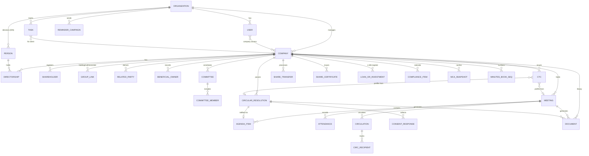
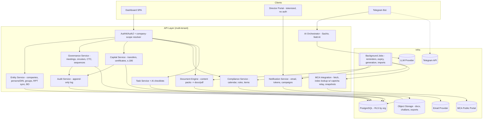

# CoSecOffice / CoSecAI — Deep Technical Product Teardown

**Purpose:** Technical reference for designing and building the **OptiReach Company Secretarial Workspace** inside the OptiReach Financial Operating System.

**Subject:** CoSecAI (branded interchangeably as *CoSec Office* / *CoSecOffice*), https://cosecoffice.com — company secretarial software for PCS firms and in-house CS teams in India. Operated by **FASTLEGAL TECHNOLOGIES PRIVATE LIMITED** (CIN U74999RJ2018PTC060472, Rajasthan).

**Date of exploration:** August 2026.

---

## 0. Methodology, Evidence Basis & Limitations

This teardown follows the evidence-labeling convention required by the brief:

| Tag | Meaning |
|---|---|
| **OBSERVED** | Directly verified on the product's public surface: the application's marketing site, product-workflow pages, enterprise workflow documentation, and 60+ product guides that describe specific in-app screens, routes, tabs, field names, and state transitions. |
| **INFERRED** | Strongly implied by observed behavior descriptions (e.g., a described state machine implies specific backend entities), but not directly verified. |
| **RECOMMENDED** | How OptiReach should implement the capability. Never a claim about CoSecOffice's actual internals. |
| **NOT OBSERVABLE** | Could not be tested/verified during exploration. |

### 0.1 Exploration constraint (important)

The live application (`/dashboard/...`) sits behind authentication (`/login`, `/signup`), and **the in-app screens themselves were not driven with test data during this exploration**. However, CoSecOffice's public documentation is unusually implementation-specific — it names dashboard routes (e.g. `/dashboard/documents/meeting-scheduler`), tab structures ("Meeting Scheduler → Circular resolutions", "Meeting Scheduler → CTC tab", "circulation audit exports (separate tab)"), exact state values ("pending → viewed → consented / declined / abstained with timestamps"), field-level detail ("reference numbers and expiry dates can be set"), and Rule 5 eligibility-blocking behavior. These pages are written as walkthroughs of live screens and are treated here as **OBSERVED (via product documentation)**. Where the doc-derived claim could plausibly be marketing rather than shipped behavior, it is downgraded to **INFERRED**. Anything that could only be validated by driving the UI with test data (validation messages, error states, pagination, concurrency behavior) is marked **NOT OBSERVABLE** and called out in §16.

Before firm design decisions are locked, a follow-up pass should run the free trial with one safe test entity against the scorecard the vendor itself publishes (load company → board notice auto-fill → BM + AGM with SS-1/SS-2 numbering → circular resolution with Rule 5 block → CTC from passed circular → one event pack → MBP-1 batch → compliance calendar → MCA status by CIN → letterhead Word output → sub-user access). That scorecard is reproduced in §16.4 as a **trial validation checklist**.

### 0.2 Sources

- `cosecoffice.com` homepage — full product surface, module list, two 6-step canonical workflows (OBSERVED)
- `/enterprise` and `/enterprise/circular-resolutions-ctc-issuance` — detailed circular-resolution and CTC state machines, FAQ confirming blocking behavior (OBSERVED)
- `/blog/paperless-board-meeting-scheduler-cosecai` — route disclosure, 6-step meeting workflow (OBSERVED)
- `/blog/best-company-secretarial-software-india-cosecoffice` — SS-1/SS-2 compliance panel, minutes-book numbering, share-transfer revert behavior, evaluation scorecard (OBSERVED)
- `/blog/mca-annual-filing-status-cin-software-india` — MCA lookup mechanics: sidebar entry, captcha-backed lookup, FY mapping, snapshots, challans (OBSERVED)
- ~65 additional product guides (titles/abstracts) enumerating the document/event catalog (OBSERVED as catalog; individual guide bodies are heavily templated and treated with lower weight)

---

# A. Executive Technical Overview

## A.1 Product purpose — OBSERVED

CoSecOffice is an India-specific, cloud, multi-entity **company secretarial operating system**: one workspace that holds entity master data (companies and LLPs keyed by CIN/LLPIN), statutory registers, board/general-meeting process, circular resolutions, certified true copies, event-based and annual ROC document generation, a compliance calendar, MCA public filing-status lookup, task management, and AI-assisted drafting. Its positioning is explicit: *"master data → event capture → board/GM papers → registers → filing"* as one connected sequence, replacing Word + Excel + email.

## A.2 Target users — OBSERVED

1. **Practising Company Secretaries (PCS)** — multi-client firms, unlimited entities, per-CIN client files.
2. **In-house CS departments** — corporate secretarial teams across subsidiaries; enterprise tier with implementation support, SSO planning, RBAC playbooks.
3. **Mid-size firms & LLPs** — standardizing quality across associates.
4. **Compliance managers** — centralized registers and board process.
5. **Directors** are *secondary* actors: they never log in; they interact via secure tokenized links (view/acknowledge notices, consent to circulars). This is a deliberate architectural decision (OBSERVED: "Directors respond via secure links; no CoSecOffice login required for the director").

## A.3 Primary workflows — OBSERVED

1. **Entity onboarding** — add company/LLP via CIN with MCA auto-fetch; import directors/shareholders (Excel/MCA Director Data); set up registers and committee master.
2. **Master-data maintenance** — group structure, related-party sync, BO/SBO/UBO register, director KYC, DSC manager.
3. **Compliance calendar** — FY-based deadlines (AGM, MGT-7, AOC-4, LLP Form 8/11, DPT-3, event filings) with reminders to clients and team.
4. **Board process** — schedule BM/EGM/AGM/committee → agenda → generate Word packs → tracked circulation → attendance/leave → minutes → audit export.
5. **Circular resolutions** — eligibility check → consent links → tally → pass/fail/expire → ratification on next board agenda.
6. **CTC issuance** — prefill from meeting or passed circular → letterhead Word → signatory grid → issuance log → email pack.
7. **Event/ROC document packs** — director change, capital events, RPT, ESOP, dividend, CSR, name/address/object change, strike-off, LLP events; regenerable when facts change.
8. **Practice ops** — task types with AI checklists and statutory timelines, sub-user RBAC, review sheets, fee tracking, reports, email-reminder campaigns, Telegram bot access.

## A.4 Major modules — OBSERVED

Entity Master (incl. Group, Related Parties, Beneficial Owners) · Directors & Shareholders · Share Capital (SH-1/SH-4/right issue/private placement/ESOP) · Loans & Investments (s.186 register) · Statutory Registers · Charges · Auditors · Director KYC · DSC Manager · Meeting Scheduler (BM/AGM/EGM/Committee + Circulation + Circular Resolutions + CTC + Audit exports) · Drafting Engine (Content Packs) · Documents / ROC Event Packs · Compliance Calendar · MCA Annual Filing Status · CS Task Manager · Team / Sub-users (RBAC) · Email Reminders · Sachiv AI · Telegram Bot · Reports / Review Sheets / Work & Fee Tracking · Document Library · Settings (letterhead/formatting) · Billing (in-app; no public pricing).

## A.5 Core domain concepts — OBSERVED + INFERRED

- **The Company (CIN) is the aggregate root.** Everything — meetings, circulars, CTCs, registers, documents, compliance items, MCA snapshots — hangs off a selected "working company." The UI enforces company context first ("Select the client entity first so … auto-fill is accurate"). (OBSERVED)
- **The Director (DIN) is a cross-entity person record.** The same DIN is reused across companies/LLPs to drive batch MBP-1/DIR-8 and conflict checks. (OBSERVED)
- **Documents are generated, versioned-by-regeneration artifacts** stored in a per-company Document Library and reused as inputs (agenda import, CTC resolution import). (OBSERVED)
- **Meetings, circulars and CTCs are "living records"** with state machines, not one-off files. (OBSERVED)
- **Compliance is calendar-first**, FY-anchored, with reminders; there is no evidence of a fully rule-evaluated applicability engine (see §7). (OBSERVED absence / INFERRED)

## A.6 Apparent system architecture — INFERRED

A multi-tenant SaaS web app: SPA-style dashboard under `/dashboard/...`; Word (.docx) generation server-side from structured Content Packs; transactional email with tokenized recipient links and open/acknowledge tracking; a scraping/lookup integration against the public MCA filing index (captcha-in-the-loop); Excel import/export throughout; an LLM-backed assistant (Sachiv AI) for drafting fields, whole documents, Q&A, and reminder copy; a Telegram Bot API integration; background scheduling for reminders and circular expiry. Nothing observed indicates e-sign, DSC-based signing, direct MCA e-filing, payment-gateway-driven public pricing, or a mobile app.

## A.7 Major automation capabilities — OBSERVED

- CIN-based company auto-fetch from MCA on onboarding.
- MCA Director Data Excel import → all entities associated with a DIN, with appointment/cessation dates.
- Auto-fill of every document from master data; regeneration when facts change.
- Related-party list **sync** from directors/shareholders/KMP/group links.
- Batch MBP-1/DIR-8 per DIN across entities.
- SS-1/SS-2 compliance panel: notice-date suggestions, 15-day draft-minutes and 30-day signed-minutes tracking, consecutive minutes-book entry/page numbering per scope (board, each committee, general meetings).
- Circular-resolution Rule 5 eligibility **blocking**; automatic pass/fail/expire from consent tallies; automatic ratification agenda item (can create the next board meeting).
- CTC prefill from meetings or passed circulars.
- Deadline reminders (email) to clients/team; AI-drafted reminder and marketing campaigns.
- AI checklists with statutory timelines attached to task types.
- Committee scoping: participants auto-limited to committee constitution from master.

## A.8 Major differentiators — OBSERVED

1. **One thread from consent → minutes → CTC** (no re-keying of resolution text across three artifacts).
2. **Statute-aware guardrails** (Rule 5 blocks, SS-1/SS-2 numbering, notice-period logic) rather than generic doc automation.
3. **Login-less director experience** via secure links with an evidence trail (pending/viewed/acknowledged; consent timestamps; exportable audit reports).
4. **DIN-centric cross-entity person graph** powering batch annual declarations and conflict checks.
5. **India-shape coverage breadth**: companies *and* LLPs, annual *and* event-based, registers *and* board process, in one product with unlimited entities.
6. **Channel reach**: Telegram bot + AI email campaigns — unusual for this category.

---

# 3. Information Architecture

## 3.1 Top-level structure — OBSERVED + INFERRED

Public surface (OBSERVED): `/` · `/solutions` · `/ai` · `/enterprise` (+ 5 sub-guides) · `/blog` (+ ~65 articles) · `/contact` · `/login` · `/signup` · `/terms-and-conditions` · `/refunds-and-cancellations` · `/privacy-policy` · `/other-details`. Pricing is deliberately **in-app only** ("View plans in your account … no public price list").

Application surface — reconstructed from route/tab disclosures (OBSERVED where quoted, otherwise INFERRED):

```text
Workspace (organization / practice)                     [org scope]
├── Dashboard
├── Companies & LLPs (client list; unlimited)           [org scope]
│   └── Working Company (selected → company context)    [company scope]
│       ├── Company sidebar                              (OBSERVED: "Open MCA filing
│       │                                                 status from the company sidebar")
│       ├── Profile / Master
│       │   ├── Basic details (CIN, FY, registered office, statutory labels)
│       │   ├── Directors (DIN-linked; KYC)
│       │   ├── Shareholders / Members
│       │   ├── KMP
│       │   ├── Corporate Group (holding/subsidiary/associate/ceased,
│       │   │                     effective dates, shareholding)
│       │   ├── Related Parties (sync · import · filter · export)
│       │   ├── Beneficial Owners (BO/SBO/UBO, effective ranges, FY filter, export)
│       │   ├── Committees (committee master: members, chair)
│       │   ├── Auditors
│       │   └── Charges
│       ├── Registers (statutory registers; members; renewed certificates)
│       ├── Share Capital (transfers SH-4 · certificates SH-1 · right issue ·
│       │                   private placement PAS-4/PAS-5 · alteration SH-7 · ESOP)
│       ├── Loans & Investments (s.186: loans given · investment book · limits)
│       ├── Documents  (OBSERVED: "dashboard Documents area")
│       │   ├── Meeting Scheduler  (OBSERVED route: /dashboard/documents/meeting-scheduler)
│       │   │   ├── Meetings (filter: FY, type = BM | AGM | EGM | Committee)
│       │   │   │   ├── Agenda builder (library import · CA-2013 predefined · AI draft)
│       │   │   │   ├── Participants (signing directors, chairperson, leave of absence)
│       │   │   │   ├── Generate packs (Notice · Minutes · Attendance)
│       │   │   │   ├── Circulation (per-director links: pending→viewed→acknowledged;
│       │   │   │   │               resend; download audit report)
│       │   │   │   └── SS-1/SS-2 compliance panel (notice dates, minutes deadlines,
│       │   │   │                                    minutes-book numbering)
│       │   │   ├── Circular Resolutions tab (draft · eligibility check · consent rule ·
│       │   │   │                             circulate · tally · ratify)
│       │   │   ├── CTC tab (prefill · passage mode · signatory grid · issuance log)
│       │   │   └── Audit exports tab (circulation evidence, CSV/Word)
│       │   ├── Event packs (director change, auditor, address, object, name,
│       │   │                dividend, CSR, RPT, s.186 loans, ESOP, KMP, strike-off,
│       │   │                convert-to-LLP, LLP agreement, shorter notice, …)
│       │   ├── Annual packs (Directors Report, AGM pack, MGT-7/AOC-4 support,
│       │   │                 MBP-1 & DIR-8 batch, lists of directors/shareholders)
│       │   └── Document Library (generated Word files; source for re-import)
│       ├── Compliance Calendar (FY deadlines, reminders, review sheets)
│       └── MCA Filing Status (CIN lookup · captcha · FY read-out ·
│                              challans PDF/ZIP · saved snapshots)
├── Tasks (CS Task Manager)                             [org scope, company-linked]
├── Email Reminders (companies/LLPs/professional groups; AI-drafted)  [org scope]
├── Sachiv AI (assistant)                               [org scope, company-aware]
├── Team / Sub-users (roles & permissions)              [org scope]
├── Reports · Review Sheets · Work/Fee tracking         [org scope]
├── Settings (letterhead, formatting, Telegram bot, profile)          [org scope]
└── Billing / Subscription (plans shown post-login)     [org scope]
```

## 3.2 Primary information hierarchy — OBSERVED

**Organization (tenant) → Working Company (CIN/LLPIN) → Module → Record → Generated Document.** Company selection is the pivotal context switch; the vendor repeatedly instructs "select the client entity first." Cross-company views exist for org-scope concerns: the client list, the task manager, the compliance calendar (per-client rows), the DIN graph (one director across entities), reminder campaigns, and team management.

## 3.3 Global vs company-specific — OBSERVED + INFERRED

| Scope | Functionality |
|---|---|
| Organization-wide | Client list, team & RBAC, tasks, reminder campaigns, Sachiv AI, Telegram bot config, letterhead/format settings, reports, fee tracking, billing |
| Company-specific | Master data, registers, meetings/circulars/CTCs, share capital, s.186 register, documents & library, compliance calendar rows, MCA snapshots, issuance logs |
| Cross-company by person | Director (DIN) view: all associated entities, appointment/cessation dates, MBP-1/DIR-8 batches (OBSERVED) |
| External (no login) | Director response portal: tokenized pages for notice acknowledgement and circular consent (OBSERVED) |

## 3.4 Interaction containers — OBSERVED (partial) + INFERRED

- **Tabs** confirmed inside Meeting Scheduler (Circular resolutions tab, CTC tab, separate audit-exports tab). (OBSERVED)
- **Sidebar** confirmed at company level. (OBSERVED)
- **FY filters** confirmed on meetings list and BO register. (OBSERVED)
- **Guided forms** for event-specific fields ("dates, amounts, parties, agenda items in the guided form"). (OBSERVED)
- Drawers/modals/breadcrumbs/bulk actions: **NOT OBSERVABLE** — plausible but unverified; do not copy blindly.

---

# 4. Complete Feature Inventory

Legend: **O** = Observed · **I** = Inferred · **N** = Not observable. "User" abbreviations: PCS = practice owner/partner; CS = in-house company secretary; Assoc = associate/sub-user; Dir = director (link-only actor).

## 4.1 Entity Master

| Feature | Purpose | User | Inputs | Outputs | Dependencies | Automation | Permissions | States | Evidence | Conf. |
|---|---|---|---|---|---|---|---|---|---|---|
| Add company via CIN | Onboard client in minutes | PCS/CS | CIN | Company master pre-populated | MCA public data | Auto-fetch from MCA | Org: create-company | Active (+ likely draft/incomplete) | Company record | O |
| Add LLP | LLP parity | PCS/CS | LLPIN/details | LLP master | — | — | Same | — | LLP record | O |
| Corporate group links | Model holding/subsidiary/associate/ceased | CS | Related entity, relation type, effective date, shareholding % | Group map on profile | Two entity records | Visible on both profiles (I) | Company: edit-master | Active/Ceased (effective-dated) | Group link rows | O |
| Related parties (RPT list) | s.188 / Ind AS 24 working list | CS | — (synced) or import file | Filterable, exportable RPT list | Directors, shareholders, KMP, group links | **Sync** from master data; refresh on change | Company: edit-master | Current/stale-until-refresh (I) | RPT export | O |
| Beneficial owner register | s.90 BO/SBO/UBO repository | CS | Person, classification (BO/SBO/UBO), effective range | Searchable register; Excel export | Company | FY-overlap filters (India FY) | Company: edit-master | Effective-dated entries | Excel export | O |
| Directors & shareholders master | Single source for auto-fill | PCS/CS | Manual, Excel import, MCA import | Master lists; "list of directors/shareholders" docs | DIN records | Import directors *as* shareholders | Company: edit-master | Appointed/Ceased (dated) | Lists, DIR-12 support | O |
| MCA Director Data import | See all entities per DIN | PCS | MCA Director Data Excel | Entity list w/ appointment & cessation dates | DIN | One-click import; cross-entity linking | Org-level | — | Imported associations | O |
| Director KYC | Due-diligence data per director | CS | KYC fields/docs | KYC record | Director | — | Company/org | — | KYC record | O |
| Committee master | Constitution of Audit/NRC/CSR etc. | CS | Committee name, members, chair | Committee record | Directors | Scopes committee-meeting participants & circulation automatically | Company: edit-master | Active (member changes dated, I) | Committee meetings | O |
| DSC manager | Track DSCs for e-filing | PCS | DSC holder, expiry (I) | Register of DSCs | Directors/signatories | Expiry reminders (I) | Org | Valid/Expired (I) | DSC list | O (existence) |
| Auditors & charges | Statutory records | CS | Auditor/charge details | Registers/records | Company | — | Company | — | Records | O (existence) |

## 4.2 Meeting Scheduler (Board Governance)

| Feature | Purpose | User | Inputs | Outputs | Dependencies | Automation | Permissions | States | Evidence | Conf. |
|---|---|---|---|---|---|---|---|---|---|---|
| Create meeting | Schedule BM/AGM/EGM/Committee | CS | Company, FY, type, date/time/venue, committee (if committee type) | Meeting record | Company master; committee master | Committee → participants auto-scoped; SS notice-date suggestions | Company: meetings-create | Draft→Scheduled→Held→Minuted→Closed (I; see §6) | Meeting record | O |
| Agenda builder | Single source for all packs | CS | Library import, CA-2013 predefined items, AI-drafted resolutions, manual text | Ordered agenda items | Document library; Sachiv AI | Consistent numbering flows into notice+minutes | Company: meetings-edit | Draft/Final (I) | Agenda | O |
| Participants & leave | Attendance basis | CS | Signing directors, chairperson; leave-of-absence entries | Attendance sheet data | Directors/committee members | Pulled from master | Same | Present/Absent/Leave (O) | Attendance sheet | O |
| Generate Word packs | Notice, minutes, attendance from one agenda | CS | Agenda + participants + letterhead | .docx files in library | Templates; settings | Same numbering/text across all three | Company: documents-create | Generated/Regenerated | Library files | O |
| Tracked circulation | Provable service of papers | CS→Dir | Recipient directors, documents | Per-director status; audit report | Email; secure links | pending→viewed→acknowledged w/ timestamps; resend | Company: circulate | pending/viewed/acknowledged | Audit report (CSV/Word) | O |
| SS-1/SS-2 panel | Standards compliance | CS | Meeting dates | Notice-date suggestion; 15-day draft & 30-day signed minutes tracking; consecutive entry/page numbers per minutes-book scope | Meeting record; prior minutes numbering | Deadline computation; sequence allocation | — | On-track/Due/Overdue (I) | Panel + numbered minutes | O |
| Shorter-notice consent | s.173/101 shorter notice | CS | Consenting parties | Consent letters + meeting docs | Meeting | Pack generation | documents-create | — | Consent letters | O |
| Circulation audit export | Evidence for SS/inspection | CS | Meeting/circulation | CSV/Word export; saved to library | Circulation events | Export builder | Company: export | — | Export files | O |

## 4.3 Circular Resolutions

| Feature | Purpose | Inputs | Outputs | Automation | States | Conf. |
|---|---|---|---|---|---|---|
| Draft circular | Written consent u/s 173 + Rules 2014 | Title, description, full "RESOLVED THAT" text or library import; AI draft | Circular record | **Rule 5 eligibility check — blocks circulation of restricted matters** (financial statements, Board's Report, prospectus, amalgamation, takeover flagged) | Draft | O |
| Configure consent | Lawful tally basis | Consent rule (majority/unanimous), director list, reference number, expiry date | Configured circular | — | Draft→Circulating | O |
| Director consent links | Login-less response | Send action | Per-director secure link; portal records response | Timestamps logged to circular record; live tally; refresh status | pending→viewed→consented/declined/abstained | O |
| Auto outcome | Remove tally archaeology | Responses vs rule | Status change | Auto **passed** when rule met; **failed** when cannot succeed; **expired** at deadline | passed/failed/expired | O |
| Ratification | Board confirmation of circulars | Passed circular; target meeting (or none) | Agenda item carrying circular reference; **creates board meeting if none scheduled** | Automatic agenda insertion; minutes reflect consent + ratification | Ratified (I) | O |

## 4.4 Certified True Copies

| Feature | Inputs | Outputs | Automation | Conf. |
|---|---|---|---|---|
| CTC generation | Passage mode (board meeting / circular resolution / EGM / AGM / committee / other); certified date, place, issued-to, purpose; signing directors | Letterhead Word CTC with structured multi-director signatory grid | **Prefill** of passage details + resolution text from the linked meeting or passed circular; import prior resolutions from library | O |
| Issuance log | — | Per-company searchable log; re-download; email CTC packs from the record | Log entry per issuance | O |

## 4.5 Share Capital

| Feature | Purpose | Key behavior | Conf. |
|---|---|---|---|
| Share transfer (SH-4) | Transfer workflow | Board approval → "Issue & post"; **deferred certificate issue**; cancellation of originals; FEMA step where applicable; register updates; **revert with audit reason if transaction cancels** | O |
| Share certificates (SH-1) | Issue/renew certificates | Formatting per Act; integrates with capital changes & private placement; renewed-certificates register | O |
| Right issue / Private placement | s.62 / s.42 packs | PAS-4, PAS-5, board resolutions, EGM notices, explanatory statements | O |
| Capital alteration | s.61 | Resolutions + SH-7 support | O |
| ESOP | s.62(1)(b), Rule 12 | Scheme docs, special resolution wording | O |

## 4.6 Loans & Investments (s.186)

Loans-given register organized **by borrower**; investment book covering equity, convertibles, funds/securities and **LLP capital contributions**; **utilisation tracked against the s.186 enabling ceiling**; document packs (board resolutions, EGM notices, explanatory statements) for inter-corporate loans. (O)

## 4.7 Compliance & MCA

| Feature | Behavior | Conf. |
|---|---|---|
| Compliance calendar | FY-based deadline rows per entity: AGM, MGT-7, AOC-4, annual returns, event filings; assignable to team members (O for enterprise copy "assignable to team members" — I on mechanism); linked to documents already generated in the same client file | O |
| Email reminders | Deadline reminders to clients and team; AI-drafted compliance reminders (AOC-4, AGM, etc.) and marketing campaigns; rich-text greetings with director/partner names; sent to companies, LLPs, and professional (CA) groups | O |
| MCA annual filing status | Opened **from the company sidebar**; uses working company's CIN; **captcha-backed** lookup of the public MCA filing index; FY mapping to filing rows; compliance read-out; optional **challan PDFs and ZIP**; **saved snapshots per CIN** for team review | O |
| ROC filing checklists | Checklist workflows tying board papers to the forms to be uploaded on the MCA portal (filing itself is manual on MCA with user credentials — explicitly: "Software cannot file on MCA for you") | O |
| Review sheets / work tracking | Practice-management QA and progress artifacts | O (existence) |

## 4.8 Documents / ROC Event Packs — catalog (all O)

Annual: Directors Report · List of Directors · List of Shareholders · AGM Notice + Explanatory Statements · Meeting Minutes · Attendance Sheets · MGT-7/AOC-4 preparation support · MBP-1 & DIR-8 (batch per DIN across all entities) · Annual Return · Bank Search Report.
Event-based: Director appointment/resignation/change (DIR-12 support) · Auditor appointment (consent + resolutions) · KMP appointment (s.203: MD/CEO/CFO/CS) · Registered-office address change (INC-22) · Object clause change (MOA alteration) · Company name change (s.13(2), INC-28) · Dividend declaration (s.123: interim board resolution; final AGM ordinary resolution; book closure; payment instructions) · CSR (s.135: committee, action plan) · RPT (s.188: resolutions, EGM notice, explanatory statement, board-report disclosure) · Inter-corporate loans (s.186) · ESOP (s.62(1)(b)) · Private placement (s.42) · Right issue · Share capital alteration (SH-7) · Share transfer (SH-4) · Share certificates (SH-1) · Strike off (STK-2, affidavits) · Convert to LLP · Shorter-notice consents · DPT-3 (deposits, Rule 16, Excel workflow).
LLP: LLP Agreement · Partners' resolutions · Address change · Form 8 / Form 11 support.

## 4.9 CS Task Manager

Task **types** for common secretarial work (director appointment, AGM, filings); **AI-generated checklists with statutory timelines**; team assignment; **client email sent from the task**; downloadable **Word checklists**; sub-user RBAC governs access. (O)

## 4.10 Team & RBAC

Sub-users (associates/trainees) with granular permissions controlling **which companies they can view, which documents they can create, and which actions they can perform**; positioned for segregation between partners and trainees; enterprise adds SSO planning and RBAC playbooks during implementation. (O for the three permission dimensions; the concrete role list is N — see §9.)

## 4.11 AI & Channels

| Feature | Behavior | Conf. |
|---|---|---|
| Sachiv AI | Assistant for CS work: Q&A/advice; generates any document in Word (resolutions, notices, minutes); module-level field AI (notes on agenda, explanatory statements, resolution wording); explicit human-in-the-loop ("review before issue") | O |
| Telegram bot | User connects **their own bot**; select a company; view full company data; describe a document and receive it as .docx; chat with Sachiv AI | O |
| AI email campaigns | AI drafts compliance reminders and marketing campaigns | O |

## 4.12 Commercial

Free trial ("free to start", "setup in ~5 minutes", cancel anytime); unlimited companies/LLPs (no per-entity caps); pricing shown only in-account; Enterprise = implementation support (kick-off, migration, templates, RBAC, playbooks, post-go-live review), SSO planning; claims 500+ PCS users. (O)

---

# 5. Domain Model / Entity Analysis

All entities below are **INFERRED** from observed behavior unless noted. Tenancy: everything is scoped to an `Organization` (the PCS firm / corporate department account); most records additionally scope to a `Company`.

## 5.1 Entity catalog

| Entity | Purpose | Key attributes | Relationships / lifecycle | Notes |
|---|---|---|---|---|
| Organization | Tenant: firm or department | name, plan, letterhead settings, telegram bot config | has Users, Companies | Root of RBAC + billing |
| User (Sub-user) | Staff actor | email, role, company-access set | belongs to Org; permissions per §9 | Directors are NOT users |
| Company | Aggregate root per entity | CIN/LLPIN, type (company/LLP/OPC/Section 8/public/private — statutory labels observed), FY config, registered office, status | has all company-scoped children | CIN unique per org (I); MCA-fetched fields cached |
| Director (Person) | DIN-keyed person, org-level | DIN, name, KYC fields | m:n Company via **Directorship** (appointment date, cessation date, designation) | DIN reuse across entities is OBSERVED — person must be org-scoped, not company-scoped |
| KMP | s.203 officers | designation (MD/CEO/CFO/CS), dates | Company + Person | Feeds RPT sync |
| Shareholder/Member | Register of members basis | holder identity, folio, holdings | Company; may reference Director (import directors as shareholders — O) | |
| ShareClass / Shareholding | Capital structure | class, nominal value, quantity | Company → Shareholder | Implied by certificates/transfers |
| ShareCertificate (SH-1) | Certificate record | cert no., distinctive nos., status | issued / **deferred** / cancelled / renewed (O: deferred issue + cancellation of originals) | Renewed-certificates register observed |
| ShareTransfer (SH-4) | Transfer transaction | transferor/ee, consideration, FEMA flag | Draft→BoardApproved→Issued&Posted; **Reverted(with audit reason)** (O) | Updates register + certificates |
| CapitalEvent | Right issue / private placement / alteration / ESOP | type, terms, dates | generates documents (PAS-4/5, SH-7…) | |
| GroupLink | Corporate relationships | relation (holding/subsidiary/associate/**ceased**), effective dates, shareholding % | Company↔Company | Effective-dated (O) |
| RelatedParty | Working RPT list | party, basis (director/shareholder/KMP/group), source ref | **derived + editable**; refresh on master change (O) | Import/export supported |
| BeneficialOwner | s.90 register | person, classification BO/SBO/UBO, effective range | FY-overlap queryable (O) | Excel export |
| Committee / CommitteeMember | Committee master | name, members, chair | scopes committee meetings (O) | |
| Meeting | BM/AGM/EGM/Committee | type, FY, date/time/venue, chairperson, committee ref | lifecycle §6.3; owns Agenda, Attendance, Circulation, generated docs | |
| AgendaItem | Single source for packs | seq no., text, kind (predefined/library/AI/manual), linked resolution text | Meeting; ratification items carry CircularResolution ref (O) | |
| Attendance / LeaveOfAbsence | Participation record | director, status (present/absent/leave) | Meeting × Director | O |
| Circulation | A send of documents | documents, sent-at | has CirculationRecipient rows | Separate audit-export surface (O) |
| CirculationRecipient | Per-director tracking | token, status pending/viewed/**acknowledged**, timestamps | Circulation × Director | Secure link, no login (O) |
| MinutesBookSequence | SS numbering | scope (board / each committee / general), next entry no., next page no. | Company; consumed by minutes generation | Consecutive numbering per scope is OBSERVED — implies a persistent counter |
| CircularResolution | Written consent | title, text, consent rule (majority/unanimous), reference no., expiry | Draft→Circulating→Passed/Failed/Expired; →Ratified via AgendaItem | Rule 5 check result stored (I) |
| ConsentResponse | Director response | token, status pending/viewed/consented/declined/abstained, timestamps | CircularResolution × Director | O |
| CTC | Certified true copy | passage mode (6 values, O), certified date/place, issued-to, purpose, resolution text, signatories[] | references Meeting or CircularResolution; append-only IssuanceLog (O) | Emailable from record |
| Loan / Investment | s.186 register | borrower / instrument (equity, convertible, fund, LLP capital), amounts, dates | Company; aggregates vs **EnablingLimit** | Utilisation % computed (O) |
| Register (various) | Statutory registers | type, rows | Company | Members, charges, transfers, renewed certs… |
| ComplianceItem | Calendar row | filing/obligation, FY, due date, status, assignee | Company; links to Documents; reminder schedule | See §7 for lifecycle caveats |
| MCASnapshot | Saved MCA lookup | CIN, captured-at, FY→filing rows, challan files | Company | Append-only per CIN (O: "saved snapshots") |
| Task | Practice work item | task type, assignee, checklist[], statutory timeline hints, client-email thread | Org, linked to Company | AI-generated checklist (O) |
| Document | Generated artifact | type, .docx file, letterhead used, source module ref, generated-at | Company Library; re-importable into agendas/CTCs (O) | "Regenerate when facts change" implies re-generation rather than in-place versioning (I) |
| DocumentTemplate / ContentPack | Drafting engine unit | event type, notice text, notes-to-agenda, minutes narration, quoted resolution, **compliance metadata (Act sections, SS refs, filings)** | powers packs (O) | Vendor-maintained; letterhead is per-org |
| ReminderCampaign | Outbound email batch | audience (companies/LLPs/CA groups), body (AI-drafted), merge fields (director/partner names) | Org | O |
| AuditLog | Who/what/when | actor, action, entity ref, timestamp | everywhere circulation/consent/issuance touch | Partially O (event logs on circulars, issuance log, audit exports); global audit log N |

## 5.2 Inferred entity-relationship model



## 5.3 Constraint & audit implications — INFERRED

- `UNIQUE(org_id, cin)` on Company; `UNIQUE(din)` on Person within org (or global with org mapping).
- `MinutesBookSequence` requires transactional, gap-free increment per `(company, scope)` — a serialized counter, not `MAX()+1` under concurrency.
- `ConsentResponse` and `CirculationRecipient` must be **append-only for state history** (timestamps per transition are exposed to auditors).
- `CTC` issuance log and share-transfer **revert reason** imply soft, reasoned reversal rather than deletes — evidence-grade records are never hard-deleted.
- Effective-dating (group links, BO entries, directorships) implies `valid_from/valid_to` ranges with overlap queries (FY filters).

---

# 6. Workflow Reverse Engineering

## 6.1 Company onboarding — OBSERVED (steps) / INFERRED (states)

```text
Trigger: user adds entity (CIN entered)
Actor: PCS/CS with create-company permission
  ↓ MCA auto-fetch (name, type, registered office, …)
  ↓ Import directors & shareholders (Excel / MCA Director Data / manual;
     "import directors as shareholders" shortcut)
  ↓ Set FY, committees (committee master), registers set-up
  ↓ Company ACTIVE → appears in client list; compliance calendar rows seeded
     for FY deadlines (I: seeding mechanism not observable — may be manual/templated)
Failure: invalid CIN → lookup fails (N: exact UX not observable)
Audit: creation actor/timestamp (I)
```

## 6.2 Director appointment / resignation — OBSERVED (docs) / INFERRED (flow)

```text
Trigger: event captured in Documents → Director change module
Inputs: person (existing DIN or new), designation, effective date, event fields
  ↓ Guided form → board/GM papers generated (resolution, appointment or
     resignation letter, explanatory statement where needed)
  ↓ Master data updated (directorship row with appointment/cessation date)
  ↓ DIR-12 support pack prepared (filing itself is on MCA portal, manual)
  ↓ Compliance calendar: DIR-12 window visible (O: "never miss DIR-12 windows")
  ↓ Downstream: MBP-1/DIR-8 batch includes/excludes the director; RPT list refresh
Notifications: client email possible from task (O)
Audit: document generation + master change history (I)
```

## 6.3 Board meeting (paperless, SS-1) — OBSERVED end-to-end

```text
Select company & FY → choose type (BM / AGM / EGM / Committee)
  ↓ [Committee] participants auto-scoped from committee master
  ↓ Build agenda: import from library | CA-2013 predefined items | AI-drafted
  ↓ SS panel: notice-date suggestion (notice-period logic); minutes deadlines
     (draft 15d, signed 30d) tracked; minutes-book numbering reserved per scope
  ↓ Set participants: signing directors, chairperson; record leave of absence
  ↓ Generate Word packs: Notice + Minutes + Attendance from the SAME agenda
     (consistent numbering and text)
  ↓ Circulate: per-director secure email links
       state per recipient: pending → viewed → acknowledged (timestamps)
       actions: resend · download audit report (CSV/Word) · save to library
  ↓ Hold meeting → attendance finalized → minutes finalized within tracked deadlines
  ↓ Optional: shorter-notice consent letters; ratification items from passed circulars
  ↓ Outputs land in Document Library; audit export archived
Failure: unopened notices visible on dashboard ("one dashboard shows who has
         not opened the notice") — chase loop is in-product
```

Inferred meeting states: `Draft → Scheduled → Circulated → Held → MinutesDraft → MinutesSigned → Closed` (only circulation sub-states and minutes deadlines are directly observed).

## 6.4 Circular resolution — OBSERVED end-to-end (richest observed state machine)

```text
Draft (title, description, RESOLVED THAT text | library import | AI draft)
  ↓ Eligibility check (Rule 5): restricted matters (financial statements,
    Board's Report, prospectus, amalgamation, takeover) → BLOCKED from
    circulation; user routed to a board meeting instead        [O, incl. FAQ]
  ↓ Configure: consent rule = majority | unanimous; directors; reference no.; expiry
  ↓ Circulate: per-director secure response link (no login)
       per-director: pending → viewed → consented | declined | abstained
       all transitions timestamped and logged to the circular record
  ↓ Live tally vs rule
       rule met            → PASSED   (automatic)
       cannot succeed      → FAILED
       deadline passes     → EXPIRED
  ↓ [PASSED] Ratification: push to next board agenda (or chosen meeting);
       if no meeting scheduled, the system CREATES one; agenda item carries
       the circular reference; minutes reflect consent + ratification
  ↓ [PASSED] CTC issuable with passage mode "Circular resolution" (prefilled)
Audit: event log per circular; circulation audit exports complement records
```

## 6.5 CTC issuance — OBSERVED

```text
Trigger: CTC tab; select passage mode
  (board meeting | circular resolution | EGM | AGM | committee | other)
  ↓ Prefill: date/time/venue + resolution text from linked meeting,
    OR title/text/reference/consent outcome from passed circular,
    OR import prior resolution from document library
  ↓ Fields: certified date, place, issued-to party, purpose
  ↓ Signatory grid: multiple signing directors from master
  ↓ Generate letterhead Word → ISSUED → append to per-company issuance log
  ↓ Actions from log: search · re-download · email CTC pack to recipient
```

## 6.6 Share transfer — OBSERVED (key transitions)

```text
Capture SH-4 particulars (transferor/ee, consideration, FEMA step where needed)
  ↓ Board approval (resolution via meeting or circular)
  ↓ "Issue & post": register of members updated; certificate handling with
     DEFERRED certificate issue and CANCELLATION of originals
  ↓ If transaction cancels: REVERT with audit reason —
     "so the legal trail matches economic reality"
```

## 6.7 Compliance task flow — OBSERVED (pieces) / INFERRED (linkage)

```text
Deadline row (FY-anchored: AGM, MGT-7, AOC-4, Form 8/11, DPT-3, event windows)
  ↓ Reminder emails to client and team (AI-drafted bodies available)
  ↓ Task created/assigned (task type + AI checklist with statutory timelines)
  ↓ Work: documents generated in client file; client email from the task;
     Word checklist downloadable
  ↓ MCA status lookup by CIN → snapshot + challans attached to client record
  ↓ Filing done manually on MCA portal → status updated in calendar (I:
     manual completion; no evidence of automatic completion detection)
```

## 6.8 Other workflows (documented at catalog level — O for outputs, I for flow)

AGM (notice + explanatory statements + minutes + attendance per SS-2, book-closure and dividend items), auditor appointment (consent letter → board/GM resolutions), dividend (interim board / final AGM ordinary resolution → payment instructions), private placement (PAS-4/PAS-5 + EGM), ESOP special resolution, name/address/object change (special resolutions + INC-form support), strike-off (STK-2 + affidavits), convert-to-LLP, LLP agreement & partner resolutions, DPT-3 Excel workflow, post-incorporation pack (first board meeting, share certificates, registers).

---

# 7. Compliance Engine Analysis

This is the section where observed evidence is **thinnest relative to marketing language** — an important competitive finding in itself.

## 7.1 What constitutes a compliance item — OBSERVED

A compliance item is a **deadline row per entity per FY**: named filings (AGM date, MGT-7, AOC-4, LLP Form 8 by 30 Oct, Form 11 by 30 May, DPT-3 by 30 Jun) plus event-filing windows (e.g. DIR-12 after director change). Items link to documents in the same client file and drive email reminders. Language used: "FY-based deadline tracking", "per-client compliance calendars", "deadline discipline".

## 7.2 Applicability — MOSTLY NOT OBSERVABLE

There is **no observed evidence of a rule-evaluated applicability engine** (e.g., automatically computing CSR applicability from net-profit thresholds, or XBRL applicability from turnover/capital). The product's own CSR guide explains s.135 thresholds *editorially* and offers "one-click drafting" — it does not claim the system computes applicability from stored financials. Attributes plausibly used for applicability, from observed master data: company vs LLP, company type/statutory labels (private/public/OPC/Section 8), listed/unlisted (mentioned in enterprise copy), FY. Turnover/paid-up-capital-driven rules: **NOT OBSERVABLE**. Verdict: applicability appears to be **template/manual-selection driven**, not a rules engine. → This is a prime **DIFFERENTIATE** opportunity for OptiReach (§18).

## 7.3 Scheduling — OBSERVED (partial)

- FY-anchored recurring rules (statutory dates keyed to FY end: Form 11 = FY end + 60 days; Form 8 = 30 Oct for March FY; DPT-3 = 30 Jun) — the blog states the formulas; whether the app computes them per-entity FY or ships fixed dates is I.
- Event-based windows (DIR-12 etc.) tracked as calendar entries. (O)
- SS deadlines computed relative to meeting dates (notice period suggestion; draft minutes +15d; signed minutes +30d). (O — the strongest observed date computation.)
- Holidays/weekends handling, extensions, deadline overrides: **NOT OBSERVABLE**.

## 7.4 Lifecycle — OBSERVED/INFERRED states only

Directly evidenced: **Upcoming/Due** (calendar + reminders), **Overdue** (penalty-risk framing, "missed MGT-7 row"), **Completed/Filed** (challans + snapshots attached). Reasonably inferred: **In Progress** (task linkage). No evidence for: Not Applicable, Pending Review, Waived, Cancelled as system states. Recommended lifecycle for OptiReach in §19.

## 7.5 Compliance → Task relationship — INFERRED

Compliance rows and the Task Manager are documented as **adjacent, not automatically chained**. Tasks have their own types + AI checklists; calendar rows are "assignable to team members." No page states "a compliance deadline automatically creates a task." Model observed:

```text
FY deadline row (calendar)     Task (task type + AI checklist)
        │  reminders                    │ assignment, client email
        └───── humans connect the two ──┘   evidence = documents + challan
                                            + MCA snapshot in client file
```

**Finding:** CoSecOffice's "compliance engine" is really *calendar + reminders + checklists + MCA read-back*. It is disciplined but not autonomous. OptiReach can leapfrog with true rule → instance → task → evidence chaining (§18, §19).

---

# 8. Document Generation Engine

## 8.1 Architecture as observed

- **Unit of generation = Content Pack per event type** (Drafting Engine): a bundle containing *notice text, notes to agenda, minutes narration, quoted resolution text, and CTC text*, with **compliance metadata wired in** — Companies Act sections, secretarial standards references, and the MCA filings triggered by the same resolution. (O)
- **Data source = company master + guided event form.** Master data (directors, shareholders, registered office, FY, committees) auto-fills; event-specific fields (dates, amounts, parties, agenda items) come from the guided form. (O)
- **Output = Word (.docx)** on the org's letterhead with formatting preferences; also PDF and Excel exports elsewhere ("Word, PDF, Excel export — publication-ready with letterheads"). (O)
- **Storage = per-company Document Library**; generated files are re-importable (agenda import, CTC resolution import). (O)
- **Regeneration model:** "regenerate when facts change — without rebuilding from a blank template." No observed in-app rich editor or diff/versioning; the working assumption is generate → download → (optionally edit in Word) → re-upload/regenerate. Version history: **NOT OBSERVABLE**. (O/N)
- **AI layer:** module-level field AI (notes on agenda, explanatory statements, resolution wording) + Sachiv AI free-form document generation; always positioned review-before-issue. (O)
- **Naming conventions, preview UX, approval gates on documents:** NOT OBSERVABLE. No document-approval workflow is evidenced (approval exists at the *resolution* level — board/consent — not the file level).

## 8.2 Inferred template engine shape

Structured templates (per event type) + variable substitution from a company-context resolver + AI text injection at designated fields + docx assembly (consistent numbering shared across notice/minutes/attendance because they render from the same AgendaItem list). The "compliance metadata" implies templates carry machine-readable annotations (section refs, SS refs, triggered filings) used to render citations and to hint calendar entries.

---

# 9. RBAC / Authorization

## 9.1 Observed facts

- Two account tiers: **owner/admin** (the subscribing PCS/CS) and **sub-users** (associates, trainees). (O)
- Permission dimensions (verbatim from vendor): **(a) which companies they can view, (b) which documents they can create, (c) which actions they can perform.** (O) → RBAC = role/permission set × **company-scoped access list** (resource scoping, not just role).
- Directors: no accounts; capability-scoped tokens per circulation/consent. (O)
- Enterprise: SSO **planning** during implementation (SSO itself not confirmed as shipped), RBAC playbooks, multi-entity rollout. (O for the service; N for SSO feature)
- Approval permissions, segregation-of-duties enforcement, document-level permissions, client (end-customer) portal access: **NOT OBSERVABLE**. No evidence clients of a PCS firm get logins.

## 9.2 Inferred + recommended permission matrix

Rows marked ✓ are inferred defaults consistent with observed copy; treat as design input, not fact.

| Role (inferred) | Companies | Master data | Meetings/Circulars | Circulate/Send | CTC issue | Documents create | Compliance edit | Tasks | Team mgmt | Billing | Export |
|---|---|---|---|---|---|---|---|---|---|---|---|
| Owner/Admin | all | ✓ | ✓ | ✓ | ✓ | ✓ | ✓ | ✓ | ✓ | ✓ | ✓ |
| Associate (sub-user) | assigned only | ✓ | ✓ | ✓(I) | ✓(I) | per-grant (O) | ✓(I) | own+assigned | ✗ | ✗ | ✓(I) |
| Trainee (sub-user) | assigned only | view | draft only (I) | ✗ (I) | ✗ (I) | per-grant | view | assigned | ✗ | ✗ | ✗ (I) |
| Director (external) | token-scoped record only | ✗ | view circulated papers; respond consent | — | — | — | — | — | — | — | — |

**Recommended for OptiReach:** reuse the existing platform RBAC, but add the two constructs CoSecOffice proves are essential in this domain: (1) **per-user company access lists** (resource scoping) and (2) **capability tokens for non-user principals** (directors) with single-purpose scopes and expiry. Add what CoSecOffice lacks: maker–checker on filings/CTC issuance, and a read-only client-portal role.

---

# 10. UI/UX as a Technical Specification

Confidence note: layout-level claims below are OBSERVED only where quoted; component-level detail (pagination, empty/loading/error states, responsiveness) was **NOT OBSERVABLE** and is omitted rather than invented.

## 10.1 Screens & interaction patterns worth reproducing

| Screen | Route (O where known) | Observed structure & patterns |
|---|---|---|
| Client list / workspace | `/dashboard` (I) | Unlimited companies+LLPs; "add via CIN" as primary CTA; selecting a company enters company context |
| Company profile | company sidebar (O) | Sidebar navigation per company; profile shows group links, related parties, BO, directors, shareholders, committees on one master ("on the company profile — not in disconnected spreadsheets") |
| Meeting Scheduler | `/dashboard/documents/meeting-scheduler` (O) | List filtered by **FY and type**; detail with tabs: agenda / participants / packs / circulation / **circular resolutions** / **CTC** / **audit exports** (tab names O) |
| Circulation dashboard | within meeting (O) | Per-director status chips pending/viewed/acknowledged; resend action; "one dashboard shows who has not opened the notice"; export CSV/Word |
| Circular resolution detail | Meeting Scheduler → Circular resolutions (O) | Eligibility warning **before send** (blocking pattern); consent-rule selector; live tally vs rule; per-director timestamped timeline |
| CTC composer | Meeting Scheduler → CTC tab (O) | Passage-mode selector (6 modes); prefill pickers (meeting / passed circular / library); signatory grid; issuance log list with search + re-download + email |
| BO register | profile section (O) | Search + **FY-overlap filter** + Excel export — the list/table pattern: filter → search → export |
| MCA status | company sidebar (O) | CIN pre-bound from working company; captcha-in-flow; FY-mapped result table; save snapshot; download challans (PDF/ZIP) |
| Guided event forms | Documents modules (O) | "Enter event-specific details (dates, amounts, parties, agenda items) in the guided form"; AI-suggest buttons on specific long-text fields; review-then-generate |
| Task manager | org scope (O) | Task types; AI checklist w/ statutory timeline hints; assignee; send client email from task; download Word checklist |

## 10.2 Cross-cutting patterns to spec into OptiReach

1. **Company-context lock**: every generative action requires a selected working entity; context is visible/persistent (sidebar). Prevents cross-client mistakes — the core safety pattern of the category.
2. **Guardrail-before-action**: eligibility checks render as blocking warnings *before* the irreversible step (circulation), not as post-hoc validation.
3. **Status-chip pipelines**: per-recipient state chips with timestamps for anything sent externally.
4. **One-source rendering**: notice/minutes/attendance visibly derive from the same agenda — editing agenda text updates all packs on regeneration.
5. **Filter → search → export** on every register/table; FY is a first-class filter dimension everywhere.
6. **Prefill pickers over blank forms**: CTC/agenda pull from prior records and the library.
7. **Evidence buttons**: "download audit report", "save snapshot", "re-download from issuance log" — every trust-sensitive object has a one-click evidence export.

---

# 11. API / Backend Behavior Inference

**No API behavior was directly observed** (no public API docs; app behind login; network traffic not captured). Everything below is **RECOMMENDED INFERRED API DESIGN** for OptiReach, derived from the observed workflows — not a claim about CoSecOffice endpoints.

```text
# Entities
POST   /companies                      # create; body may be {cin} → triggers MCA fetch job
GET    /companies?fy=&q=
GET    /companies/{id}
PATCH  /companies/{id}
GET    /companies/{id}/directors        POST /companies/{id}/directors
GET    /persons?din=                    POST /persons/{id}/mca-import   # Director Data Excel
GET    /companies/{id}/shareholders     POST /companies/{id}/shareholders/import
GET    /companies/{id}/group-links      POST /companies/{id}/group-links
POST   /companies/{id}/related-parties/sync
GET    /companies/{id}/related-parties/export
GET    /companies/{id}/beneficial-owners?fy=
GET    /companies/{id}/committees       POST /companies/{id}/committees

# Meetings & governance
POST   /companies/{id}/meetings         # {type, fy, datetime, venue, committee_id?}
GET    /companies/{id}/meetings?fy=&type=
POST   /meetings/{id}/agenda-items      PATCH /agenda-items/{id}
POST   /meetings/{id}/generate          # {artifacts:[notice,minutes,attendance]}
POST   /meetings/{id}/circulations      # creates recipients w/ tokens; sends email
GET    /circulations/{id}/recipients
POST   /circulations/{id}/recipients/{rid}/resend
GET    /circulations/{id}/audit-export?format=csv|docx
GET    /portal/c/{token}                # director view (unauthenticated, token-scoped)
POST   /portal/c/{token}/acknowledge

# Circular resolutions
POST   /companies/{id}/circulars        # server runs eligibility check → 422 w/ rule refs if blocked
POST   /circulars/{id}/circulate        # {rule: majority|unanimous, directors[], expiry, ref_no}
GET    /portal/r/{token}                POST /portal/r/{token}/respond  # consent|decline|abstain
GET    /circulars/{id}                  # includes live tally + computed status
POST   /circulars/{id}/ratify           # {meeting_id?} → creates meeting if absent, adds agenda item

# CTC
POST   /companies/{id}/ctcs             # {passage_mode, source: meeting|circular|library, ...}
GET    /companies/{id}/ctcs?q=          POST /ctcs/{id}/email
GET    /ctcs/{id}/download

# Capital & s.186
POST   /companies/{id}/share-transfers  POST /share-transfers/{id}/approve
POST   /share-transfers/{id}/issue-post POST /share-transfers/{id}/revert   # {reason} required
POST   /companies/{id}/certificates     GET  /companies/{id}/s186/summary   # utilisation vs limit

# Compliance & MCA
GET    /companies/{id}/compliance?fy=&status=
PATCH  /compliance-items/{id}           # status, assignee
POST   /companies/{id}/mca-status/lookups   # returns captcha challenge → completes with answer
GET    /companies/{id}/mca-status/snapshots
GET    /mca-snapshots/{id}/challans.zip

# Documents & tasks
POST   /documents/generate              # {company_id, pack_type, form_data} → async job → docx
GET    /companies/{id}/documents?type=
POST   /tasks                           # {type, company_id, assignee} → AI checklist job
POST   /tasks/{id}/email-client
POST   /reminder-campaigns              # {audience, ai_draft?:true}
```

Design implications carried from observed behavior: document generation and MCA lookup are **async job-shaped** (captcha round-trip, ZIP assembly); portal endpoints are **unauthenticated but token-capability-scoped**; circular status is **server-computed** from responses (never client-set); revert endpoints **require a reason**.

---

# 12. Database / Persistence Analysis

**RECOMMENDED IMPLEMENTATION** for OptiReach (PostgreSQL). Not a claim about CoSecOffice's storage. Conventions: all tables carry `id uuid pk`, `org_id uuid not null`, `created_at/updated_at timestamptz`, `created_by/updated_by uuid`; company-scoped tables carry `company_id`; RLS (or query-layer enforcement) on `org_id`; soft delete only where legally deletable — evidence tables are append-only instead.

```sql
-- Tenancy & access
organizations(id, name, letterhead jsonb, settings jsonb)
users(id, org_id, email citext, role_id, status)
user_company_access(user_id, company_id, primary key(user_id, company_id))
roles(id, org_id, name); role_permissions(role_id, permission text)

-- Entities
companies(id, org_id, kind company|llp, cin text, name, company_type,
          fy_end date, registered_office jsonb, status,
          unique(org_id, cin))
persons(id, org_id, din text, name, kyc jsonb, unique(org_id, din))
directorships(id, company_id, person_id, designation, appointed_on date,
          ceased_on date null)                      -- effective-dated
kmp(id, company_id, person_id, designation, appointed_on, ceased_on)
shareholders(id, company_id, holder jsonb, folio, person_id null)
share_classes(id, company_id, name, nominal_value numeric)
holdings(id, shareholder_id, share_class_id, quantity, distinctive_from, distinctive_to)
group_links(id, company_id, related_company_ref jsonb, relation
          holding|subsidiary|associate|ceased, shareholding_pct,
          valid_from date, valid_to date null)
related_parties(id, company_id, party jsonb, basis director|shareholder|kmp|group,
          source_id uuid null, is_manual bool, synced_at)
beneficial_owners(id, company_id, person jsonb, classification bo|sbo|ubo,
          valid_from, valid_to null)                -- FY-overlap: daterange + GiST
committees(id, company_id, name); committee_members(committee_id, person_id,
          is_chair bool, valid_from, valid_to)

-- Governance
meetings(id, company_id, type bm|agm|egm|committee, committee_id null,
          fy, scheduled_at timestamptz, venue, chair_person_id, status,
          notice_due_on date, minutes_draft_due date, minutes_signed_due date)
agenda_items(id, meeting_id, seq int, kind predefined|library|ai|manual,
          title, body text, resolution_text text, circular_id uuid null,
          unique(meeting_id, seq))
attendance(id, meeting_id, person_id, status present|absent|leave)
minutes_book_seq(company_id, scope text, next_entry int, next_page int,
          primary key(company_id, scope))           -- SELECT ... FOR UPDATE
circulations(id, meeting_id, sent_at, documents jsonb)
circulation_recipients(id, circulation_id, person_id, token text unique,
          status pending|viewed|acknowledged, viewed_at, acked_at)
circulars(id, company_id, title, description, resolution_text,
          consent_rule majority|unanimous, ref_no, expires_at,
          status draft|circulating|passed|failed|expired,
          eligibility_result jsonb, passed_at)
consent_responses(id, circular_id, person_id, token unique,
          status pending|viewed|consented|declined|abstained,
          viewed_at, responded_at)                  -- append transition rows
ctcs(id, company_id, passage_mode board|circular|egm|agm|committee|other,
          meeting_id null, circular_id null, resolution_text,
          certified_on date, place, issued_to, purpose,
          signatories jsonb, document_id, issued_at)  -- APPEND-ONLY

-- Capital & s.186
share_transfers(id, company_id, transferor, transferee, share_class_id,
          quantity, consideration numeric, fema_applicable bool,
          status draft|board_approved|issued_posted|reverted,
          reverted_reason text null)
share_certificates(id, company_id, cert_no, status deferred|issued|cancelled|renewed,
          holder_ref, distinctive_from, distinctive_to)
s186_limits(id, company_id, fy, enabling_limit numeric)
s186_entries(id, company_id, kind loan|investment, counterparty,
          instrument equity|convertible|fund|llp_capital|loan,
          amount numeric, dated date, status)

-- Compliance & documents
compliance_rules(id, org_id null, code, name, basis fy|event, formula jsonb,
          applicability jsonb)                       -- OptiReach differentiator
compliance_items(id, company_id, rule_id null, name, fy, due_on date,
          status upcoming|due|in_progress|filed|overdue|na|waived,
          assignee_id null, evidence jsonb)
mca_snapshots(id, company_id, cin, captured_at, payload jsonb)  -- APPEND-ONLY
mca_challans(id, snapshot_id, fy, file_ref)
documents(id, company_id, type, source_module, source_id, file_ref,
          letterhead_used bool, generated_at, generation_inputs jsonb)
document_templates(id, code, event_type, content_pack jsonb,
          compliance_meta jsonb, version int)
tasks(id, org_id, company_id null, type, title, assignee_id, due_on,
          checklist jsonb, status)
reminder_campaigns(id, org_id, audience jsonb, subject, body, sent_at)
audit_log(id, org_id, company_id null, actor_type user|token|system,
          actor_id, action, entity, entity_id, diff jsonb, at timestamptz)
          -- append-only; consider partition by month
```

Key constraints/indexes: `unique(org_id,cin)`; `unique(meeting_id,seq)`; unique partial index one active circulation token per recipient; GiST on `daterange(valid_from,valid_to)` for BO/group FY-overlap queries; `minutes_book_seq` mutated only inside the minutes-finalization transaction; DB-level CHECKs mirroring state machines (e.g., `reverted_reason NOT NULL WHEN status='reverted'`).

---

# 13. Automation Engine

Observed automations, expressed as Trigger → Rule → Action → Result → Notification → Audit:

| # | Trigger | Rule | Action | Result | Notification | Audit | Conf. |
|---|---|---|---|---|---|---|---|
| 1 | CIN entered on add-company | valid CIN | Fetch MCA master data | Pre-populated company | — | create event (I) | O |
| 2 | MCA Director Excel uploaded | DIN match | Link all entities, appointment/cessation dates | Cross-entity person graph | — | import record (I) | O |
| 3 | Master data changes | RPT sync rules | Refresh related-party list | Current RPT list | — | synced_at | O |
| 4 | Circular submitted for circulation | Rule 5 restricted-matter check | **Block** + warn; route to board meeting | Invalid process prevented | In-UI warning | eligibility result stored (I) | O |
| 5 | Consent response received | Tally vs majority/unanimous | Auto status → passed/failed | No manual tally | Live dashboard | timestamped event log | O |
| 6 | Circular expiry datetime | deadline passed, rule unmet | Status → expired | Closed record | (I) | event log | O |
| 7 | Circular passed | ratification setting | Insert ratification agenda item; **create board meeting if none** | Minutes reflect both | — | agenda link | O |
| 8 | Meeting created | SS-1/SS-2 date math | Suggest notice date; set 15d/30d minutes deadlines; reserve minutes numbering | Standards discipline | Panel indicators | sequence consumption | O |
| 9 | Committee meeting type chosen | committee master | Scope participants + circulation to members | No wrong-recipient packs | — | — | O |
| 10 | Recipient opens/acks link | token event | Update pending→viewed→acknowledged | Evidence trail | Dashboard chips; resend action | recipient timestamps | O |
| 11 | Deadline approaching | calendar row + reminder schedule | Send email reminder (AI-drafted body available) | Fewer misses | Email to client/team | sent log (I) | O |
| 12 | Task created with type | type→checklist mapping | AI generates checklist w/ statutory timelines | Ready worklist | — | — | O |
| 13 | MBP-1/DIR-8 run | same DIN across entities | Batch generate declarations for every entity | One-click annual batch | — | documents | O |
| 14 | Facts change on an event | regeneration | Re-render pack from stored inputs | Updated documents | — | new document rows | O |
| 15 | Telegram message | bot command / NL | Return company data / generate .docx / AI chat | Mobile access | Telegram reply | (N) | O |

Escalation chains, SLA timers, webhooks: **NOT OBSERVABLE** (likely absent).

---

# 14. Integrations

| Integration | Purpose | Trigger | Data exchanged | User-visible behavior | Failure/retry | Auth | Conf. |
|---|---|---|---|---|---|---|---|
| MCA — company master fetch | CIN onboarding | Add company | CIN → name/type/office etc. | Pre-filled profile | N | public data | O |
| MCA — annual filing index | Filing status read-back | Sidebar action | CIN → FY-mapped filing rows, challan PDFs | **Captcha-in-the-loop** lookup; snapshot save; ZIP download | Captcha retry implied; else N | public portal + user-solved captcha | O |
| MCA — Director Data Excel | Cross-entity DIN graph | File upload | Excel → associations | One-click import | N | file-based | O |
| Email (transactional) | Circulation, consent, CTC packs, reminders, client email from tasks | Sends throughout | Tokenized links; docx attachments | Tracked open/ack states | Resend action (O); bounce handling N | platform-managed | O |
| Telegram Bot API | Mobile access | User connects own bot token | Commands ↔ data, .docx files, AI chat | Select company → data/doc/chat | N | user's bot token | O |
| LLM provider (Sachiv AI) | Drafting, checklists, reminder copy, Q&A | Field buttons, assistant, task creation | Prompt context from master data | AI-suggest → review → accept | N | server-side | O |
| Excel/CSV import-export | Data in/out everywhere | User actions | Directors, shareholders, RPT, BO, audit exports, DPT-3 workflow | Download/upload | N | — | O |
| Explicit non-integrations | No MCA e-filing ("cannot file for you"), no e-sign/DSC signing observed, no payment/calendar/WhatsApp/cloud-storage integrations observed, no public API | | | | | | O(absence)/N |

---

# 15. Audit / Traceability

Observed audit surfaces (all strong signals the product is designed for evidence, not just convenience):

1. **Circulation audit trail** — per-director received/opened/acknowledged with timestamps; exportable CSV/Word; framed as SS-1/SS-2 and dispute evidence. (O)
2. **Circular event log** — every consent transition "logged to the circular resolution record for later audit." (O)
3. **CTC issuance log** — per-company, searchable, re-downloadable, email-from-record. (O)
4. **Share-transfer revert reason** — reversal never silent; reason captured "so the legal trail matches economic reality." (O)
5. **MCA snapshots** — point-in-time captures per CIN with challans, "saved … for team review." (O)
6. **Minutes-book numbering** — consecutive entry/page numbers per scope: an integrity mechanism against back-dated insertion. (O)
7. Generic who-created/modified history on master data, document version history, global activity feed: **NOT OBSERVABLE**.

**Immutability requirements for a production-grade implementation (RECOMMENDED):** append-only stores for consent responses, circulation events, CTC issuances, MCA snapshots, and the audit log; reasoned-reversal (never delete) for register mutations; hash or server-timestamp anchoring for consent records if they may be litigated; sequence counters transactional and gap-free.

---

# 16. Edge Cases

| Edge case | CoSecOffice behavior | Conf. |
|---|---|---|
| Circular on a Rule-5 restricted matter | Blocked before circulation with warning; FAQ confirms "Yes. The product … blocks circulation" | O |
| Circular deadline passes without tally | Status → expired, tracked | O |
| Circular mathematically cannot pass | Status → failed | O |
| Passed circular with no upcoming board meeting | System creates the meeting for ratification | O |
| Share transfer cancelled after processing | Revert with mandatory audit reason; registers realigned | O |
| Director hasn't opened the notice | Dashboard surfaces non-openers; resend | O |
| Committee papers to wrong directors | Prevented structurally: participants scoped from committee master | O |
| Same DIN across 20+ companies | First-class: cross-entity import + batch declarations | O |
| Invalid/duplicate CIN on onboarding | Not observable during exploration | N |
| Inactive/struck-off company handling | Not observable (strike-off *documents* exist; entity-status gating unknown) | N |
| Director change mid-workflow (e.g., during a live circulation) | Not observable | N |
| Deleted/disabled sub-user with assigned tasks | Not observable | N |
| Failed document generation / failed MCA lookup UX | Not observable (captcha retry implied) | N |
| Concurrent edits / minutes-number race / document version conflict | Not observable | N |
| Duplicate filing prevention | Not observable (filing is off-platform on MCA) | N |

## 16.4 Trial validation checklist (run before design freeze)

Drive the free trial with one safe test entity and verify: CIN add + auto-fetch failure path · duplicate CIN · board-notice auto-fill · SS numbering across two consecutive meetings (check counter behavior) · Rule 5 block wording and bypass resistance · consent link expiry + revocation on director cessation · CTC edit-after-issue (is the log truly append-only?) · concurrent agenda edits by two sub-users · sub-user permission granularity screens · calendar row completion mechanics · whether compliance rows auto-seed on onboarding · document regeneration vs versioning · export fidelity of audit reports.

---

# 17. Technical Architecture Reconstruction

**INFERRED** high-level architecture sufficient to support the observed product (and the RECOMMENDED baseline for OptiReach):



Data-flow spine: **master data → event capture → generation → circulation/consent → evidence → calendar/filing read-back** — every service either writes to or reads from the company aggregate, and every externally visible action emits an audit event.

---

# 18. OptiReach Implementation Translation

Context: OptiReach is a multi-tenant Financial Operating System (FastAPI · Vue · PostgreSQL) with existing RBAC, audit, and compliance/tax infrastructure. The Company Secretarial Workspace should **reuse** those substrates and out-execute CoSecOffice where its architecture is weakest (rules-engine compliance, versioning, client portal, filing evidence chains).

## 18.1 Capability classification

### MUST HAVE (competitive MVP)
1. **Entity master with CIN onboarding** — companies + LLPs, MCA auto-fetch, statutory labels, FY config, registered office. Without this, nothing auto-fills.
2. **Org-level person graph keyed by DIN** with effective-dated directorships; Excel + MCA Director Data import; import-directors-as-shareholders shortcut.
3. **Company-context lock UX** — persistent working-entity selector; all generative actions scoped.
4. **Meeting module (BM/AGM/EGM/Committee)** with single-source agenda → notice/minutes/attendance .docx on letterhead; committee master scoping; leave of absence; SS-1/SS-2 date math and per-scope minutes numbering.
5. **Tracked circulation** with tokenized login-less director links, pending→viewed→acknowledged timestamps, resend, and CSV/Word audit export. This is the category's trust anchor.
6. **Circular resolutions** with Rule 5 eligibility blocking, majority/unanimous tally, auto pass/fail/expire, and ratification chaining.
7. **CTC** with 6 passage modes, prefill from meetings/circulars, signatory grid, append-only issuance log.
8. **Document engine (Content Packs)** for the top ~15 events (director change, auditor, AGM/annual pack, MBP-1/DIR-8 batch, dividend, address/name/object change, share transfer SH-4 + SH-1, right issue/private placement, LLP agreement/resolutions) with compliance metadata and regeneration from stored inputs.
9. **Compliance calendar** — FY-anchored deadline rows, assignees, email reminders, evidence attachment (challans/snapshots/documents).
10. **Sub-user RBAC with per-company access lists** — mapped onto existing OptiReach RBAC.
11. **Document library** per company, re-importable into agendas/CTCs.

### SHOULD HAVE (fast follow)
- s.186 Loans & Investments register with enabling-limit utilisation.
- BO/SBO/UBO register with FY-overlap filters + export; group-structure links; related-party sync.
- MCA annual-filing-status lookup with snapshots and challan archive (respect ToS/captcha realities; see DO NOT COPY note).
- CS Task Manager with type→checklist mapping and client-email-from-task.
- Statutory registers suite, charges, auditors, DSC manager, director KYC.
- AI drafting at designated fields (explanatory statements, notes on agenda) with review-before-issue.
- Remaining event catalog (ESOP, CSR, RPT, strike-off, convert-to-LLP, DPT-3, KMP).
- Shorter-notice consent flows; review sheets/work tracking.

### DIFFERENTIATE (build better than CoSecOffice)
1. **True compliance rules engine** — CoSecOffice ships a calendar; OptiReach already owns compliance/tax infrastructure. Build `rule → applicability(company attributes: type, listing, paid-up capital, turnover from the FinOS ledger!) → generated compliance instances → auto-created tasks → evidence → completion`. Financial data living in the same platform makes threshold-driven applicability (CSR 2%, XBRL, DPT-3 amounts, s.186 limits fed by actual books) a moat CoSecOffice structurally cannot match.
2. **Client portal** — CoSecOffice gives PCS clients only emails; a read-only client workspace (their calendar, their documents, approval requests) is a clear gap.
3. **Document versioning + in-app diff/preview** — regeneration-only is weak; version chains with "what changed since board saw it" is auditor gold.
4. **Maker–checker approvals** on CTC issuance, register mutations, and filing completion — enterprise governance CoSecOffice doesn't evidence.
5. **E-sign/DSC integration** for minutes, consents, and CTCs — absent in CoSecOffice; huge completion-of-loop value in India.
6. **Structured filing evidence chain** — SRN/challan capture tied to the compliance instance and the source resolution (one thread: resolution → form → SRN → challan), extending their consent→minutes→CTC thread into filing.
7. **WhatsApp (in addition to Telegram/email)** for director nudges — India-appropriate channel they lack.
8. **Financial cross-links** — dividend workflows drawing distributable-profit checks from OptiReach ledgers; s.186 limits computed from actual paid-up capital + free reserves.

### DO NOT COPY
- **Marketing-email campaign engine inside the product** — deliverability/compliance liability, off-mission for a FinOS; integrate with existing comms instead.
- **User-supplied Telegram bot tokens** as the primary mobile story — support later via a unified notification layer; don't architect around it.
- **Captcha-relay scraping of MCA as a headline feature** — fragile and ToS-sensitive; implement as best-effort with graceful degradation and clear provenance, or via legitimate data providers; never let core flows depend on it.
- **"Generate any document" free-form AI as a peer of structured packs** — keep AI inside guardrailed fields; unconstrained generation undermines the compliance-metadata guarantees that make packs trustworthy.
- **In-app pricing opacity** — a growth-marketing choice, not product architecture.

---

# 19. Final Implementation Blueprint — OptiReach Company Secretarial Workspace

## 19.1 Modules
`entities` · `persons` · `governance` (meetings/circulars/CTC) · `capital` · `registers` · `compliance` (engine + calendar) · `documents` (packs + library) · `tasks` · `portal` (director + client) · `mca` · `notifications` · `ai` · reuse: `rbac`, `audit`, `billing`.

## 19.2 Domain entities & PostgreSQL
Adopt §12 wholesale, plus OptiReach deltas: `compliance_rules.applicability` evaluated against company attributes **and ledger-derived financial facts**; `filings(id, compliance_item_id, form_code, srn, filed_on, challan_ref, filed_by)`; `document_versions(document_id, version, file_ref, diff_summary)`; `approvals(entity, entity_id, maker_id, checker_id, status)`; `client_portal_users`.

## 19.3 API domains (FastAPI routers)
`/companies` `/persons` `/meetings` `/circulars` `/ctcs` `/capital` `/registers` `/compliance` `/filings` `/documents` `/tasks` `/portal` (public, token-auth) `/mca` `/campaignsless-notifications` — contracts per §11, with async job endpoints (`/jobs/{id}`) for generation, imports, MCA lookups.

## 19.4 RBAC permissions (delta on existing OptiReach RBAC)
Permission atoms: `cosec.company.{view,create,edit}` · `cosec.master.edit` · `cosec.meeting.{create,edit,circulate}` · `cosec.circular.{create,circulate}` · `cosec.ctc.{issue,approve}` · `cosec.capital.{edit,approve}` · `cosec.register.edit` · `cosec.compliance.{edit,complete,approve}` · `cosec.document.{create,export}` · `cosec.task.{assign}` · plus **resource scope**: `user_company_access`. Roles: Firm Admin · Manager · Associate · Trainee · Client (portal, read-only + approvals) · Director (token principal, no role rows).

## 19.5 Compliance engine
Rule definitions (code, legal basis, basis=fy|event, due-date formula as data, applicability predicate over entity + financial facts) → nightly + on-change evaluation → compliance instances per company/FY → auto task creation with checklist template → reminders (T-30/T-14/T-7/T-1, configurable) → evidence attach (document/filing/challan/snapshot) → completion (maker–checker optional) → immutable status history. States: `not_applicable, upcoming, due, in_progress, pending_review, filed, completed, overdue, waived` (waive requires reason + permission).

## 19.6 Workflow state machines (server-enforced, DB-checked)
- Meeting: `draft → scheduled → circulated → held → minutes_draft → minutes_signed → closed` (SS deadlines as computed fields; numbering consumed at minutes_signed).
- Circulation recipient: `pending → viewed → acknowledged` (append-only events).
- Circular: `draft → circulating → passed|failed|expired → ratified` with Rule-5 gate on `draft→circulating` (422 with statutory refs).
- Share transfer: `draft → board_approved → issued_posted → [reverted(reason)]`.
- CTC: `issued` (append-only; corrections = new issuance referencing superseded one).
- Compliance item: per §19.5.
- Task: `open → in_progress → blocked → done|cancelled`.

## 19.7 Document engine
Content-pack schema: `{event_type, fragments: {notice, notes_to_agenda, minutes_narration, resolution, ctc}, variables[], compliance_meta: {act_sections[], ss_refs[], triggered_filings[]}, version}`. Renderer: Jinja-style substitution → docx assembly (python-docx / docxtpl) → org letterhead layer → PDF derivative → store with `generation_inputs` for deterministic regeneration → version row on every render. AI hooks only at declared fragment slots.

## 19.8 Background jobs
Reminder dispatcher (cron) · circular expiry sweeper · SS-deadline status refresher · document render workers · Excel/MCA import workers · MCA lookup (interactive captcha relay, then async assembly) · rule-evaluation nightly · digest emails · webhook/event emitter for the wider FinOS.

## 19.9 Notifications
Channels: email (tokenized links), in-app, WhatsApp (phase 3), client portal. Token service: single-purpose capability tokens (circulation-view, consent-respond, client-approve) with expiry + revocation on directorship cessation.

## 19.10 Audit events (append-only, reuse OptiReach audit service)
`company.created/updated` · `master.*.changed(diff)` · `meeting.*` · `circulation.sent/viewed/acknowledged` · `circular.eligibility_blocked/circulated/response/passed/failed/expired/ratified` · `ctc.issued/emailed` · `transfer.approved/issued/reverted(reason)` · `compliance.status_changed/waived(reason)` · `filing.recorded` · `document.generated(version)` · `mca.snapshot_saved` · `access.granted/revoked`.

## 19.11 Integrations
MCA company fetch (provider or best-effort) · MCA filing index (best-effort, snapshot provenance) · email provider · LLM (existing OptiReach AI layer) · e-sign/DSC (phase 3) · WhatsApp BSP (phase 3) · Excel import/export · FinOS internal: ledger facts feed compliance applicability & s.186/dividend checks.

## 19.12 Frontend routes (Vue)
`/cosec` (practice dashboard) · `/cosec/companies` · `/cosec/companies/:id/{profile,directors,shareholders,group,related-parties,beneficial-owners,committees,registers,capital,s186,compliance,mca,documents}` · `/cosec/companies/:id/meetings` + `/meetings/:mid/{agenda,participants,packs,circulation,audit}` · `/cosec/companies/:id/{circulars,circulars/:cid,ctcs,ctcs/new}` · `/cosec/tasks` · `/cosec/team` · public: `/p/c/:token` (circulation) · `/p/r/:token` (consent) · `/portal` (client).

## 19.13 Major UI components
WorkingCompanySwitcher (persistent, context-locking) · StatusChipTimeline (per-recipient states + timestamps) · EligibilityGate (blocking pre-action warning w/ statutory refs) · AgendaBuilder (reorder, library/predefined/AI sources) · PackPreviewTabs (notice/minutes/attendance from one agenda) · SignatoryGrid · PrefillPicker (meeting/circular/library) · RegisterTable (filter+FY+search+export) · CompliancePipeline (kanban/status by FY) · EvidenceDrawer (attach challan/snapshot/doc) · AuditExportButton · ConsentPortalPage (mobile-first, zero-auth).

## 19.14 Phase-wise implementation order
- **Phase 0 (2–3 wks):** trial validation of §16.4 against CoSecOffice; content-pack authoring for top 15 events; rule catalog v1.
- **Phase 1 — Foundation (MVP core):** entities + person graph + imports; company-context UX; document engine + library; compliance calendar (rows, reminders, evidence); RBAC scoping.
- **Phase 2 — Governance (the moat-parity release):** meetings + SS math + numbering; circulation + director portal; circulars + Rule-5 gate; CTC + issuance log; audit exports. *Parity with CoSecOffice's strongest thread achieved here.*
- **Phase 3 — Capital & registers:** SH-4/SH-1 with deferred/cancel/revert; right issue/private placement; s.186 register with ledger-fed limits; statutory registers; BO/group/RPT.
- **Phase 4 — Differentiation:** compliance rules engine on financial facts; filings + SRN evidence chain; maker–checker; client portal; document versioning/diff; e-sign; WhatsApp.
- **Phase 5 — Scale & polish:** task manager AI checklists; MCA snapshots; remaining event catalog; reports/fee tracking; enterprise SSO.

---

# 20. Quality & Uncertainty Statement

Every claim above is tagged. The highest-confidence observed subsystems (suitable to spec against directly) are: the circular-resolution state machine, tracked circulation, CTC issuance, SS-1/SS-2 date/numbering behavior, committee scoping, the share-transfer revert pattern, DIN-centric imports/batching, and the MCA snapshot mechanics. The lowest-confidence areas (validate in trial before committing design): compliance-row seeding and lifecycle, document versioning, RBAC role granularity screens, all error/concurrency behavior, and anything in §16 marked NOT OBSERVABLE. No APIs, schemas, or internal architecture of CoSecOffice are asserted as fact anywhere in this document; §§11–12, 17, 19 are OptiReach design recommendations derived from observed behavior.

*— End of teardown —*
