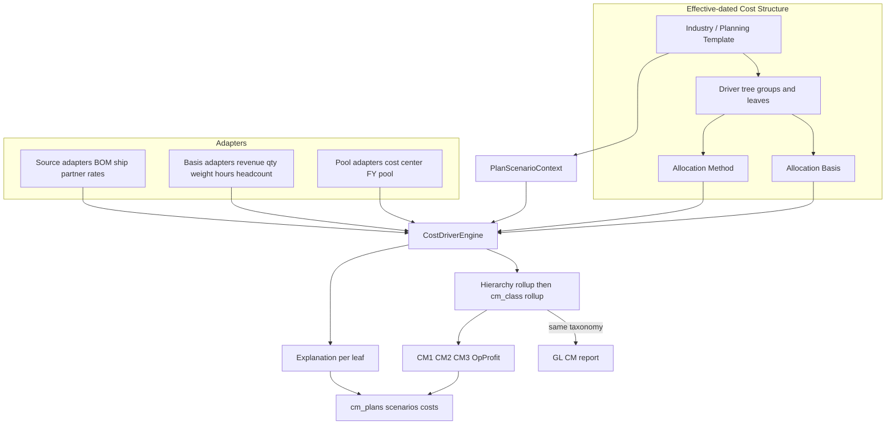

# Contribution Margin Cost Driver Framework

## Verdict

Keep the **document/scenario shell**, **SO/QTN margin gate**, and **GL `Account.cm_class` report** as-is. Replace only the **economics core** — hardcoded `FIXED_DRIVERS` × `% of revenue` in [`waterfall.py`](backend/app/services/cm_planning/waterfall.py) — with a **generic Cost Driver engine** that separates:

1. **Allocation Method** (how the amount is computed / shared)
2. **Allocation Basis** (what the share is proportional to)
3. **Driver Hierarchy** (groups → children for drill-down)
4. **Explanation** (auditable “why is this ₹X?” on every amount)

Results still roll up into the shared five-class taxonomy (`revenue → variable_cost → product_channel_fixed → segment_bu_fixed → corporate_overhead → operating_profit`). MVP `% of revenue` becomes one (method, basis) pair, not a special case.

## Design locks (non-negotiable)

1. **Stable waterfall contract:** CM1 / CM2 / CM3 / OpProfit and the five `cm_class` values remain the public API and GL bridge. Drivers (leaf or group) map *into* classes; companies do **not** invent new CM levels in Phase 1–3.
2. **Method ≠ Basis:** every allocable driver declares both. “5% of revenue” is `method=percentage` + `basis=revenue` + `pct=5`. “Allocate Corporate HR by headcount” is `method=pool_share` + `basis=headcount` + pool ref — **not** a hardcoded revenue %.
3. **Engine has no driver-specific business logic:** `for driver in leaves: method.execute(driver, basis.resolve(ctx), ctx)`. BOM/shipping/partner are **source adapters**; weight/hours/headcount are **basis adapters**.
4. **Hierarchy for UX, flat for math:** only **leaf** drivers produce amounts; **group** drivers = sum of children. Waterfall KPIs use class rollups; UI can expand groups.
5. **Every amount is explainable:** each calculated cost row stores a structured `explanation` (method, basis, pool, inputs, formula string, allocated amount).
6. **MVP compatibility:** existing `allocations` JSONB (`*_pct_of_revenue`) → three leaf drivers with `percentage` + `revenue`.
7. **GL actuals untouched** in Phases 0–2; Est-vs-Actual still joins on `cm_class`.
8. **4-layer rule:** logic only in `backend/app/services/cm_planning/`.



## Current baseline (what we keep)

| Keep | Why |
|---|---|
| [`cm_plans` / scenarios / items / costs](backend/app/models/cm_planning.py) | Document lifecycle + what-ifs; `cm_plan_costs` becomes the explanation carrier |
| Scenario overrides + compare + apply-to-quotation | Core UX value |
| Margin gate in quotation / sales_order services | Policy surface stays |
| [`cm_cost_rates`](backend/app/models/cm_planning.py) | Rate / source input |
| Industry JSON under [`cm_planning_templates/`](backend/data/cm_planning_templates/) | Become full driver trees |
| Frontend plan list/detail/settings shell | Evolve; don’t rebuild nav |

## Target model

### 1. Cost Driver (hierarchical, effective-dated)

| Field | Purpose |
|---|---|
| `code` | Stable id (`material`, `corporate_hr`, `corporate_overhead`, …) |
| `label` | UI label |
| `parent_code` | Nullable; groups children under a parent |
| `is_group` | If true: amount = Σ children; no method/basis execute |
| `cm_class` | One of five classes (required on leaves; groups usually inherit/same) |
| `allocation_method` | Registry key (leaves only) |
| `allocation_basis` | Registry key or null when method needs no basis (`fixed_amount`, `from_source`) |
| `method_params` | JSONB (`pct`, `rate`, `amount`, `pool_ref`, `formula`, …) |
| `basis_params` | JSONB (e.g. custom formula, UOM field mapping) |
| `source` | Source adapter for `from_source`: `bom_material`, `bom_operating`, `valuation`, `shipping_rule`, `sales_partner`, `cost_rate`, `none` |
| `scope` | `line` \| `header` \| `plan` |
| `sort_order` | Sibling order |
| `enabled` / `is_system` | Toggle + seeded flag |
| `valid_from` / `valid_to` | On structure (or driver) for effective dating |

Example tree:

```text
corporate_overhead          (group → cm_class corporate_overhead)
├── corporate_hr            (leaf: pool_share × headcount)
├── corporate_finance       (leaf: pool_share × revenue)
├── corporate_it            (leaf: pool_share × headcount)
└── corporate_legal         (leaf: fixed_amount)

variable_cost               (group → cm_class variable_cost)
├── material                (leaf: from_source bom_material)
├── labor                   (leaf: from_source bom_operating)
├── freight                 (leaf: from_source shipping_rule)
└── packaging               (leaf: from_source cost_rate)
```

Waterfall still: **CM1** = Rev − Σ variable leaves; **CM2/CM3/OpProfit** subtract product / segment / corporate class totals (group or flat leaves).

### 2. Allocation Method × Allocation Basis (orthogonal)

**Methods** (how):

| Method | Needs basis? | Meaning | Phase |
|---|---|---|---|
| `from_source` | No | Amount from source adapter | **1** |
| `fixed_amount` | No | Absolute ₹ | **1** |
| `percentage` | **Yes** | `pct × basis_value` (MVP: pct × revenue) | **1** |
| `rate_times_basis` | **Yes** | `rate × basis_units` (per unit, per hour, …) | **1** |
| `pool_share` | **Yes** | `pool × (object_basis / total_basis)` | **3** (interface in 1) |
| `pct_of_driver` | No* | `pct × another driver’s amount` | **2** |
| `formula` | Optional | Restricted expression | **3** |
| `abc_activity` | Via activity | ABC rate × activity basis | **4** |

\* `pct_of_driver` uses another driver as implicit base, not the Basis library.

**Basis library** (what) — pluggable adapters returning a `BasisResolution` (`value`, `total` for share methods, `unit`, `label`, `inputs`):

| Basis code | Resolves from context | Phase |
|---|---|---|
| `revenue` | Scenario net revenue | **1** |
| `quantity` | Σ line qty | **1** |
| `transaction_count` | 1 per scenario/order (enables per-order) | **1** |
| `weight` | Σ line weight (Item / line field) | **2** |
| `volume` | Σ line volume | **2** |
| `machine_hours` | Estimate or override / routing stub | **2** |
| `labor_hours` | BOM ops / override | **2** |
| `floor_area` | Manual / cost-center attribute | **3** |
| `headcount` | Manual company/CC attribute or HR stub | **3** |
| `storage_days` | Override / logistics stub | **3** |
| `custom_formula` | Sandboxed expression over context | **3** |

MVP translations:

| Today | Method | Basis | Params |
|---|---|---|---|
| `product_channel_fixed_pct_of_revenue: 3` | `percentage` | `revenue` | `pct=3` |
| per-unit fixed (planned, never shipped) | `rate_times_basis` | `quantity` | `rate=…` |
| per-order fee | `fixed_amount` or `rate_times_basis` | `transaction_count` | `amount` / `rate` |

Registry sketch:

```python
# methods/ and bases/ are separate registries
amount, explanation = METHODS[driver.allocation_method].execute(
    driver,
    basis=BASES[driver.allocation_basis].resolve(ctx, driver.basis_params) if driver.allocation_basis else None,
    ctx=ctx,
    prior_amounts=amounts,
)
```

### 3. Explainability (first-class output)

Every leaf amount written to [`cm_plan_costs`](backend/app/models/cm_planning.py) (extend with `explanation` JSONB) must answer **“Why is this ₹2,430?”**:

```json
{
  "driver_code": "corporate_hr",
  "driver_label": "Corporate HR",
  "parent_code": "corporate_overhead",
  "cm_class": "corporate_overhead",
  "method": "pool_share",
  "method_label": "Cost Center Allocation",
  "basis": "revenue",
  "basis_label": "Revenue",
  "basis_value": "48600.00",
  "basis_total": "1000000.00",
  "pool_ref": "corporate_fy26",
  "pool_label": "Corporate FY26",
  "pool_amount": "50000.00",
  "rate_or_pct": null,
  "allocated_amount": "2430.00",
  "formula_display": "50,000 × (48,600 / 1,000,000)",
  "inputs": {
    "revenue": "48600.00",
    "pool_amount": "50000.00"
  }
}
```

For MVP `percentage` + `revenue`:

```json
{
  "method": "percentage",
  "method_label": "Percentage of basis",
  "basis": "revenue",
  "basis_value": "100000.00",
  "rate_or_pct": "5",
  "allocated_amount": "5000.00",
  "formula_display": "5% × revenue 100,000"
}
```

API: include `explanation` on cost rows; plan UI Phase 2 shows a **Why?** drawer. Compare/CSV can optionally export formula_display.

### Scenario denormalized columns

**Do not drop** typed columns in Phase 1. Engine dual-writes:

- Leaf (+ rolled group) amounts into `cm_plan_costs` **with explanations**
- Known codes into existing scenario columns for current UI
- Optional `scenario.driver_tree` JSONB for hierarchy totals

### Templates

Evolve planning templates into **trees** with method + basis:

```json
{
  "id": "manufacturing",
  "drivers": [
    {
      "code": "variable_cost",
      "label": "Variable Cost",
      "is_group": true,
      "cm_class": "variable_cost",
      "children": [
        {"code": "material", "allocation_method": "from_source", "source": "bom_material", "scope": "line"},
        {"code": "labor", "allocation_method": "from_source", "source": "bom_operating", "scope": "line"}
      ]
    },
    {
      "code": "corporate_overhead",
      "is_group": true,
      "cm_class": "corporate_overhead",
      "children": [
        {
          "code": "corporate_overhead_default",
          "allocation_method": "percentage",
          "allocation_basis": "revenue",
          "method_params": {"pct": 5}
        }
      ]
    }
  ],
  "target_cm1_pct": 30,
  "min_cm1_pct": 15
}
```

`apply_planning_template` installs the full structure (not only settings `%` keys). Source preferences that are ignored today become real `source` on leaves.

### Effective dating & reusable planning templates

- Company **Cost Structure** version with `effective_from`; plan stores **`cost_structure_snapshot`** (full tree + method/basis/params) so history doesn’t drift.
- **Reusable Planning Template** = named company-owned clone of a structure (+ targets/policy).

## Phased migration

### Phase 0 — Architecture freeze & fixtures

- Archive this plan under [`docs/plans/`](docs/plans/README.md); update [`docs/accounting/contribution-margin.md`](docs/accounting/contribution-margin.md) and [`cm_planning_engine.plan.md`](docs/plans/cm_planning_engine.plan.md).
- Pure-math tests: method×basis matrix, hierarchy rollup, explanation shape, compat mapper from `*_pct_of_revenue`.

**Exit:** documented contract + tests; zero app behaviour change.

### Phase 1 — Core engine behind existing API (no UX break)

**Data** (migration `0083_cm_cost_structure`):

- `cm_cost_structures` (company, name, template_id, effective_from, is_active)
- `cm_cost_drivers` (structure_id, code, label, parent_code, is_group, cm_class, allocation_method, allocation_basis, method_params, basis_params, source, scope, sort_order, enabled, is_system)
- `cm_plan_costs.explanation` JSONB
- `cm_plans.cost_structure_snapshot` JSONB; keep `allocations` for back-compat

Seed Manufacturing-equivalent tree: variable leaves via `from_source`; three fixed leaves as `percentage` + `revenue` at 3/2/5.

**Services:**

| Module | Role |
|---|---|
| `methods/*.py` | Method registry |
| `bases/*.py` | Basis registry (`revenue`, `quantity`, `transaction_count` first) |
| `engine.py` | Leaf execute → explanations → hierarchy rollup → cm_class rollup → `WaterfallResult` |
| `structure.py` | CRUD / effective resolve / snapshot / apply template |
| `adapters.py` | Source resolution extracted from `estimate.py` |

**API:** existing `/cm-plans/*` unchanged in shape; cost rows gain `explanation`. Lean `GET/PUT /cm-planning/cost-structure`. Settings `allocations` ↔ sync `percentage`/`revenue` params on the three fixed leaves.

**Frontend:** keep % settings + typed waterfall; explanations available in API for later UI.

**Exit:** identical numbers for demo/plans; explanations populated; template `source` honored.

### Phase 2 — Admin UI, hierarchy drill-down, extended bases

- Cost Structure admin: **tree editor**, method + basis dropdowns, params forms.
- Bases: weight, volume, machine_hours, labor_hours (resolve from item/BOM/overrides; missing data → warning, not silent 0 without explanation).
- Plan detail: dynamic waterfall from tree (expand/collapse groups); **Why?** panel bound to `explanation`.
- `keep_manual`; `reprice` + pricing ladder on customer change; company Planning Templates.

**Exit:** Services/SaaS can disable BOM material and use non-revenue bases without code changes; users can audit any leaf amount.

### Phase 3 — Pools, rich bases, variance

- `pool_share` + cost-center / named FY pools; bases headcount, floor_area, storage_days, `custom_formula`.
- Sandboxed `formula` method; plan-vs-GL variance history by `cm_class` (and optionally by driver code when GL tagging allows).
- Child RLS; one open plan per SO; optional `target_cm2_pct` gate.

**Exit:** “Corporate HR → allocate by headcount from pool Corporate FY26” works end-to-end with a full explanation.

### Phase 4 — ABC + AI hooks

- `abc_activity` + activity masters (descriptor-first).
- **RecommendationPort** stub (suggested rate / target CM); no vendor lock-in.
- Dimensional actuals deferred until GL dims exist.

## What deliberately stays out of Phase 1

- Configurable N-level CM taxonomies (GL enum redesign)
- Rewriting Accounts CM report
- Full pool_share / headcount / ABC / AI
- Dropping typed scenario columns
- Why? UI panel (API field only in Phase 1)

## Key files to change

| Area | Files |
|---|---|
| Models / migration | [`cm_planning.py`](backend/app/models/cm_planning.py), new `0083_…` |
| Engine | `methods/`, `bases/`, `engine.py`, `structure.py`, `adapters.py`; slim [`waterfall.py`](backend/app/services/cm_planning/waterfall.py), [`estimate.py`](backend/app/services/cm_planning/estimate.py), [`plan.py`](backend/app/services/cm_planning/plan.py) |
| Schemas / API | [`schemas/cm_planning.py`](backend/app/schemas/cm_planning.py), [`cm_plans.py`](backend/app/api/v1/selling/cm_plans.py) |
| Templates | [`backend/data/cm_planning_templates/*.json`](backend/data/cm_planning_templates/) |
| Tests | [`test_cm_planning.py`](backend/tests/unit/test_cm_planning.py), `test_cm_allocation_methods.py`, `test_cm_allocation_bases.py`, `test_cm_explanations.py` |
| Frontend | Settings + Plan views, [`cm_planning.ts`](frontend/src/types/cm_planning.ts) (Phase 2 Why? + tree) |
| Docs | [`docs/plans/`](docs/plans/README.md), [`contribution-margin.md`](docs/accounting/contribution-margin.md), [`PROJECT.md`](PROJECT.md) |

## Risk controls

- **Golden fixtures:** ₹1000/₹950 compare + 3/2/5% waterfall must stay green through Phase 1.
- **Dual-write:** typed columns + hierarchical costs + explanations.
- **Compat shim:** settings `allocations` ↔ fixed leaves’ `percentage`/`revenue`.
- **Snapshot on seed/recompute:** plans freeze method, basis, hierarchy, and params.
- **Missing basis data:** explanation records `status: incomplete` + warning; never invent silent zeros without trace.

## Success criteria

1. Users who only set the three % fields see no behaviour change.
2. New **method** or **basis** = registry entry only — zero waterfall/GL redesign.
3. “Allocate by headcount” is a basis choice on `pool_share`, not a new hardcoded driver.
4. Hierarchy drill-down without changing CM1/CM2/CM3 contract.
5. Every leaf amount answers “why?” via structured explanation.
6. Industry templates drive sources, methods, bases, and tree shape.
