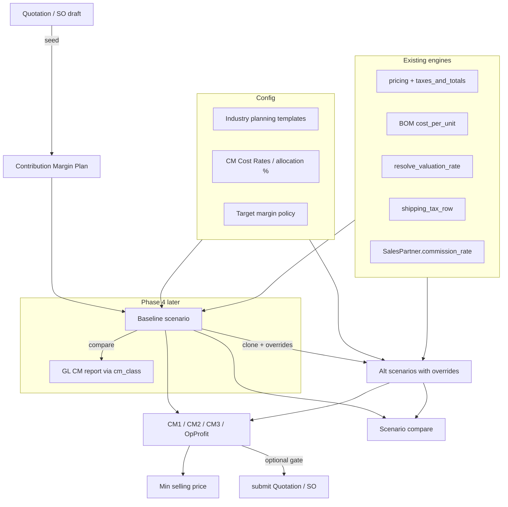

# Pre-sales Contribution Margin Planning Engine

## Verdict

Build a **standalone `Contribution Margin Plan`** document (bespoke service) that snapshots estimated revenue and cost drivers against a Quotation or Sales Order **before confirmation**, with **first-class scenario analysis** (side-by-side what-ifs). Keep the existing GL CM report ([`contribution_margin.py`](backend/app/services/financial_reports/contribution_margin.py), `Account.cm_class`) as the **actuals** waterfall. Do **not** remove or rewrite the GL report.

Rewrite [`docs/plans/contribution_margin_engine.plan.md`](docs/plans/contribution_margin_engine.plan.md) / [`docs/accounting/contribution-margin.md`](docs/accounting/contribution-margin.md) so “planning + scenarios” vs “actuals report” are explicit siblings.



## Design locks

1. **Artifact:** standalone DocType `Contribution Margin Plan` with **named scenarios** as children. Linked to `quotation_id` and/or `sales_order_id`. Plan `docstatus` 0/1/2; scenarios are editable while plan is draft.
2. **Baseline + what-ifs:** seed creates one `is_baseline=true` scenario from the Quotation/SO. Additional scenarios are clones plus a structured **override patch**; the estimate engine re-runs on (baseline inputs ⊕ overrides). Baseline is the source of truth for “current quote”; alts never mutate the Quotation until the user explicitly applies a scenario.
3. **GL report stays** — same five-class taxonomy. Planning cost drivers map into those classes for later Est vs Actual.
4. **Primary UX host:** Quotation first; scenarios panel on OrderForm + full Plan view.
5. **Net revenue base:** line net (ex GST). Freight/commission are cost rows.
6. **Machine-first:** Plan = bespoke service + descriptor for list/permissions. `CM Cost Rate` → descriptor.

## Scenario analysis (core value)

### Example what-ifs (all first-class)

| Lever | Override field | Engine effect |
|---|---|---|
| Selling price ₹1,000 vs ₹950 | `items[].selling_rate` | Recalc revenue / CM% / min price |
| Freight ₹40 vs ₹70 | `freight_amount` or `shipping_rule_id` | Replace freight cost row |
| Material +10% | `material_cost_factor` (e.g. 1.10) | Scale material driver amounts |
| Qty 100 vs 500 | `items[].qty` | Scale revenue + variable costs; re-run freight free-above / allocations |
| Customer A vs B | `customer_id` (+ optional `sales_partner_id`) | Re-resolve selling discounts via [`apply_selling_pricing`](backend/app/services/pricing.py) / blanket; re-resolve commission rate |

### Override patch shape (JSON on scenario)

```json
{
  "customer_id": null,
  "sales_partner_id": null,
  "shipping_rule_id": null,
  "freight_amount": 70,
  "material_cost_factor": 1.10,
  "labor_cost_factor": 1.0,
  "additional_discount_percentage": null,
  "items": [
    { "line_key": "…", "selling_rate": 950, "qty": 500 }
  ]
}
```

- Unset keys inherit baseline. Explicit `null` in API means “clear override / inherit” (store only set keys).
- `line_key` = stable id of `cm_plan_items` on the baseline (or `quotation_item_id`).
- Changing `customer_id` without explicit line rates: re-price each item through the selling pricing ladder for that customer; store resolved rates on the scenario item rows after compute.
- Changing only `selling_rate` / `qty`: do **not** re-price unless `reprice: true` flag on the scenario.

### Compare output

`POST /api/v1/cm-plans/{id}/compare` with `scenario_ids[]` (2–5) returns:

- Per scenario: full waterfall (revenue, drivers, CM1/2/3, op profit, pcts, min selling)
- Diff vs baseline (or vs first id): absolute + Δ% on each total and key drivers
- Rank hint: best CM1%, best operating profit (informational)

Pure function `diff_scenarios(results) -> CmScenarioCompare` — unit-tested with the ₹1000/₹950 style fixtures.

### Apply scenario → Quotation (Phase 2+)

`POST /cm-plans/{id}/scenarios/{sid}/apply-to-quotation`: copies chosen selling rates/qty/discount/partner/shipping onto the **draft** Quotation (does not auto-submit). Blocked if Quotation not draft. Marks scenario `applied_at`.

## Cost model (planning)

| Cost driver | Default source | `cm_class` bucket |
|---|---|---|
| Material | BOM material share / else [`resolve_valuation_rate`](backend/app/services/manufacturing_common.py); × `material_cost_factor` | `variable_cost` |
| Labor / ops | BOM operating_cost; × `labor_cost_factor` | `variable_cost` |
| Freight | shipping rule / override `freight_amount`; pro-rata by line net | `variable_cost` |
| Commission | partner rate × net (customer/partner from scenario) | `variable_cost` |
| Packaging | `CM Cost Rate` master | `variable_cost` |
| Product/channel fixed | % of revenue or per-unit from template/settings | `product_channel_fixed` |
| Segment/BU fixed | Same | `segment_bu_fixed` |
| Corporate OH | Same | `corporate_overhead` |

Waterfall:

- **CM1** = Revenue − Σ variable drivers  
- **CM2** = CM1 − product/channel fixed  
- **CM3** = CM2 − segment/BU fixed  
- **Operating profit** = CM3 − corporate overhead  

Manual cost-row overrides (`source=manual`) allowed on a scenario; recompute with `keep_manual=true` preserves them.

## Min selling price / target margins

Targets on plan/settings: `target_cm1_pct`, optional `target_cm2_pct`, `min_cm1_pct`.

\[
\text{min\_selling} = V / (1 - t)
\]

Computed **per scenario** (and per line). Submit policy `off | warn | block` (default `warn`) evaluates the **baseline** scenario (or last-applied) against `min_cm1_pct`.

## Schema (migration after `0080`)

**`cm_plans`:** `quotation_id?`, `sales_order_id?`, `template_id`, policy snapshot (`target_cm1_pct`, `min_cm1_pct`, `submit_policy`), `warnings` JSON. Naming series e.g. `CMP-.YYYY.-`.

**`cm_plan_scenarios`:** `cm_plan_id`, `name` (“Baseline”, “Price −5%”, “Qty 500”), `is_baseline`, `sort_order`, `overrides` JSONB, `customer_id?`, `sales_partner_id?`, `shipping_rule_id?`, rolled-up money fields (`revenue`, drivers, `cm1/2/3`, `operating_profit`, pcts, `min_selling_total`), `applied_at?`.

**`cm_plan_items`:** `cm_plan_scenario_id`, `line_key`, `item_id`, `qty`, `selling_rate`, `selling_amount`, `quotation_item_id?`, per-line CM + `min_selling_rate`.

**`cm_plan_costs`:** `cm_plan_scenario_id`, optional `cm_plan_item_id`, `driver`, `cm_class`, `amount`, `source`, `rate`, `qty`, `notes`.

**`cm_cost_rates`:** descriptor master (packaging etc.).

Also: nullable **`shipping_rule_id`** on `quotations` / `sales_orders` for deterministic freight.

**Settings** `system_settings.cm_planning` (separate from report key `contribution_margin`):

```json
{
  "target_cm1_pct": 35,
  "target_cm2_pct": 25,
  "min_cm1_pct": 15,
  "submit_policy": "warn",
  "default_template": "manufacturing",
  "max_scenarios_per_plan": 10,
  "allocations": {
    "product_channel_fixed_pct_of_revenue": 3,
    "segment_bu_fixed_pct_of_revenue": 2,
    "corporate_overhead_pct_of_revenue": 5
  }
}
```

Partial unique: one baseline per plan; one draft plan per quotation (`quotation_id WHERE docstatus=0`).

## Backend services

| Module | Role |
|---|---|
| `backend/app/services/cm_planning/` | `estimate.py` (drivers), `waterfall.py` (pure math + min price), `scenario.py` (clone, apply overrides, compare/diff), `plan.py` (CRUD/submit), `seed.py`, `templates.py`, `apply_to_quotation.py` |
| Keep | GL `contribution_margin.py` + `cm_classification.py` |

Estimate pipeline (shared by baseline seed and scenario recompute):

1. Resolve party context (customer / partner / shipping) from scenario ⊕ overrides.
2. Build line qty/rates (override or reprice).
3. Resolve material/labor/freight/commission/packaging/allocations.
4. Persist item + cost rows; write waterfall totals on scenario.

APIs:

- `POST /cm-plans/from-quotation/{id}` — plan + baseline scenario
- `POST /cm-plans/from-sales-order/{id}`
- `POST /cm-plans/preview` — ephemeral baseline (no persist)
- `POST /cm-plans/{id}/scenarios` — `{ name, clone_from_scenario_id?, overrides }`
- `PUT /cm-plans/{id}/scenarios/{sid}` — update overrides → recompute
- `POST /cm-plans/{id}/scenarios/{sid}/recompute`
- `POST /cm-plans/{id}/compare` — `{ scenario_ids }`
- `POST /cm-plans/{id}/scenarios/{sid}/apply-to-quotation`
- CRUD/submit/cancel plan; templates + settings
- Submit Quotation/SO: `assert_margin_policy` on baseline

## Industry planning templates

`backend/data/cm_planning_templates/` (not CoA `cm_templates/`): driver prefs, default allocations, default targets. Industries: manufacturing, retail, saas, services, hospitality.

## Frontend

- `ContributionMarginPlanView.vue`: waterfall for selected scenario; scenario list; “New scenario” with override form (price, freight, material %, qty, customer); **compare table** (columns = scenarios).
- [`OrderFormView.vue`](frontend/src/views/trade/OrderFormView.vue): CM panel — Estimate, open plan, quick compare of 2 scenarios, show CM1–3 + Δ vs baseline; keep fulfillment CTP panel separate.
- Workspace: Selling → CM Plans; Accounts → Reports still has GL CM.

## Estimated vs Actual (Phase 4)

`GET /cm-plans/{id}/actual-comparison` — baseline (or selected) scenario vs GL CM report for a date range. Lean: deal estimate vs company actuals. Voucher-level deferred.

## Phases

### Phase 0 — Docs + fixtures
- Reframe docs; unit fixtures for waterfall, min price, and **scenario diff** (₹1000 vs ₹950, freight 40 vs 70, material ×1.1, qty 100 vs 500).

### Phase 1 — Plan + baseline scenario
- Migration (plans/scenarios/items/costs + `shipping_rule_id`); seed baseline from Quotation; recompute; CRUD/submit; driver unit tests.

### Phase 2 — Scenarios + pricing UX (MVP value)
- Clone scenario + overrides; compare API; min selling; templates/settings; OrderForm panel; apply-to-quotation; submit `warn`.

### Phase 3 — Harden
- SO seed/link; `cm_cost_rates`; `block` policy; demo seed with 2–3 scenarios; CSV export of compare.

### Phase 4 — Estimated vs Actual
- [x] Lean variance vs GL CM (`actual-comparison` + plan UI); company CM settings UI; per-plan allocations snapshot (`0082`).

## Out of scope (MVP)

- Auto-writing Pricing Rules from scenarios.
- Monte-Carlo / solver optimization across levers.
- True ABC overhead engines.
- Removing GL CM report / `Account.cm_class`.

## Key reuse

- BOM / valuation: [`bom.py`](backend/app/services/bom.py), [`resolve_valuation_rate`](backend/app/services/manufacturing_common.py)
- Price / customer discounts: [`pricing.py`](backend/app/services/pricing.py), blanket rates
- Freight: [`shipping.py`](backend/app/services/shipping.py)
- Commission: `SalesPartner.commission_rate` (wire into estimate)
- Pattern: worksheet doc with children (Income Tax Computation style)
