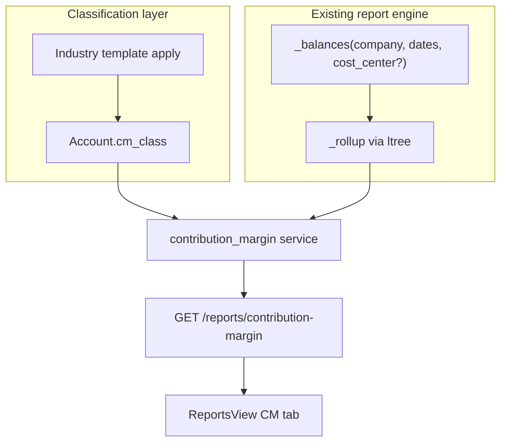

# Contribution Margin Reporting Engine

## Verdict

Ship CM as a **classification layer over the existing P&L engine**, not a new ledger. Tag each P&L leaf account with one of five `cm_class` values; reuse [`_balances` / `_rollup` / `_statement_rows`](backend/app/services/financial_reports/_helpers.py) to aggregate GL; present a structured CM waterfall. **v1 = company-wide + optional Cost Center filter.** Product/Branch slices wait for Accounting Dimensions ([docs/accounting/04-accounts-setup.md](docs/accounting/04-accounts-setup.md))—those columns do not exist on GL today.



## Current architecture (constraints)

| Layer | Today | Implication for CM |
|---|---|---|
| CoA | `root_type`, `report_type`, free-text `account_type` + unused `account_category` | Do **not** overload `account_category` (Schedule-III labels). Add dedicated `cm_class`. |
| GL | Append-only; dims = `account_id`, `cost_center_id`, party | Only Cost Center is usable for filter/breakdown without schema on `gl_entries`. |
| P&L | Date-range, aggregate by account tree / Income vs Expense — **ignores** cost center | Extend helpers; keep statutory P&L unchanged. |
| Gross Profit | Invoice lines × stock valuation — not GL | Complementary item margin; **not** a substitute for CM. |
| Branch / Product on GL | Absent | Out of v1 dimensional scope. |
| Account API | CRUD omits `account_category` | Expose `cm_class` on Account create/update/response. |

Key reuse targets: [`statements.profit_and_loss`](backend/app/services/financial_reports/statements.py), [`_helpers._balances`](backend/app/services/financial_reports/_helpers.py), report router [`api/v1/accounts/reports.py`](backend/app/api/v1/accounts/reports.py), UI hub [`ReportsView.vue`](frontend/src/views/accounts/ReportsView.vue).

## Report structure (3-level CM)

| Section | `cm_class` | Formula |
|---|---|---|
| Revenue | `revenue` | Σ credits (sign-normalized like P&L income) |
| − Variable costs | `variable_cost` | |
| **= CM1** | | Revenue − Variable |
| − Product / Channel fixed | `product_channel_fixed` | |
| **= CM2** | | CM1 − Product/Channel fixed |
| − Segment / BU fixed | `segment_bu_fixed` | |
| **= CM3** | | CM2 − Segment/BU fixed |
| − Corporate overhead | `corporate_overhead` | |
| **= Operating profit** | | CM3 − Corporate OH |

Each section lists leaf (and optional group) account rows identical in spirit to `FinancialStatementRow`, plus section totals and CM%. Unclassified P&L balances surface in an **Unclassified** bucket (configurable: warn vs exclude vs force-map).

Industry-agnostic: the five classes are fixed; **which accounts map to which class is company data**, seeded from optional industry templates (manufacturing COGS→variable; SaaS hosting→variable; retail store rent→product_channel_fixed; HQ rent→corporate_overhead; etc.).

---

## Design decisions (locked)

1. **Schema: one column on `accounts`**, not a separate mapping table — minimal change, joins free for reports. Nullable enum; null = unclassified.
2. **Do not change `gl_entries`** in v1. No Product/Branch FKs. Optional `cost_center_id` query param filters existing GL rows.
3. **Statutory P&L / BS / ITR seeding stay untouched** — CM is an additive report.
4. **Templates are apply-once suggestions** stored as JSON under `backend/data/cm_templates/` (pattern match on `account_type` / `account_category` / name keywords), not hardwired into CoA seed.
5. **Gross Profit remains the item-level margin report**; CM docs will cross-link, not merge engines.
6. **Cost Center hierarchy is not auto-mapped to CM levels** — CM level comes from the *account* tag. CC filter only scopes which postings contribute (e.g. “CM for Main plant”).

---

## Database changes

**Migration (single Alembic revision):**

```sql
-- PostgreSQL enum
CREATE TYPE cm_class AS ENUM (
  'revenue',
  'variable_cost',
  'product_channel_fixed',
  'segment_bu_fixed',
  'corporate_overhead'
);
ALTER TABLE accounts ADD COLUMN cm_class cm_class NULL;
CREATE INDEX ix_accounts_company_cm_class ON accounts (company_id, cm_class);
```

**Optional (same migration or tiny follow-up):** store company CM prefs in existing [`system_settings`](backend/app/models/core.py) JSON key `contribution_margin` (or a dedicated row pattern already used for income-tax settings):

```json
{
  "unclassified_policy": "bucket",   // bucket | exclude | error
  "show_zero_rows": false,
  "applied_template": "manufacturing"
}
```

No new tenant tables. No changes to Cost Center / Fiscal Year / Period Closing.

**Backfill:** leave `cm_class` null; optional post-migrate script or Settings “Apply template” endpoint fills suggestions. India CoA `account_category` values (`Revenue from Operations`, `Cost of Goods Sold`, `Operating Expenses`, `Finance Costs`, …) make good heuristic seeds for `in_standard` companies.

---

## Backend changes

### Models / schemas
- [`Account`](backend/app/models/accounts/masters.py): `cm_class: Mapped[str | None]`
- [`AccountCreate` / `Update` / `Response`](backend/app/schemas/accounts/masters.py): add optional `cm_class`
- New report DTOs in [`schemas/accounts/reports.py`](backend/app/schemas/accounts/reports.py):
  - `ContributionMarginSection` — `cm_class`, `label`, `rows: list[FinancialStatementRow]`, `total`, `pct_of_revenue`
  - `ContributionMarginReport` — `from_date`, `to_date`, `cost_center_id?`, `sections[]`, `cm1`, `cm2`, `cm3`, `operating_profit`, `cm1_pct`, `cm2_pct`, `cm3_pct`, `unclassified_total`, `warnings[]`

### Helpers (extend, don’t fork)
- `_balances(..., cost_center_id: uuid.UUID | None = None)` — add optional `GLEntry.cost_center_id == …` (and later `IN` for CC subtree if needed).
- Keep `_rollup` / `_statement_rows` as-is; CM service groups leaf nets by `account.cm_class` after balances.

### New service
- `backend/app/services/financial_reports/contribution_margin.py`
  - `contribution_margin(db, company_id, from_date, to_date, cost_center_id=None) -> ContributionMarginReport`
  - Sign rules: Income-like (`revenue`) credit-positive; expense classes debit-positive — mirror P&L.
  - Only accounts with `report_type == "Profit and Loss"` participate.
  - Export from [`financial_reports/__init__.py`](backend/app/services/financial_reports/__init__.py).

### Classification / templates service
- `backend/app/services/cm_classification.py`
  - `apply_cm_template(db, company_id, template_id, overwrite: bool)` — sets `cm_class` on matching leaves; never touches BS accounts.
  - `list_cm_templates()`, `get_unclassified_pnl_accounts(company_id)`.
  - Bulk PATCH helper for Account list (or reuse account update).

### APIs (thin routers — logic in services)

| Method | Path | Purpose |
|---|---|---|
| `GET` | `/api/v1/reports/contribution-margin?from_date&to_date&cost_center_id?` | Main report |
| `GET` | `/api/v1/contribution-margin/templates` | List industry templates |
| `POST` | `/api/v1/contribution-margin/apply-template` | `{ template_id, overwrite }` |
| `GET` | `/api/v1/contribution-margin/unclassified` | P&L leaves with null `cm_class` + period activity hint |
| `PATCH` | `/api/v1/accounts/{id}` | Already exists — add `cm_class` field |

Permissions: same as other reports (`require_permission` on Financial Report / Account read-write as used today).

### Unit tests
- Pure classification + waterfall math (no DB): sample account map + fake balances → CM1/CM2/CM3.
- Template heuristics for 1–2 industries.
- `_balances` cost-center filter does not alter default P&L when filter omitted.

---

## Frontend changes

1. **[`ReportsView.vue`](frontend/src/views/accounts/ReportsView.vue)** — new tab `contribution-margin`:
   - Filters: `from_date`, `to_date`, optional Cost Center picker (engine list `/m/cost-center` or existing accounts store pattern).
   - Waterfall: section headers, account rows with indent, totals, CM%, unclassified callout with link to classification UI.
2. **Classification UX** (minimal):
   - Prefer extending [`ChartOfAccountsView.vue`](frontend/src/views/accounts/ChartOfAccountsView.vue) / Account form with a **CM Class** select on P&L leaves.
   - Settings strip or Accounts workspace card: “Apply industry template” + list unclassified.
3. **Types** in [`frontend/src/types/accounts.ts`](frontend/src/types/accounts.ts); workspace deep-link `?tab=contribution-margin` in [`workspaces.ts`](frontend/src/config/workspaces.ts).

Stay inside existing Accounting visual language (tables/filters like P&L)—no new design system.

---

## Industry templates (examples)

Stored as declarative JSON, e.g. `backend/data/cm_templates/manufacturing.json`:

```json
{
  "id": "manufacturing",
  "label": "Manufacturing",
  "rules": [
    { "match": { "account_category": "Revenue from Operations" }, "cm_class": "revenue" },
    { "match": { "account_type": "Cost of Goods Sold" }, "cm_class": "variable_cost" },
    { "match": { "account_category": "Operating Expenses", "name_contains": ["Freight", "Power"] }, "cm_class": "variable_cost" },
    { "match": { "name_contains": ["Depreciation"] }, "cm_class": "product_channel_fixed" },
    { "match": { "name_contains": ["Rent", "Admin"] }, "cm_class": "corporate_overhead" }
  ]
}
```

Similar files: `retail`, `saas`, `services`, `hospitality`. Rules are hints; finance owns final mapping. Order: first match wins; `overwrite=false` skips already-set accounts.

---

## Dependencies

| Depends on | Status |
|---|---|
| GL + CoA + Fiscal posting dates | Done |
| P&L helpers | Done — extend `_balances` only |
| Cost Center on invoice/JE → GL | Done (often sparse — see edge cases) |
| Account CRUD + CoA UI | Backend done; CoA UI thin — CM class field still shippable via API + report warnings |
| Accounting Dimensions (Product/Branch) | **Not required for v1**; document as Phase 4 |
| Gross Profit / stock valuation | Independent; no hard dependency |
| Period Closing | Irrelevant to period P&L/CM math (same as statutory P&L) |

---

## Edge cases

- **Unclassified P&L activity:** per settings — `bucket` (default), `exclude` (silent understatement — warn), or `error` (400 with account list).
- **BS / Equity tagged by mistake:** ignore in CM; validate on Account save (`cm_class` only allowed when `report_type == Profit and Loss"`).
- **Group accounts:** store `cm_class` only on leaves (or inherit for display only); totals always from leaves to avoid double-count (same rule as P&L).
- **Missing cost center on GL lines:** filter excludes them when `cost_center_id` set — surface `warnings: ["N postings lack cost center"]`; recommend company default CC on invoice lines (already used for round-off).
- **Taxes / round-off / FX:** template usually maps tax expense → corporate or exclude; GST input/output are BS — out of CM.
- **Returns / credit notes:** already in GL net — CM follows P&L signs.
- **Multi-currency:** report in company currency (`debit`/`credit`), same as P&L.
- **CM vs Gross Profit divergence:** GP uses current valuation COGS; CM uses booked expense accounts — document as expected.
- **ITR / book profit:** continue seeding from statutory P&L, never from CM.

---

## Migration strategy

1. Ship migration with nullable `cm_class` — **zero breakage**.
2. Deploy backend + empty CM report (all unclassified → warning).
3. Seed templates in repo; Settings “Apply template” for demo/India CoA companies.
4. Optional: soft prompt in CM tab until unclassified activity = 0.
5. No data backfill required for historical GL; classification is metadata on accounts.

---

## Implementation phases

### Phase 0 — Spec & fixtures (no production report yet)
- Finalize enum + DTO shapes; add 2–3 industry JSON templates; unit-test waterfall math with fixtures.

### Phase 1 — Core engine (MVP)
- Migration `cm_class`; Account schema/API; extend `_balances`; `contribution_margin` service + `GET /reports/contribution-margin`; unit tests; ReportsView tab (period only).

### Phase 2 — Configurability
- Templates list + apply-template; unclassified endpoint; CoA / Account UI field; settings `unclassified_policy`; Cost Center filter on report + helper.

### Phase 3 — Hardening
- Warnings for null CC when filtered; CSV export (mirror ITR/report CSV style if desired); demo seed mapping for India CoA; docs in `docs/accounting/` + PROJECT.md todo.

### Phase 4 — Dimensional CM (explicitly later)
- When Accounting Dimensions land (Project/Branch) or item is posted to GL: add optional dimension filters to `_balances` and CM breakdown-by-dimension endpoints. Until then, product margin stays on Gross Profit; org slice stays on Cost Center.

---

## Docs to update (when coding starts)

- New short guide: `docs/accounting/contribution-margin.md` (structure, templates, vs Gross Profit / P&L).
- Touch [docs/accounting/03-financial-reports.md](docs/accounting/03-financial-reports.md) inventory row.
- [PROJECT.md](PROJECT.md) Remaining Todo — optional USP/accounting line under financial reports.

## Out of scope (v1)

- Changing GL immutability or posting rules.
- Auto-allocating corporate overhead across cost centers.
- Replacing Gross Profit or statutory P&L.
- Branch / Product GL dimensions.
- True APS-style product P&L from manufacturing WIP (separate manufacturing analytics).
