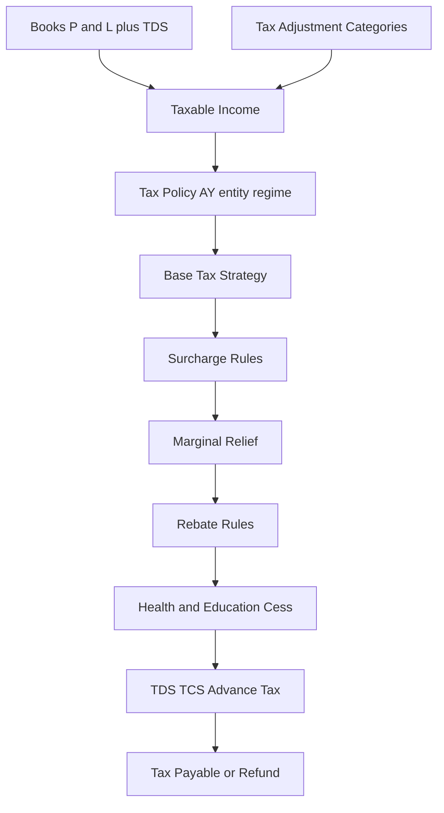

# Income Tax Engine Refactor

## Current state (what changes)

Today [`compute_tax_pack`](backend/app/services/income_tax_computation.py) does:

`book_profit + adjustments → flat tax_rate × surcharge_rate × cess_rate → credits`

All three rates live on one master: [`IncomeTaxRateTable`](backend/app/models/compliance.py) (`income_tax_rate_tables`). Proprietor is seeded as a flat 30% proxy. There are **no** slabs, threshold surcharge, marginal relief, 87A, or special-rate heads.

Target: keep the worksheet + adjustment categories; replace the tax-math core with a **policy-selected strategy** fed only from master data.



## Architecture decisions (locked)

1. **Masters stay machine-first** — new tables get descriptors in [`descriptors.py`](backend/app/registry/descriptors.py); list/form at `/m/<slug>`. Heavy math stays in services.
2. **`Income Tax Rate Table` = flat entities only** — drop `surcharge_rate` / `cess_rate` from this table (migrate existing seed values into the new surcharge/cess masters). Unique key remains `(company_id, AY, entity_type, filing_regime)`.
3. **`Tax Policy` is the router** — one row per `(company_id, AY, entity_type, filing_regime)` with `computation_method` ∈ `FlatRate | SlabBased | RuleBased`, plus FKs/links to the rule packs used for that combo.
4. **Strategies are code modules; parameters are data** — Python implements algorithms (progressive slabs, threshold surcharge, marginal relief formula, rebate cap); every number (slab bands, %, thresholds, rebate max income/amount) comes from masters. No hardcoded AY rates in services.
5. **AY + effective dating on every rule master** — `assessment_year` (required) + optional `effective_from` / `effective_to` for mid-year / future changes. Resolution: match AY, then pick the pack effective on the computation `to_date` (or `as_of`).
6. **Audit snapshot on submit** — store `policy_id`, `computation_method`, and a JSON `tax_breakdown` (slab steps, surcharge before/after relief, rebate code, cess base) on the computation so historical filings do not drift when masters change.
7. **Special rates = RuleBased path** — separate income lines taxed at special rates; residual ordinary income uses Flat or Slab per policy. Computation gains a child table for special-rate buckets (amount entered; rate from master). Full automated capital-gains schedule from books is **out of this refactor**.
8. **Form 16 / employee payroll tax** remains out of scope (per existing ITR plan). This engine serves **entity** worksheets; `Individual`/`Proprietor` use slab masters for business taxable income, not salary Form 16.
9. **TCS credit** becomes its own field on the computation (`tcs_credit`); pipeline: `total_tax − tds − tcs − advance_tax`.

## New master tables

All company-scoped, `disabled` flag, seeded per AY via [`income_tax_masters.py`](backend/app/services/income_tax_masters.py) / seed script.

| Master | Purpose | Key fields |
|--------|---------|------------|
| **Tax Policy** | Selects method + links rule packs | `assessment_year`, `entity_type`, `filing_regime`, `computation_method`, optional FKs to rate table / slab set / surcharge set / cess rule / rebate set; `effective_from`/`to` |
| **Income Tax Slab Set** + **Slab Line** (child) | Progressive bands | Parent: AY, entity_type, regime, name. Child: `from_amount`, `to_amount` (null = open), `rate_percent`, `idx` |
| **Surcharge Rule Set** + **Surcharge Bracket** | Threshold surcharge + marginal relief flag | Bracket: `income_from`, `income_to`, `rate_percent`; set: `marginal_relief_enabled` |
| **Health & Education Cess Rule** | Cess % and base | `cess_rate`, `base` ∈ `TaxPlusSurcharge` (default) |
| **Rebate Rule** | e.g. 87A | `section_code`, `max_taxable_income`, `max_rebate_amount`, `regime` filter |
| **Special Income Tax Rate** | CG / lottery / crypto etc. | `income_category_code`, `rate_percent`, AY, regime; optional `description` |
| **Income Tax Rate Table** (kept, slimmed) | Flat % only | `tax_rate` only (+ AY/entity/regime) |

**Tax Adjustment Category** — unchanged; still applied before tax.

Entity types on policy/slabs: extend select options to `Company | Proprietor | Individual | Firm | LLP` (Individual and Proprietor both slab-capable; Company/Firm/LLP default FlatRate in seed).

## Engine module layout

Replace monolithic `compute_tax_pack` with a package:

```
backend/app/services/income_tax_engine/
  __init__.py          # run_pipeline(...) public entry
  context.py           # TaxContext dataclass (inputs + resolved masters)
  pipeline.py          # ordered steps matching the required pipeline
  strategies/
    flat_rate.py
    slab_based.py
    rule_based.py      # special lines + ordinary residual via nested strategy
  surcharge.py         # brackets + marginal relief
  rebate.py
  cess.py
  resolve.py           # load Tax Policy + related masters for company/AY/as_of
```

**Pipeline** ([`pipeline.py`](backend/app/services/income_tax_engine/pipeline.py)):

1. `taxable_income = book_profit + net_adjustments` (existing adjustment math)
2. Resolve **Tax Policy** (fail clearly if missing)
3. Partition special-rate lines → `special_tax`; ordinary base = taxable − special amounts (floored rules documented in code)
4. **Base tax** via strategy (`FlatRate` / `SlabBased`; `RuleBased` = special + ordinary strategy)
5. **Surcharge** on tax (or on income thresholds per bracket master) → optional **marginal relief**
6. **Rebate** (reduce tax, not below zero) — e.g. 87A when taxable ≤ max and regime matches
7. **Cess** on (tax − rebate + surcharge_after_relief) or per cess `base` field
8. Credits: TDS + TCS + advance tax → `tax_payable`

Router/service layer ([`income_tax_computation.py`](backend/app/services/income_tax_computation.py)) stays thin: load doc → call `run_pipeline` → persist amounts + breakdown.

## Computation document changes

Extend [`IncomeTaxComputation`](backend/app/models/compliance.py):

- `policy_id`, `computation_method` (denormalized snapshot)
- `rebate_amount`, `marginal_relief_amount`, `tcs_credit`
- `tax_breakdown` JSONB (audit trail)
- Keep existing amount columns for UI/export compatibility
- Child: `IncomeTaxSpecialIncomeLine` (`category_code` / FK to special rate, `amount`, `tax_amount`)

UI ([`IncomeTaxView.vue`](frontend/src/views/compliance/IncomeTaxView.vue)): show strategy, rebate, marginal relief, TCS, breakdown panel; link to Tax Policy / masters.

## Migration & seed strategy

1. New Alembic revision (after current HEAD): create new tables; add computation columns; **migrate** rate-table surcharge/cess into default cess rule + single-bracket surcharge set per existing rate row; backfill Tax Policy `FlatRate` for each existing rate row; then drop surcharge/cess columns from `income_tax_rate_tables`.
2. Seed AY packs (e.g. 2024-25…2026-27) for:
   - Company/Firm/LLP → FlatRate + surcharge brackets where applicable + 4% cess
   - Proprietor/Individual Normal & New → SlabBased bands + 87A rebate rows + surcharge brackets with marginal relief enabled
3. Update unit tests in [`test_income_tax_computation.py`](backend/tests/unit/test_income_tax_computation.py): flat corporate regression + new slab / surcharge relief / 87A cases (all numbers from fixtures, not magic constants in the engine).

## Phased delivery

| Phase | Deliverable |
|-------|-------------|
| **R0 — Schema & masters** | Models, migration, descriptors, slim rate table, Tax Policy + all rule masters, seed backfill |
| **R1 — Engine pipeline** | `income_tax_engine` package; wire computation service; FlatRate path parity with today’s results; persist breakdown |
| **R2 — Slab + surcharge + rebate + cess** | SlabBased strategy; threshold surcharge + marginal relief; 87A; cess from master; computation UI fields |
| **R3 — Special rates** | Special rate master + computation child lines; RuleBased strategy; residual ordinary tax |
| **R4 — Docs & smoke** | Update [`docs/ITR_GAP_AND_PLAN.md`](docs/ITR_GAP_AND_PLAN.md) + `PROJECT.md`; seed script + unit/smoke coverage |

R0–R1 preserve existing Company computations. R2 unlocks proprietor/individual slab accuracy. R3 enables CG/lottery/crypto buckets without hardcoding.

## Files to touch (primary)

- Models/schemas: [`backend/app/models/compliance.py`](backend/app/models/compliance.py), [`backend/app/schemas/compliance.py`](backend/app/schemas/compliance.py)
- Engine: new `backend/app/services/income_tax_engine/`; refactor [`income_tax_computation.py`](backend/app/services/income_tax_computation.py), [`income_tax_masters.py`](backend/app/services/income_tax_masters.py)
- Registry: [`descriptors.py`](backend/app/registry/descriptors.py)
- Migration: new version under `backend/migrations/versions/`
- Frontend: [`IncomeTaxView.vue`](frontend/src/views/compliance/IncomeTaxView.vue), [`compliance.ts`](frontend/src/types/compliance.ts)
- Docs: `docs/ITR_GAP_AND_PLAN.md`, `PROJECT.md`

## Explicit non-goals (this refactor)

- Live portal / DSC e-file
- Employee Form 16 / 24Q / payroll slabs
- Full MAT/AMT engine
- Auto-deriving capital-gains amounts from stock/asset ledgers
- Hardcoded Finance Act rates in Python
