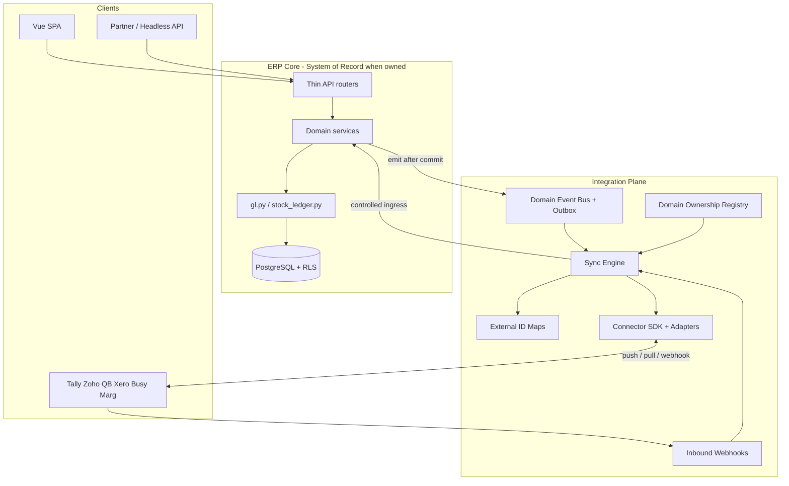
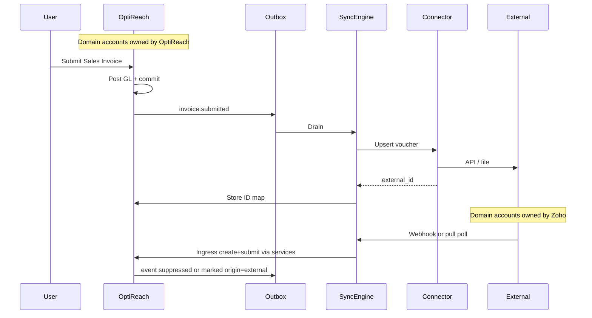

# External Accounting Integration Architecture

## Verdict

OptiReach today is a **strong internal ledger engine**, not an integration platform. The 4-layer stack, append-only GL/SLE, voucher lifecycle, and multi-tenant RLS are excellent foundations. What is missing is a **domain-ownership model**, a **durable sync spine** (events + outbox + mappings), and a **connector SDK**. Those should be designed and partially landed **before** shipping Tally/Zoho/QB adapters — otherwise every connector will reinvent sync, conflict, and SoR rules.

Do **not** treat integrations as “export CSV from invoices.” Treat them as a first-class **Integration Plane** beside the ERP core.

---

## Current state (what the codebase already gives you)

**Strengths to keep**
- Clear boundaries: thin routers → [`backend/app/services/`](backend/app/services/) → pure models; logic never in routers/models ([`PROJECT.md`](PROJECT.md)).
- Single writers: [`gl.py`](backend/app/services/gl.py) (`make_gl_entries` / reverse) and [`stock_ledger.py`](backend/app/services/stock_ledger.py) — ideal choke points for “something financially real happened.”
- Append-only ledgers + cancel-by-reversal (DB triggers) — natural CDC/sync semantics.
- Proven **provider Protocol** pattern for India compliance: [`gsp.py`](backend/app/services/gsp.py), [`itr_efile.py`](backend/app/services/itr_efile.py).
- SaaS todos already name API keys, rate limits, webhooks ([`docs/erpnext_migration_prompt.md`](docs/erpnext_migration_prompt.md) §5.2).
- Redis + APScheduler present (usable later for workers / schedules).

**Weaknesses that block bidirectional coexistence**
- No domain events, transactional outbox, webhooks, or post-submit dispatcher (submit/cancel are inline; `log_audit` is not a sync bus).
- No connector package, credential store, ID mappings, sync cursors, or conflict policy.
- No API-key / OAuth surface for headless tenants or partner apps.
- Registry engine hooks are master-only (`before_insert` / `validate`) — **not** `on_submit` / `on_cancel` ([`registry/base.py`](backend/app/registry/base.py)).
- “Tally” today = line-item CSV in UI ([`DataEntry.vue`](frontend/src/components/shared/DataEntry.vue)), not voucher sync.
- In-process APScheduler ≠ durable retry/backpressure for flaky external APIs.
- Module flags exist for manufacturing; there is **no per-domain SoR / ownership** concept for “books live in Zoho, stock lives here.”

---

## Product model to encode in architecture

Align with your vision: **headless + modular + tenant-chosen SoR per domain**.

| Domain (examples) | May be owned by OptiReach | May be owned by external app |
|---|---|---|
| Chart of Accounts / journals | yes | Tally, Zoho Books, QB, Xero |
| AR/AP invoices & payments | yes | same |
| Inventory / warehouses | yes | Zoho Inventory, Busy, Marg |
| Selling / buying ops | yes | often OptiReach while books stay external |
| Manufacturing / shop floor | usually OptiReach | rarely external accounting apps |

**Rules the platform must enforce**
1. **Per-tenant, per-domain ownership** — e.g. `accounts=external:zoho_books`, `stock=optireach`, `selling=optireach`.
2. **Write authority** — only the owner domain accepts primary writes; non-owners accept **sync writes** through a controlled ingress path (never bypass taxes/ledgers by raw GL inserts from outside).
3. **Gradual migration** — ownership can flip domain-by-domain (import → dual-run → cutover).
4. **Complete replacement** — when all domains = OptiReach, connectors become optional mirrors or are disabled.
5. **No forced workflow** — UI and APIs must degrade gracefully when a domain is externally owned (read-only UI, or “synced from Zoho” badges).

This is the critical pre-connector change: without ownership, bidirectional sync has no conflict policy.

---

## Target architecture



### Layer responsibilities

**1. Domain Ownership Registry** (new, company-scoped)
- Table/config: `domain` → `owner` (`optireach` | `external`) + `connector_id` + conflict policy.
- Checked by services (or a thin guard) before accepting user writes vs sync writes.
- Surfaced in onboarding and Settings UI.

**2. Domain Event + Transactional Outbox** (new spine)
- After successful submit/cancel (and master create/update where relevant), write an **outbox row in the same DB transaction** as the voucher commit.
- Event shape: `{event_id, company_id, domain, aggregate_type, aggregate_id, action, occurred_at, payload_ref/version}`.
- Worker drains outbox → Sync Engine (at-least-once; idempotent handlers).
- Prefer this over calling connectors inside `submit_sales_invoice` (keeps HTTP submit fast; survives retries).

**Minimal choke-point strategy (do not spray emits everywhere):**
- Emit from shared post-commit helpers called by voucher services, **plus** one emit path next to `make_gl_entries` / `make_sl_entries` for “ledger materialized” facts when needed for reconciliation.
- Do **not** rely on the metadata engine for transaction events.

**3. Sync Engine** (orchestration, connector-agnostic)
- Responsibilities: cursor/watermark, batching, retry/backoff, dead-letter, direction filtering by ownership, conflict detection, idempotency keys.
- Modes per connection: `push`, `pull`, `webhook`, `file` (Tally XML/CSV where APIs are weak).
- Stores `sync_run`, `sync_cursor`, `sync_item` (status, external ref, error).

**4. External Identity Maps**
- `(company_id, connector, entity_type, local_id) ↔ external_id` (+ hash of last synced payload).
- Mandatory for bidirectional and for remigration without duplicates.

**5. Connector SDK** (extend the GSP pattern, don’t copy it blindly)
- Protocol per capability, not per entire product dump:
  - `AuthAdapter`, `MasterSyncAdapter`, `VoucherSyncAdapter`, `LedgerExportAdapter`, `WebhookVerifier`.
- Each product (TallyPrime, Zoho Books, Zoho Inventory, Busy, Marg, Vyapar, KhataBook, QuickBooks, Xero) is an **adapter package** implementing only what that product supports.
- File-based products (classic Tally / Marg / Busy / Vyapar) plug in as `file` or `desktop-bridge` transports; cloud APIs as HTTPS.
- Credentials in secret store / encrypted company settings — never in code (same rule as GSP).

**6. Controlled ingress (inbound writes)**
- External → OptiReach must go through **existing domain services** (`create_*` / `submit_*`), not raw `GLEntry` inserts — preserves taxes, outstanding, bins, audit, docstatus.
- Ingress requests carry `sync_context` (connector, external_id, idempotency_key) so services can skip re-emitting loops (echo suppression).

**7. Headless access**
- Land **API keys + scopes + Redis rate limits** (already on SaaS roadmap) as part of the Integration Plane, not as an afterthought.
- Optional signed webhooks **out** to customer endpoints (mirror of inbound).

---

## Bidirectional sync — how it stays correct



**Conflict & loop rules (encode once in Sync Engine)**
- **Ownership wins** for primary writes on that domain.
- **Echo suppression**: events with `origin=connector:X` are not pushed back to X.
- **Version / payload hash** on maps: skip no-op; on conflict when both sides dirty → quarantine + operator resolve (do not silent last-write-wins for money).
- **Cancel semantics**: external mirrors must create **reversing** vouchers / credit notes as appropriate — never UPDATE/DELETE OptiReach GL rows; never expect in-place edits of ledger history.
- **Master vs transaction order**: COA → tax maps → parties/items → open balances → vouchers; Sync Engine schedules dependency waves.
- **Partial domain ownership**: if stock is OptiReach-owned and books are Zoho-owned, push **financial vouchers / journal summaries**, not necessarily every SLE — configurable projection profiles per connector.

**Projections (important for India desktop ERPs)**
- Full voucher mirror (SI/PI/PE/JE) when the external app is full books.
- Journal-only / trial-balance bridge when the external app is weak or file-based.
- Inventory-only profile for Zoho Inventory / Busy stock modules.

---

## What to change in the current architecture *before* connectors

These are **platform prerequisites**. Skipping them will force rewrites of every adapter.

| Priority | Change | Why |
|---|---|---|
| P0 | **Domain ownership model** + write guards | Enables coexistence / migration / SoR flip without code forks |
| P0 | **Transactional outbox + event types** for voucher submit/cancel and key masters | Reliable outbound without blocking HTTP; foundation for bidirectional |
| P0 | **External ID map + sync run tables** | Dedup, resume, audit of sync |
| P0 | **API keys + scoped public API** | Headless FOS; partner access |
| P1 | **Sync Engine skeleton** (worker process, retry, DLQ, echo suppression) | One place for bidirectional policy |
| P1 | **Connector SDK** (Protocol + Null + registration), mirror GSP style under e.g. `backend/app/integrations/` | Keep adapters replaceable |
| P1 | **Secret/credential store pattern** for connectors | Multi-tenant safety |
| P2 | **Durable job runner** (Redis queue or outbox-polled worker separate from API) | APScheduler alone is insufficient for flaky third parties |
| P2 | **Ingress sync APIs** that call domain services with `sync_context` | Safe inbound |
| P2 | **Onboarding migration toolkit** (COA/party/item/open-balance import profiles) | Seamless switch from Tally/Zoho/etc. |
| Later | First real adapters (suggest: Zoho Books cloud API + Tally export/import bridge) | Prove SDK with one cloud + one file/desktop |

**Explicitly do not**
- Put connector HTTP calls inside [`sales_invoice.py`](backend/app/services/sales_invoice.py) submit paths.
- Allow connectors to INSERT into `gl_entries` / `stock_ledger_entries`.
- Build one mega-“AccountingIntegration” class with product-specific `if tally` branches.
- Use the metadata engine as the sync event bus.
- Assume OptiReach is always SoR in UI copy or service guards.

**Compatible with existing rules**
- Connectors and sync orchestration live under services / a new `integrations/` package — still no logic in routers/models.
- All new tables: `company_id` + RLS.
- Preserve append-only ledger invariants.

---

## Suggested package layout (future)

```
backend/app/integrations/
  ownership.py          # domain owner registry + guards
  events.py             # event types + emit helpers
  outbox.py             # transactional outbox writer/drainer
  sync_engine.py        # orchestration, conflicts, cursors
  mappings.py           # external ID maps
  credentials.py        # secret resolution
  sdk/
    protocols.py        # Auth / Master / Voucher / Webhook protocols
    registry.py         # register_connector("zoho_books", ...)
  connectors/
    zoho_books/
    tallyprime/
    quickbooks/
    xero/
    ...
backend/app/api/v1/integrations/   # thin: connections, mappings, sync runs, webhooks
backend/app/jobs/sync_outbox.py    # worker entry
```

Frontend: Integrations workspace (connections, domain ownership matrix, sync health, conflict queue) — schema-driven where possible; not required for the spine.

---

## Implementation phases (architecture delivery — product rollout of vendors can be chosen later)

1. **Spine**: ownership + outbox events + maps + API keys.
2. **Engine**: sync worker, idempotency, echo suppression, DLQ, pull/push/webhook modes.
3. **SDK**: protocols + Null connector + one reference fake connector in tests.
4. **Migration kit**: bulk master/open-balance import through services.
5. **Adapters**: add vendors independently; each is a plugin, not a core change.
6. **Hardening**: reconciliation reports (OptiReach TB vs external TB), sync SLO dashboards.

Bidirectional is **designed in from phase 1–2** (maps, ownership, ingress path, echo suppression). Whether the first *customer-visible* ship is outbound-only is a go-to-market choice, not an architecture fork.

---

## Fit to long-term “Financial Operating System” vision

| FOS need | Architectural answer |
|---|---|
| Modular adoption | Domain ownership + module flags already started |
| Headless | API keys + event/webhook plane + no UI assumption in sync |
| Coexistence | Split SoR per domain; projections per connector |
| Gradual migration | Import → dual-run (both sides mapped) → ownership flip |
| Replace external books | Disable connector / set all domains to OptiReach |
| India + global vendors | Transport-agnostic SDK (API, file, desktop bridge) |
| Maintainability | One Sync Engine; N thin adapters; reuse GSP-style registration |

---

## Bottom line

**Modify the platform first** (ownership, outbox/events, maps, API keys, sync engine, connector SDK). **Then** add Tally/Zoho/QB/Xero/Busy/Marg/etc. as adapters. The current ERP core does not need a rewrite; it needs a deliberate Integration Plane and SoR-aware write policy so OptiReach can be primary, secondary, or mixed without locking customers into one workflow.
