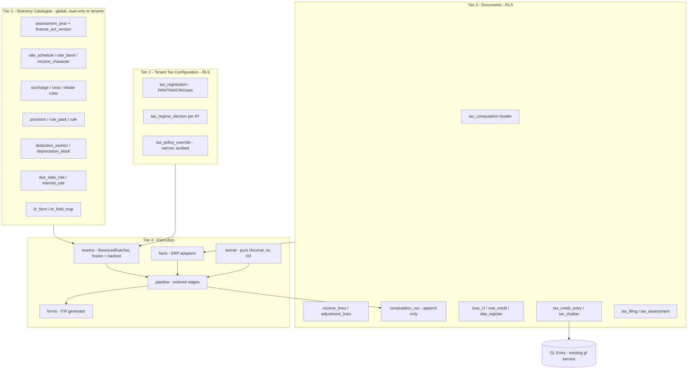

# ITR Module — Enterprise Re-architecture

> Scoping decisions taken with the user: **clean break** (no data preservation), **corporate/entity (ITR-6) depth first**, **full GL integration** (challan documents post to the ledger).

## 1. Critical review of the current design

Evidence-based critique. Each item names the file that proves it.

### 1.1 The root defect: statutory law is stored as tenant data

Every rule master in [backend/app/models/compliance.py](backend/app/models/compliance.py) carries `CompanyScopedMixin` — `IncomeTaxRateTable` (L59), `IncomeTaxSlabSet` (L94), `SurchargeRuleSet` (L154), `HealthEducationCessRule` (L213), `RebateRule` (L244), `SpecialIncomeTaxRate` (L275), `TaxPolicy` (L308), `TaxAdjustmentProvision` (L366), `TaxAdjustmentRulePack` (L393), `TaxDepreciationBlock` (L494).

`ensure_income_tax_masters()` in [backend/app/services/income_tax_masters.py](backend/app/services/income_tax_masters.py) copies the Income-tax Act into every tenant: 3 AYs x 6 flat specs + 2 slab entities x 2 regimes + 4 special rates + the whole provision catalogue, per company. Consequences:

- A Finance Act amendment requires N per-tenant data migrations with no way to verify they all landed.
- Tenants hold `write` on these descriptors ([backend/app/registry/descriptors.py](backend/app/registry/descriptors.py) L737-1170 grant `_ACCOUNTS_USER`), so an Accounts User can rewrite the slab table and silently change every filed return.
- No reproducibility: a computation submitted last year re-reads today's rows.

### 1.2 The seeded law is factually wrong

In [backend/app/services/income_tax_masters.py](backend/app/services/income_tax_masters.py):

- `_DEFAULT_AYS = ("2024-25", "2025-26", "2026-27")` share one `_NORMAL_SLABS` and one `_NEW_SLABS` verbatim — the new regime changed in every one of those years.
- `_FLAT_RATE_SPECS` gives a domestic company `surcharge = "0"` under the Normal regime; the real 7% (>₹1cr) / 12% (>₹10cr) brackets are absent entirely.
- No age category, so old-regime senior (60+) and super-senior (80+) exemptions cannot be expressed.
- The 25% vs 30% company rate has no turnover condition; 115BAB is missing; `filing_regime` is a two-value string (`Normal|New`) that cannot represent 115BAA / 115BAB / 115BA / 115BAC as distinct elections.

### 1.3 Calculation bugs that produce wrong tax

- **Marginal relief is an admitted approximation.** [income_tax_engine/surcharge.py](backend/app/services/income_tax_engine/surcharge.py) computes `tax_at_threshold = tax * (threshold / income)` with the comment "conservative lean". Statutory marginal relief requires re-running the rate structure at the threshold. The current formula is wrong for every slab-based assessee.
- **Wrong rounding mode.** `q()` uses `Decimal.quantize(Decimal("0.01"))`, which defaults to `ROUND_HALF_EVEN`. Tax requires half-up, and s.288A/288B require total income and tax payable rounded to the nearest ₹10. Neither exists.
- **Float contamination.** `q()` in [income_tax_engine/context.py](backend/app/services/income_tax_engine/context.py) does `Decimal(x or 0)` — a float argument yields binary artifacts. [tax_adjustment_engine/methods/formula_safe.py](backend/app/services/tax_adjustment_engine/methods/formula_safe.py) converts every fact to `float()` before evaluating.
- **Two rounding domains.** `income_tax_engine` quantizes to 2dp, `tax_adjustment_engine` to 6dp; values cross the boundary un-normalized.
- **Cess base is a dead parameter** — [cess.py](backend/app/services/income_tax_engine/cess.py) opens with `_ = cess_base`.
- **Rebate ignores income character** — 87A must not apply to 112A LTCG, and the new regime's own 87A marginal relief is unmodelled ([rebate.py](backend/app/services/income_tax_engine/rebate.py)).
- **Surcharge cap missing** — 111A/112A/115AD income caps at 15% surcharge; `apply_surcharge` applies one rate to the whole tax.
- **Hardcoded fixture law in production code** — [income_tax_computation.py](backend/app/services/income_tax_computation.py) L146-149 defaults `rebate_max_taxable` to ₹7,00,000 / ₹5,00,000 and `max_amount` to ₹25,000 / ₹12,500 inside a helper the API can reach.

### 1.4 Whole statutory areas are absent or stubbed

- **MAT/AMT (115JB/115JC)** — `mat_bridge_stub()` in [tax_adjustment_engine/phase_d.py](backend/app/services/tax_adjustment_engine/phase_d.py) hardcodes 15% and is labelled `Informational`. For a company, liability is the *higher* of normal tax and MAT; today MAT never affects the result. No 115JAA credit ledger.
- **Loss carry-forward and set-off** — `loss_setoff_stub()` returns a note string. No ledger, no head-wise set-off order, no 8-year expiry, no unabsorbed depreciation.
- **Interest 234A/234B/234C** — not computed anywhere. `advance_tax_instalments()` in [itr_export.py](backend/app/services/itr_export.py) hardcodes four dates and returns percentages only.
- **Chapter VI-A** — one `chapter_via_deduction` Decimal column. No per-section caps (80C ₹1.5L, 80D age-dependent, 80CCD(1B) ₹50k, 80G qualifying-limit arithmetic), no regime gating.
- **Presumptive taxation (44AD/44ADA/44AE)** — absent.
- **Tax depreciation** — `TaxDepreciationBlock` mixes the statutory *rate* with a tenant *WDV register* whose opening balance a human types. No asset linkage, no <180-day half-rate rule, no additional depreciation.

### 1.5 Schema redundancy and denormalization

- `income_tax_computations` is two documents fused into one: entity worksheet + individual heads + Form 16 employer/employee fields + payroll bridge columns, policed by three partial unique indexes (L636-664). Assessee mode is a discriminator on a 45-column table.
- Results are stored twice — as ~15 Decimal columns *and* inside `tax_breakdown` JSONB.
- Explicit legacy mirrors: `rebate_87a` duplicates `rebate_amount` (L723-726); on adjustment lines `amount` duplicates `final_amount` (L565-568).
- `TaxAdjustmentCategory` (L473) is self-documented as "Legacy … prefer TaxAdjustmentProvision" yet still has a descriptor, an FK from every line, and branch logic in `_replace_adjustments`.
- `TaxPolicy` is a tenant row whose only content is five nullable FKs and two method strings — a join table masquerading as a master.
- Income heads are four Decimal columns; special income is a separate child table. Both are the same concept (income of a given character) modelled twice.
- Tenant tax configuration lives in an untyped `SystemSetting` JSON blob ([income_tax_settings.py](backend/app/services/income_tax_settings.py)) — not joinable, not versioned, not auditable — and `filing_regime` is a static setting when a regime is a per-AY election (irrevocable for 115BAA).

### 1.6 Auditability failures

- **Recompute destroys history.** Both `_persist_adjustment_results` and `_replace_adjustments` in [income_tax_computation.py](backend/app/services/income_tax_computation.py) issue `delete(IncomeTaxAdjustmentLine).where(computation_id == doc.id)` then re-insert — the exact pattern PROJECT.md forbids for GL and stock ledgers.
- `prior_year_line_id` is a bare `UUID` with **no FK** (L591); it dangles the moment the prior year is recomputed.
- Override preservation is keyed by `section_code` (`override_by_section` in [tax_adjustment_engine/pipeline.py](backend/app/services/tax_adjustment_engine/pipeline.py)) — two rules on one section collide and an override is lost.
- No engine version, no rule-set hash, no Finance Act pin on the document, so a submitted return cannot be reproduced.

### 1.7 Engine determinism and correctness

- **Arbitrary rule-pack selection** — `resolve_adjustment_pack` ends with `pack = await db.scalar(stmt)` over a query that can match several packs; the winner is whatever Postgres returns first.
- **`_topo_sort` has no cycle detection** — it adds to `visited` before recursing, so a dependency cycle silently yields an arbitrary order instead of an error.
- **`Composite` is declared but not implemented** — `METHODS["Composite"] = manual.evaluate`, with a comment claiming the pipeline expands it; it does not.
- **Fact adapters return zero unconditionally** — `tds_gap_estimate` and `unpaid_43b_estimate` in [tax_adjustment_engine/adapters/__init__.py](backend/app/services/tax_adjustment_engine/adapters/__init__.py) are `return ZERO` stubs, so 40(a)(ia) and 43B always fall through to `NeedsInput`.
- **`cash_over_threshold` is wrong in substance** — it string-matches `"cash" in mode_name.lower()` and sums *entire* payment entries above ₹10,000. s.40A(3) aggregates per payee per day, has a ₹35,000 transporter limit, and disallows the payment, not the voucher.
- **Chapter VI-A hack** — after running the engine, `recompute_adjustments` sums `stage == "ChapterVIA"` lines and *overwrites* `doc.chapter_via_deduction`, so one deduction can be counted through two paths.

### 1.8 Credits, payments and filing

- `advance_tax_paid` is a hand-typed Decimal. No challan record (BSR code, challan serial, CIN, deposit date), so ITR Schedule IT cannot be produced and 234B/C cannot be computed.
- TDS credit is a single aggregate from `tds_26q`. Schedules TDS1/TDS2/TCS need per-deductor TAN, section and amount.
- 26AS reconciliation ([form26as_recon.py](backend/app/services/form26as_recon.py)) compares two totals and persists nothing.
- E-filing returns an envelope; no `ack_no`, no filed JSON snapshot, no hash, no verification mode. No revised/belated/updated return concept and no 143(1) intimation tracking.
- The "ITR pack" in [itr_export.py](backend/app/services/itr_export.py) is a bespoke dict of invented labels, not the CBDT schema. `_build_itr1_pack` takes an unannotated `db` it never uses.
- **No GL impact at all** — the tax liability never reaches the books; no current-tax provision, no advance-tax asset.

### 1.9 API and UI

- [income_tax_computations.py](backend/app/api/v1/compliance/income_tax_computations.py) is a 15-endpoint god-router mixing CRUD, workflow, calendar, reconciliation, three export formats, PDF and e-file. Two near-duplicate endpoints (`/itr` and `/itr-6`) return the same model.
- `/advance-tax-calendar` takes `total_tax` as a query parameter and does arithmetic in the router — business logic outside `services/`.
- [frontend/src/views/compliance/IncomeTaxView.vue](frontend/src/views/compliance/IncomeTaxView.vue) is a ~900-line single-file view holding list, create, detail, edit, adjustments, special income, exports, e-file, 26AS and payroll seeding — and ships a `fillDummyData()` function in production.
- Test coverage is one file, [backend/tests/unit/test_income_tax_computation.py](backend/tests/unit/test_income_tax_computation.py), which asserts only that marginal relief is non-zero (`assert result.marginal_relief_amount > ZERO`) — never the amount, so the known-wrong formula passes.

---

## 2. Target architecture

Four strictly separated tiers; the dependency arrow only ever points downward.



### 2.1 Tier 1 — Statutory Catalogue (new Postgres schema `statutory`)

Physically separate: tables live in a `statutory` schema, carry **no `company_id`**, have **no RLS policy**, and `erp_app` is granted `SELECT` only. `erp_owner` (migrations plus the loader CLI) is the sole writer. Tenants cannot edit the law even through a bug, because the database refuses.

Content ships as versioned JSON packs under `backend/data/statutory/in/<ay>/`, loaded by an idempotent `python -m scripts.load_statutory` invoked from the migration entrypoint.

Tables:

- `statutory.assessment_year` — `code`, `ay_start/end`, `fy_start/end`, `prev_ay_code` (self FK). Ends the string surgery in `_prev_assessment_year`.
- `statutory.finance_act_version` — `ay_code`, `version`, `enacted_on`, `source_ref`. **Everything below keys to a version**, so an amendment ships as a new version and already-filed returns keep pointing at the old one.
- `statutory.assessee_class` — Company, Firm, LLP, Individual, HUF, AOP/BOI, Cooperative, Trust; `default_itr_form`.
- `statutory.tax_regime` — `Normal`, `115BAA`, `115BAB`, `115BA`, `115BAC`, `Old`; `assessee_class_code`, `is_default`, `election_irrevocable`, `election_form` (10-IC / 10-ID / 10-IEA). Replaces the `Normal|New` string.
- `statutory.income_character` — `ORDINARY`, `LTCG_112A`, `LTCG_112`, `STCG_111A`, `LOTTERY_115BB`, `VDA_115BBH`, `DIVIDEND`, … each with `surcharge_cap_percent`, `rebate_eligible`, `setoff_group`, `loss_carry_years`. This is where special-rate semantics actually belong.
- `statutory.rate_schedule` + `statutory.rate_band` — **one structure subsumes flat rates, slabs and special rates**; a flat rate is a one-band schedule. Scoped by `finance_act_version_id`, `assessee_class_code`, `regime_code`, `income_character_code` (null = ordinary), `age_category`, `condition_expr` (e.g. turnover threshold). Bands carry `lower`, `upper`, `rate_percent`, `fixed_amount`. This collapses three of today's tenant tables into one.
- `statutory.surcharge_schedule` + `statutory.surcharge_band` — with `marginal_relief_method` and `capped_characters` for the 15% cap.
- `statutory.cess_rule`, `statutory.rebate_rule` (with `marginal_relief_enabled` and `excluded_characters`).
- `statutory.provision` — section taxonomy plus `itr_schedule` and `itr_field_path`, so an add-back knows where it lands on the form.
- `statutory.rule_pack` + `statutory.rule` — AY rule packs, globally owned.
- `statutory.deduction_section` — Chapter VI-A with `cap_amount`, `cap_expr`, `qualifying_limit_percent`, `regime_allowed`, `age_dependent_caps`.
- `statutory.depreciation_block` — IT Act block rates and additional-depreciation eligibility (the *law* half of today's `TaxDepreciationBlock`).
- `statutory.due_date_rule` (advance-tax instalments, ITR due dates by class and audit status) and `statutory.interest_rule` (234A/B/C, 244A). Removes the hardcoding from `advance_tax_instalments()`.
- `statutory.itr_form` + `statutory.itr_field_map` — form code, AY, schema version, and canonical-field to CBDT-JSON-path mapping. Turns the invented `payload` dict into a real generator.

### 2.2 Tier 2 — Tenant tax configuration (RLS)

- `tax_registrations` — PAN, TAN, CIN, `assessee_class_code`, `residential_status`, incorporation date, nature-of-business codes, jurisdiction. Replaces the `SystemSetting` blob; PAN's 4th character is validated against `assessee_class_code`.
- `tax_regime_elections` — company x AY x regime, `elected_on`, `form_ack_no`, `irrevocable`, `docstatus`. Regime becomes an auditable annual election.
- `tax_policy_overrides` — the **only** tenant-writable rule surface: pin a non-default `rate_schedule` (for instance the turnover-based 25% vs 30% choice) or disable one rule, each with a mandatory reason and an audit row.

### 2.3 Tier 3 — Documents (RLS)

- `tax_computations` — slim header: company, `ay_code`, `assessee_class_code`, `regime_election_id`, `filing_type` (Original / Revised 139(5) / Belated 139(4) / Updated 139(8A)), `revises_computation_id`, period, `docstatus`, and **`finance_act_version_id` pinned at creation**.
- `tax_computation_income_lines` — replaces the four head columns *and* `income_tax_special_income_lines`: `head` (Salary/HP/PGBP/CG/OS), `income_character_code`, `sub_ref`, `gross`, `deductions`, `net`, `source_doc_type/id`. Head-wise and directly mappable to ITR schedules.
- `tax_computation_adjustment_lines` — same intent as today, but with real FKs to `statutory.provision` / `statutory.rule`, a genuine self-FK on `prior_year_line_id`, and a `run_id`.
- `tax_computation_runs` — **append-only**. Every evaluation inserts a row: `run_no`, `trigger`, `engine_version`, `finance_act_version_id`, `ruleset_hash`, `input_hash`, `duration_ms`, `user_id`. Recompute writes a new run and stamps `superseded_at` on the previous one; nothing is deleted.
- `tax_computation_results` — one row per run holding taxable income, tax under **each** basis (normal and MAT/AMT), which was applied, surcharge, marginal relief, cess, rebate, 234A/B/C interest, credits, and net payable. Ends the columns-plus-JSONB duplication.
- `tax_credit_entries` — append-only TDS/TCS/advance/self-assessment credits with `deductor_tan`, `section_code`, `amount_credited`, `amount_claimed`, `challan_id`, `reconciliation_status`. Makes Schedules TDS1/TDS2/TCS/IT real and turns 26AS recon into a persisted match.
- `tax_challans` — submittable Advance Tax / Self-Assessment / Regular Assessment challan (BSR code, challan serial, CIN, deposit date, major/minor head) that **posts GL** through the existing `services/gl.py`.
- `tax_depreciation_registers` + `tax_depreciation_movements` — per-company per-AY block WDV with asset-level additions and deletions and the <180-day half-rate rule, linked to `assets`.
- `tax_loss_carry_forward_ledger` + `tax_loss_setoff_entries` — **append-only**, head-wise, with `expires_after_ay`.
- `mat_credit_ledger` — append-only 115JAA credit created / utilised / expired.
- `tax_filings` — form code, schema version, generated JSON plus sha256, `ack_no`, `filed_on`, `verification_mode` (DSC/EVC), provider, response.
- `tax_assessments` — 143(1) intimation and demand with variance against our computation (later phase).

**Net effect:** 14 tenant tables become 6 tenant tables plus 17 globally-owned catalogue tables, and the law is stored once.

### 2.4 Tier 4 — Execution (`backend/app/services/taxation/`)

Replaces both `income_tax_engine/` and `tax_adjustment_engine/`.

```
taxation/
  catalogue/     read-only accessors + process-level cache of the statutory schema
  resolve/       (company, AY, class, regime) -> ResolvedRuleSet (frozen, hashable)
  facts/         one adapter per ERP source: books, depreciation, payments, tds, prior_year
  kernel/        PURE - no DB, no I/O: money, rounding, slabs, surcharge, marginal_relief,
                 cess, rebate, mat, amt, setoff, interest_234, chapter_via
  adjustments/   provision evaluators (Decimal only, no float)
  pipeline.py    ordered stages, each a pure function (state, ruleset) -> state
  runs.py        persistence - creates a run, writes lines + result, never deletes
  forms/         itr6.py, itr3.py, ... driven by statutory.itr_field_map
```

Kernel rules:

- `kernel/money.py` — one `Decimal` money type, `ROUND_HALF_UP` everywhere, plus an explicit `round_to_nearest_ten()` applied at exactly the two statutory points (s.288A total income, s.288B tax payable). One quantum, not 2dp in one engine and 6dp in the other.
- `kernel/marginal_relief.py` — computes tax at the threshold by **re-running the rate schedule**, not by proportional scaling; same treatment for the new-regime 87A marginal relief.
- `kernel/surcharge.py` — per-character surcharge with the 15% cap on 111A/112A/115AD, applied as a weighted computation rather than one rate on total tax.
- `kernel/mat.py` — 115JB book profit from a declared add/less list, compare with normal tax, record both, apply the higher, and create or consume MAT credit.
- `kernel/interest_234.py` — 234A/234B/234C from `statutory.due_date_rule` and `interest_rule` plus the actual `tax_challans` deposit dates.

The pipeline becomes explicit and complete:

`gather facts -> income heads -> adjustments -> loss set-off -> gross total income -> Chapter VI-A -> total income (288A) -> tax by income character -> rebate -> surcharge + marginal relief -> cess -> MAT/AMT compare -> credits -> interest 234 -> net payable (288B)`

Today's pipeline has no set-off stage, no Chapter VI-A stage, no MAT comparison and no interest stage.

**Determinism contract:** `ResolvedRuleSet` is frozen and hashed. Each run persists `ruleset_hash` plus `finance_act_version_id` plus `engine_version`, so a return filed three years ago recomputes byte-identically. That is the auditability bar this design must clear.

### 2.5 API

Clean-break resource routers under `/api/v1/tax/`, replacing the 15-endpoint god-router:

- `/tax/registrations`, `/tax/elections`
- `/tax/catalogue/*` — read-only law browser (assessment years, rate schedules, provisions, due dates)
- `/tax/computations` — CRUD plus `POST /{id}/runs` (recompute), `GET /{id}/runs` (audit history), `GET /{id}/runs/{run_id}/explain` (line-level derivation)
- `/tax/challans`, `/tax/credits`, `/tax/credits/reconcile-26as`
- `/tax/filings` — generate, download, e-file, record acknowledgement

Calendar and suggested-amount arithmetic moves out of the router into `services/taxation/`.

### 2.6 UI

`IncomeTaxView.vue` is decomposed into a workspace shell plus tab components — `HeadsTab`, `AdjustmentsTab`, `DepreciationTab`, `SetOffTab`, `MatTab`, `CreditsTab`, `ChallansTab`, `ResultTab`, `RunsAuditTab`, `FormPreviewTab` — backed by `useTaxComputation` and `useTaxCatalogue` composables. `fillDummyData()` is deleted. Catalogue descriptors become read-only for all tenant roles.

---

## 3. Phased migration plan

Current Alembic head is `0084_tax_adjustment_engine`. Each phase is independently shippable and ends with `ruff check .`, `pytest tests/unit`, `npm run build`, a container restart and numbered manual verification steps.

- **Phase 1 — Statutory catalogue (`0085_statutory_schema`).** Create the `statutory` schema and its 17 tables; `GRANT SELECT` to `erp_app` and nothing more; author the AY 2024-25 / 2025-26 / 2026-27 JSON packs with *correct* rates, slabs, surcharge brackets (including company 7%/12%), cess, 87A and income characters; build the idempotent loader plus a pack validator; expose the read-only catalogue API. No behaviour change yet.
- **Phase 2 — Tenant configuration (`0086_tax_registration`).** `tax_registrations`, `tax_regime_elections`, `tax_policy_overrides`; migrate the `SystemSetting` blob; PAN-vs-class validation; settings UI rewrite.
- **Phase 3 — Kernel.** Pure `taxation/kernel/` with correct rounding, correct marginal relief, character-aware surcharge and rebate. Golden-vector and property tests land here, before anything depends on it.
- **Phase 4 — Computation documents (`0087_tax_computation`).** New header / income lines / adjustment lines / runs / results; drop the 8 legacy tables and `TaxAdjustmentCategory`; resolver, fact adapters and pipeline wired to the kernel; append-only recompute.
- **Phase 5 — Credits, challans and GL (`0088_tax_credits_challans`).** `tax_challans` posting through `services/gl.py`, `tax_credit_entries`, persisted 26AS reconciliation, current-tax provision JE on submit.
- **Phase 6 — Corporate depth (`0089_mat_setoff_depreciation`).** Tax depreciation register driven from `assets`, loss carry-forward ledger with set-off order and expiry, 115JB MAT with the 115JAA credit ledger, MAT-vs-normal comparison in the pipeline.
- **Phase 7 — Interest and compliance calendar (`0090_tax_interest`).** 234A/B/C from real challan dates; advance-tax shortfall projection; scheduler reminders through the existing notification seam.
- **Phase 8 — Forms and filing (`0091_tax_filings`).** `itr_field_map`-driven ITR-6 generator against the CBDT schema, `tax_filings` with JSON hash and acknowledgement, revised/belated/updated return chaining.
- **Phase 9 — UI rebuild.** Workspace decomposition, run-audit and explain views, read-only catalogue browser.
- **Phase 10 — Decommission.** Delete `income_tax_engine/`, `tax_adjustment_engine/`, `income_tax_masters.py`, `income_tax_settings.py`, `itr_export.py`, the legacy router and descriptors; rewrite `docs/ITR_GAP_AND_PLAN.md` as `docs/TAXATION_ARCHITECTURE.md`.

Individual-track depth (head-wise Salary/HP/CG/OS schedules, per-section Chapter VI-A, regime comparison, Form 16) and presumptive 44AD/44ADA/44AE are deliberately sequenced after Phase 8; the Tier 1 and Tier 3 models above are shaped to accept them without further schema change.

## 4. Testing strategy

- `tests/unit/taxation/kernel/` — golden vectors per AY from published CBDT illustrations, covering slab boundaries, each surcharge threshold with and without marginal relief, 87A edges, and character-capped surcharge.
- **Property tests** — post-tax income must be monotonic in pre-tax income across every surcharge threshold. The current approximation fails this; the new marginal relief must pass it.
- `tests/unit/taxation/statutory/` — pack validation: every (version, class, regime) has a gapless, non-overlapping band set; no dangling references; every rule's provision exists.
- `tests/integration/` — full lifecycle including GL assertions on challan posting, MAT-higher-than-normal selection, loss set-off across years, and an RLS test proving `erp_app` cannot write to `statutory`.
- Determinism test — recompute a submitted return and assert an identical `ruleset_hash` and result.

## 5. Process obligations (PROJECT.md)

On confirmation, copy this plan to `docs/plans/itr_enterprise_rearchitecture.plan.md` and add a row to `docs/plans/README.md`. After each phase, rebuild the containers and supply numbered manual verification steps.