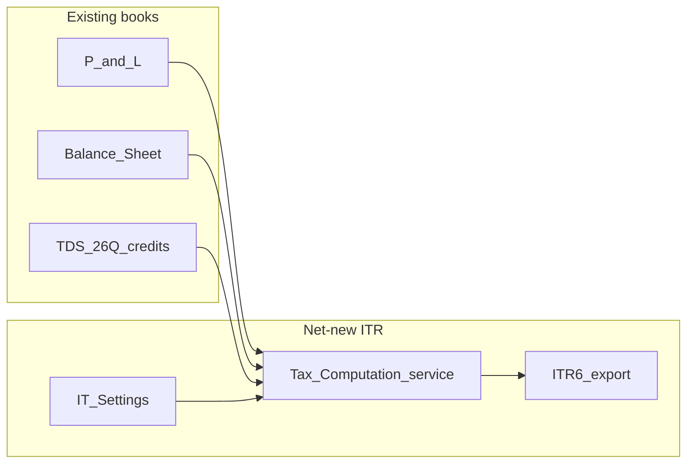

# ITR Gap Assessment & Plan (pause before code)

## Research verdict (step 1 — verified on upstream trees)

**Neither ERPNext nor India Compliance computes or files the business entity’s Income Tax Return (ITR-3/5/6).** What exists nearby is TDS/TCS, GST returns, payroll employee tax, and Schedule III presentation — not ITR.

### Inspected sources (cite these in the doc)

`**frappe/erpnext` `develop` (recursive tree, ~5429 blobs):**

- **No** paths matching `itr`, `income_tax`, `form_16`, `tax_return`, or `self_assessment`.
- **Has (related, not ITR):** Tax Withholding stack under `[erpnext/accounts/doctype/tax_withholding_](https://github.com/frappe/erpnext/tree/develop/erpnext/accounts/doctype)*` + report `[tax_withholding_details](https://github.com/frappe/erpnext/tree/develop/erpnext/accounts/report/tax_withholding_details)`; regional LDC `[erpnext/regional/doctype/lower_deduction_certificate](https://github.com/frappe/erpnext/tree/develop/erpnext/regional/doctype/lower_deduction_certificate)`.
- **No India GST/ITR under regional** — `erpnext/regional/` has UAE/US/Italy/etc.; India GST lives elsewhere.

`**frappe/hrms` `develop`:**

- Employee payroll tax only: `[hrms/payroll/doctype/income_tax_slab](https://github.com/frappe/hrms/tree/develop/hrms/payroll/doctype/income_tax_slab)`, reports `[income_tax_computation](https://github.com/frappe/hrms/tree/develop/hrms/payroll/report/income_tax_computation)` / `income_tax_deductions` (`ref_doctype: Salary Slip`).
- **No** Form 16 / Form 24Q / entity ITR.

`**resilient-tech/india-compliance` `develop`:**

- README is GST-centric (GSTR-1/3B, e-invoice, e-way, 2A/2B).
- Module `[india_compliance/income_tax_india/](https://github.com/resilient-tech/india-compliance/tree/develop/india_compliance/income_tax_india)` = TDS seed data + withholding reports + **Schedule III P&L/BS templates** — `doctype/` **is empty**, **zero `itr` paths**.

### Distinction table (for the doc)

| Capability                    | Upstream                   | OptiReach today                       |
| ----------------------------- | -------------------------- | ------------------------------------- |
| Entity ITR compute / file     | None                       | None                                  |
| TDS/TCS on invoices           | ERPNext withholding        | Have (+ 26Q / 16A)                    |
| GST returns / e-docs          | india-compliance           | Have (Phases 0–5+)                    |
| Employee income tax / Form 16 | HRMS slabs + salary slip   | Out of scope until Payroll            |
| Schedule III financials       | india-compliance templates | P&L/BS exist; not Schedule III-shaped |

**Stance:** treat entity ITR as a **net-new India USP** (same framing as MCA in [docs/USP_AND_FUTURE_SCOPE.md](docs/USP_AND_FUTURE_SCOPE.md) §4) — pre-fill / computation / export from books; live e-filing later.

**Default scope (committed):** Phase 1 targets **companies filing ITR-6** (Pvt Ltd / OPC — matches Company tenant + MCA USP). Proprietor/partnership (ITR-3/5) is a sequenced later phase behind `entity_type` settings. Say if you want proprietor-first instead before implementation.

---

## Step 2 deliverable (on your approval of this plan): write the doc only

Create [docs/ITR_GAP_AND_PLAN.md](docs/ITR_GAP_AND_PLAN.md) in the **same structure/tone** as [docs/INDIA_COMPLIANCE_GAP_AND_PLAN.md](docs/INDIA_COMPLIANCE_GAP_AND_PLAN.md) / [docs/ASSETS_GAP_AND_PLAN.md](docs/ASSETS_GAP_AND_PLAN.md):

1. Plain-language summary
2. What an Indian MSME needs for income tax (vs GST/TDS)
3. What ERPNext / india-compliance / HRMS actually have (with paths above)
4. What OptiReach already has (reuse — don’t rebuild)
5. Gaps
6. Data model + **machine-first DocType classification**
7. Phased build plan
8. Decisions / out of scope
9. Status: plan only — build on hold until owner says go

### Reuse (don’t rebuild)

- Financials: `[backend/app/services/financial_reports/statements.py](backend/app/services/financial_reports/statements.py)` (`profit_and_loss`, `balance_sheet`)
- Fiscal Year master; GL / Period Closing
- TDS: `[tds_returns.py](backend/app/services/tds_returns.py)`, Tax Withholding Category
- Compliance UI pattern: `[frontend/src/views/compliance/](frontend/src/views/compliance/)` + routes in `[frontend/src/router/index.ts](frontend/src/router/index.ts)`
- Per-company settings blob pattern (GST Settings via `SystemSetting`)

### Gaps to call out

1. No company PAN/TAN (only `Company.tax_id` GSTIN) — needed for ITR header + TDS forms
2. No books → taxable-income bridge (add-backs / disallowances / depreciation IT vs books)
3. No corporate tax computation (rates, surcharge, cess, MAT — phased)
4. No advance-tax calendar / credit vs TDS receivable
5. No ITR-6 (then 3/5) worksheet or JSON/export
6. No Form 26AS/AIS reconciliation
7. No e-filing / DSC integration (later, like GSP)

### DocType classification (PROJECT.md §6)

| Artifact                                                                    | Decision                                                                                          |
| --------------------------------------------------------------------------- | ------------------------------------------------------------------------------------------------- |
| **Income Tax Settings** (entity_type, regime, AY defaults, PAN/TAN refs)    | Config blob like GST Settings — **not** a new master table                                        |
| **Company fields** `pan`, `tan`                                             | Columns on existing Company                                                                       |
| **Income Tax Rate Table** (AY × slab/rate/surcharge/cess for companies)     | **Simple master → descriptor** (+ light `validate` for non-overlap)                               |
| **Tax Adjustment Category** (40(a), 43B, etc. codes)                        | **Simple master → descriptor**                                                                    |
| **Income Tax Computation** (one per company × AY; worksheets, tax, credits) | **Transaction / heavy logic → bespoke service**; `docstatus` 0/1/2; list/form still schema-driven |
| **Advance Tax Payment** (link to Payment Entry / JE)                        | Light submittable doc → **bespoke** (allocation math) or child rows on Computation                |
| **ITR export (JSON/PDF pack)**                                              | Read-only **bespoke generator** (mirror GSTR JSON) — no DocType                                   |
| Employee Form 16 / 24Q                                                      | **Out of scope** until HRMS Payroll                                                               |

### Phased plan (in the doc)

- **Phase 0 — Settings + identity:** `pan`/`tan` on Company; Income Tax Settings blob (`entity_type=Company`, AY, filing regime); Compliance nav stub. Migration `**0066_…`** after `[0065_manufacturing](backend/migrations/versions/0065_manufacturing.py)`.
- **Phase 1 — Computation pack (headline):** bespoke `IncomeTaxComputation` — pull FY P&L, adjustment lines (manual + category master), compute tax from Rate Table, credit TDS from books, show payable/refundable. UI: `/income-tax` mirroring GstReturnsView.
- **Phase 2 — ITR-6 export:** schedule-oriented JSON/CSV pack for offline utility / CA handoff (not live portal).
- **Phase 3 — Advance tax calendar + reminders** (15 Jun / 15 Sep / 15 Dec / 15 Mar).
- **Phase 4 — ITR-3/5** behind `entity_type` (proprietor / firm / LLP).
- **Phase 5 — 26AS/AIS import reconcile** (file upload first).
- **Phase 6 — Live e-filing** (pluggable provider; optional — same pattern as GSP).

**Out of scope initially:** full MAT/AMT depth, international tax, trust ITR-7, employee Form 16, replacing the CA for audit/3CD.

---

## Step 3 — pause (this message)

No application code, migrations, or Vue until you review the written plan doc and explicitly approve implementation.

## Step 4 — only after you say implement

Mirror compliance module under 4-layer rule:

- models → schemas → services (`income_tax_computation.py`, settings) → `api/v1/compliance/`
- descriptors for Rate Table + Adjustment Category
- Alembic `0066_*`, RLS/`company_id`
- Vue under `views/compliance/`
- Verify: `ruff check .`, `pytest tests/unit`, `npm run build`

Update [PROJECT.md](PROJECT.md) Remaining Todo + USP checklist when built.