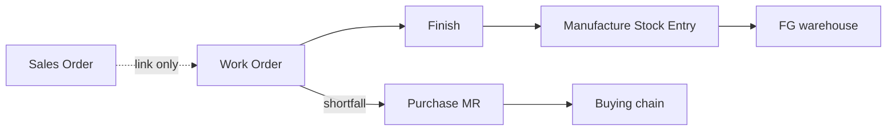
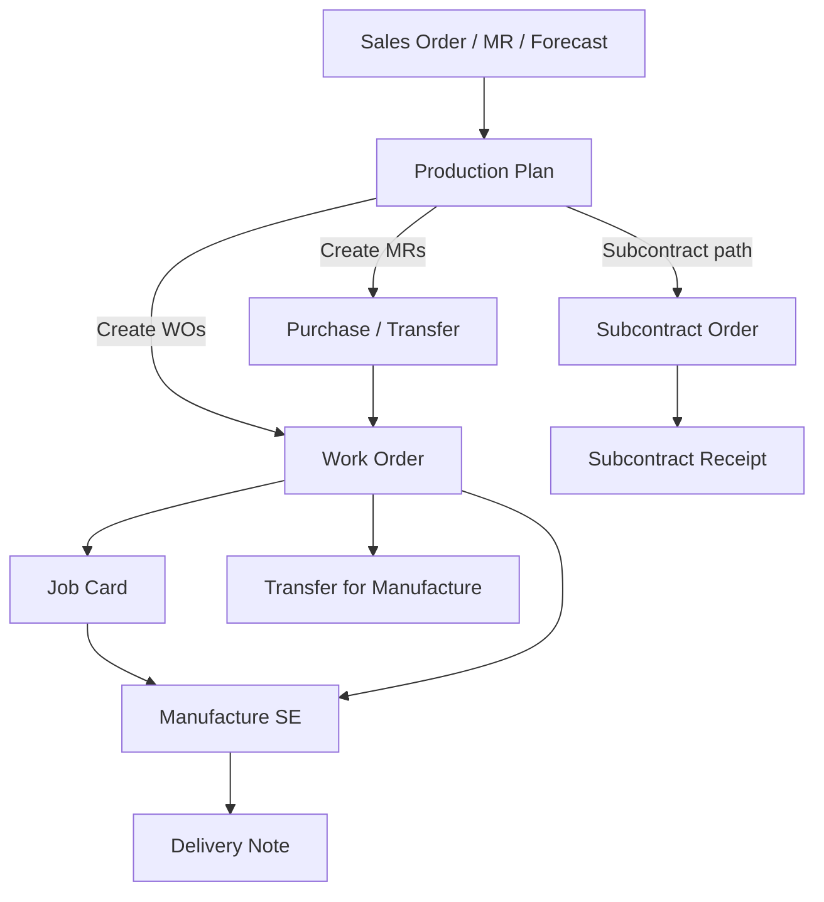

# Manufacturing Gap Analysis & Roadmap

## Deliverable

Write **[`docs/MANUFACTURING_GAP_AND_PLAN.md`](docs/MANUFACTURING_GAP_AND_PLAN.md)** (already referenced by [`backend/app/models/manufacturing.py`](backend/app/models/manufacturing.py) but missing), modelled on [`docs/ITR_GAP_AND_PLAN.md`](docs/ITR_GAP_AND_PLAN.md): plain-language summary, ERPNext baseline (verified against docs + capability catalog), OptiReach scorecard, design simplifications, phased build plan, cross-module dependencies, and a post-parity USP layer.

Also update [`PROJECT.md`](PROJECT.md) Remaining Todo to point at the new doc, and add a short “Manufacturing Planning” USP stub to [`docs/USP_AND_FUTURE_SCOPE.md`](docs/USP_AND_FUTURE_SCOPE.md) for the Phase 7+ differentiators.

**No implementation in this pass** — analysis + roadmap only (same sequencing as ITR).

**Baseline assumption:** discrete / light-assembly manufacturing (MTO + MTS + subcontract). Process manufacturing (formula, potency, tanks) is explicitly out of Phase 0–6 and listed as later.

---

## Current state (OptiReach today)

Working **kitting/assembly loop** from migration `0065`:

| Capability | Status |
|---|---|
| Flat BOM + cost rollup + default BOM | Done — [`bom.py`](backend/app/services/bom.py) |
| Work Order lifecycle + Finish → Manufacture SE | Done orchestration — [`work_order.py`](backend/app/services/work_order.py) |
| WIP transfer API | Backend only; **no UI** |
| Material availability + shortfall Purchase MR | Done |
| Settings (4 JSON fields) + 4 reports + Vue workspace | Done |
| Manufacture/Repack **valuation + operating-cost GL** | **Broken/partial** — purposes exist on model; [`stock_entry.py`](backend/app/services/stock_entry.py) still treats Receipt/Issue/Transfer only; `revert_manufacture_entry` never wired on cancel |
| Serial/batch on FG or components | **Blocked** by ValidationError (stock serial/batch already exist elsewhere) |
| Multi-level BOM, Job Card, Production Plan, Operation/Routing/Workstation, scrap, subcontract, QI | **Missing** |

End-to-end business chain today is truncated:

ERPNext (and the target platform) need demand → plan → buy/make → shop floor → quality → warehouse → dispatch.

---

## ERPNext v15 baseline (parity target)

Full capability catalog will be written into the doc. Headline document chain:

**Masters:** BOM (+ ops, scrap), Operation, Workstation, Routing, Item manufacturing fields, Item Alternative, Manufacturing Settings, QI Template.

**Documents:** BOM, Work Order, Job Card, Production Plan, Stock Entry purposes (Transfer/Consume/Manufacture/Send to Subcontractor), Subcontracting Order/Receipt, Downtime Entry, optional Pick List.

**Planning (MRP-I):** PP explode + net Projected Qty; workstation slot reservation on WO submit; lead time days on Item; **no** true APS, reverse schedule, forecast, or CTP.

**Reports:** Open/WIP/Completed WO, WO Summary, Production Analytics, BOM Explorer, BOM Stock, BOM Search, Issued/Consumed Materials, Downtime.

---

## Design simplifications (capability preserved, fewer docs)

Commit to these in the gap doc so implementation does not clone Frappe’s doctype count:

1. **Subcontracting:** one **Subcontract Job** (or Work Order `production_type = Subcontract`) + Stock Entry “Send to Subcontractor” + **Subcontract Receipt** that capitalizes service cost — skip ERPNext’s separate Subcontracting BOM + dual PO/SCO ceremony where a Service Item + PO still drives the commercial rate.
2. **Shop floor:** Operation / Workstation / Routing as **engine masters** (`descriptors.py`); Job Card remains bespoke but **optional** — WO without operations finishes like today; with operations, Job Cards are required to progress completed qty.
3. **Planning UI:** one **Production Plan** document (ERPNext-compatible semantics) plus a later **Planning Board** view — do not invent a second MRP doctype for parity.
4. **Scrap / by-product:** BOM Scrap child + Manufacture SE scrap rows (ERPNext v15 model); defer v16 “Secondary Items” cost-allocation % until needed.
5. **Settings:** keep `SystemSetting` JSON key `manufacturing_settings` (extend keys); no Frappe-style singleton DocType.
6. **Serial/Batch:** reuse existing inline stock serial/batch on Manufacture SE lines (per [`STOCK_GAP_AND_PLAN.md`](docs/STOCK_GAP_AND_PLAN.md) §3.3) — no Serial and Batch Bundle clone.
7. **Quality:** pass/fail QI gate on Manufacture FG (+ optional Job Card) once Quality module exists; no full QI Template PLM in mfg phases.
8. **Phantom BOM / BOM Template / Plant Floor / Downtime Entry:** include in parity matrix; implement Phantom + Do Not Explode with multi-level; Downtime as thin master; Plant Floor as a Job Card board view; BOM Template/variants only if Item variants already matter.

---

## Gap matrix (summary for the doc)

| Area | ERPNext | OptiReach | Verdict |
|---|---|---|---|
| Flat BOM + costing | Yes | Yes | Parity (costing path) |
| Multi-level / phantom / do-not-explode | Yes | No | Gap |
| BOM ops + Routing + Workstation | Yes | No | Gap |
| Scrap / process loss | Yes | No | Gap |
| Alternate BOM / Item Alternative | Yes | Partial (multi-BOM flags only) | Gap |
| WO lifecycle + partial finish + stop | Yes | Mostly | Close transfer UI + return components |
| Backflush modes + Material Consumption SE | Yes | No | Gap |
| Manufacture valuation + op-cost GL | Yes | **Incomplete** | **P0 correctness** |
| Job Card + time logs + sequencing | Yes | No | Gap |
| Production Plan + netting | Yes | No | Gap |
| Capacity (workstation calendar) | Soft finite | No | Gap |
| Subcontracting E2E | Yes | No (Buying also gaps) | Gap |
| Serial/Batch through mfg | Yes | Blocked | Gap (unblock) |
| QI on manufacture / JC | Yes | Quality module absent | Gap (depends Phase 5 QI) |
| Reports (Explorer, Analytics, …) | ~10 | 4 | Gap |
| ATP/CTP, reverse schedule, forecast, APS, pegging UI | Weak/absent | Absent | **Post-parity USP** |

Cross-module blockers already documented: Buying MR type `Manufacture` + subcontract ([`BUYING_GAP_REPORT.md`](docs/BUYING_GAP_REPORT.md)); Projected Qty / reservation ([`STOCK_GAP_AND_PLAN.md`](docs/STOCK_GAP_AND_PLAN.md)); Quality module not started ([`PROJECT.md`](PROJECT.md) Phase 5).

---

## Phased roadmap

### Phase 0 — Correctness & surface (foundation)
Close the loop so today’s BOM→WO can be trusted in books and UI.

- Manufacture / Repack / Material Transfer for Manufacture posting in `stock_entry.py` (consume cost pool → FG rate; credit `operating_cost_account`; WIP warehouse reclass).
- Wire `cancel_stock_entry` → `revert_manufacture_entry`.
- WIP transfer + return-components actions in [`WorkOrderDetailView.vue`](frontend/src/views/manufacturing/WorkOrderDetailView.vue).
- Unblock serial/batch on WO/Finish (reuse stock services).
- Expand Manufacturing Settings: backflush basis (`BOM` \| `Transferred`), default op-cost account, allow overtime flag (stub), material consumption toggle.
- Item fields: `default_bom_id`, `include_item_in_manufacturing`, manufacturing section on Item form.
- MR type `Manufacture` (Buying API + form) for PP later.
- Integration tests green for valuation/GL (suite already expects this in [`test_manufacturing.py`](backend/tests/integration/test_manufacturing.py)).

### Phase 1 — BOM depth (parity core recipe)
- Multi-level explosion via recursive CTE; WO flag `use_multi_level_bom`.
- Phantom BOM + per-line Do Not Explode.
- BOM Scrap / process loss; scrap warehouse on WO.
- Alternate Item (descriptor master) + allow-alternative on BOM/WO.
- BOM Explorer + BOM Search reports; BOM Update Tool (mass component replace) as a service action.
- Nested cost rollup (optional include sub-assembly op cost).

### Phase 2 — Shop floor (Job Card path)
- Engine masters: Operation, Workstation (hours, holiday list link, capacity, hourly cost components), Routing.
- BOM Operations child; WO Operations planned/actual.
- Job Card + time logs; sequence enforcement; scrap on JC; optional transfer-against-JC.
- Material Consumption for Manufacture SE purpose.
- Capacity planning on WO submit (ERPNext-style slot find within Capacity Planning Days) — infinite-capacity PP still OK.
- Plant Floor = filtered Job Card board UI.
- Downtime Entry thin master.
- Reports: Open/WIP/Completed WO, WO Summary, Issued/Consumed Materials, Production Analytics (charts).

### Phase 3 — Production Plan (MRP-I parity)
- Production Plan: Get Items from Sales Order / Material Request / Manual; consolidate; include exploded / sub-assemblies; manufacturing type In House \| Subcontract \| Material Request; skip available (net Projected Qty — depends Stock projected qty work).
- Actions: Create Work Orders; Create Material Requests; Close/Reopen.
- SO → PP → WO pegging fields retained for later visibility USP.
- Material Request Plan export (CSV).

### Phase 4 — Subcontracting
- Align with Buying: subcontract PO / service charge; supplier warehouse.
- Simplified Subcontract Job + Send to Subcontractor SE + Subcontract Receipt (RM consume at supplier WH + FG + service into valuation).
- Backflush based on BOM vs transferred for subcontract.
- Reports: open subcontract jobs, RM at supplier.

### Phase 5 — Quality gates (with Quality module)
- QI required on Item/BOM for manufacture FG; block Finish / DN on reject (matches PROJECT Phase 5).
- Optional in-process QI from Job Card.
- Keep simplified pass/fail + remarks until full templates needed.

### Phase 6 — ERPNext parity polish
- Pick List against WO (if Stock Pick List lands).
- Over-transfer %, stop/reopen rules, return unconsumed WIP before Stop.
- Full report parity checklist + Playwright smoke of SO→PP→WO→JC→SE→DN.
- Feature flag `manufacturing` (already sketched in migration prompt).
- Mark **ERPNext feature parity** for discrete manufacturing.

### Phase 7+ — Modern planning platform (USP beyond ERPNext)

Model manufacturing as one connected workflow; this is the OptiReach differentiator called out in the user brief and to be added to USP doc:

| Capability | Intent |
|---|---|
| **Supply chain timeline** | Single pegging view: demand → planned supply (WO/PO/MR) → inventory → production → QI → dispatch → delivery |
| **Lead-time engine** | Roll-up purchase LT + queue/setup/run from Routing + subcontract LT + transit; critical path on BOM tree |
| **Delivery-date estimation (CTP)** | Promise date from remaining capacity + material ETA (not just Projected Qty) |
| **Reverse scheduling** | Backward from customer/required date; flag infeasible; suggest pull-in actions |
| **Integrated procurement plan** | Time-phased buy list with suggested order dates (LT offset), not only “create MR now” |
| **Finite capacity board** | Drag-drop / overload visibility beyond ERPNext’s submit-time slot reservation |
| **Demand forecasting** | Light statistical + manual override → feeds Production Plan (no black-box APS in v1) |
| **What-if scenarios** | Sandbox plan copy; commit to live PP/WOs |
| **ATP** | Soft then hard reservation against SO lines once Stock reservation exists |

Architecture note for the doc: keep calculation in `services/` (e.g. `mfg_planning.py`, `lead_time.py`, `ctp.py`); Planning Board is a Vue workspace; no logic in routers. Prefer extending Production Plan + WO over inventing parallel shadow tables where possible; scenario copies may need a `plan_scenario_id`.

---

## Doc structure (what will be written)

1. Scope / status / SaaS framing  
2. Plain-language: what a manufacturer actually needs (demand→delivery)  
3. What ERPNext has (verified catalog)  
4. What OptiReach has today (file-level inventory)  
5. Full gap matrix (Present / Partial / Absent / Simplify)  
6. Design decisions & simplifications  
7. Phases 0–6 (parity) with exit criteria + key files  
8. Phases 7+ (planning USP)  
9. Cross-module dependencies (Stock, Buying, Selling, Quality, Projects)  
10. Explicitly out of scope (process mfg, full MES/IoT, PLM/ECO, CMMS)  
11. Suggested migration series after current ITR head (`0069+` when implementing)

---

## Implementation notes (for later — not this task)

- 4-layer rule: routers thin; masters via descriptors where possible (Operation, Workstation, Routing, Item Alternative, Downtime).
- Reuse Stock Ledger / Moving Average; never UPDATE SLE.
- Company_id + RLS on every new table.
- Verify: `pytest tests/unit` + manufacturing integration; `npm run build`; Playwright smoke per phase.
