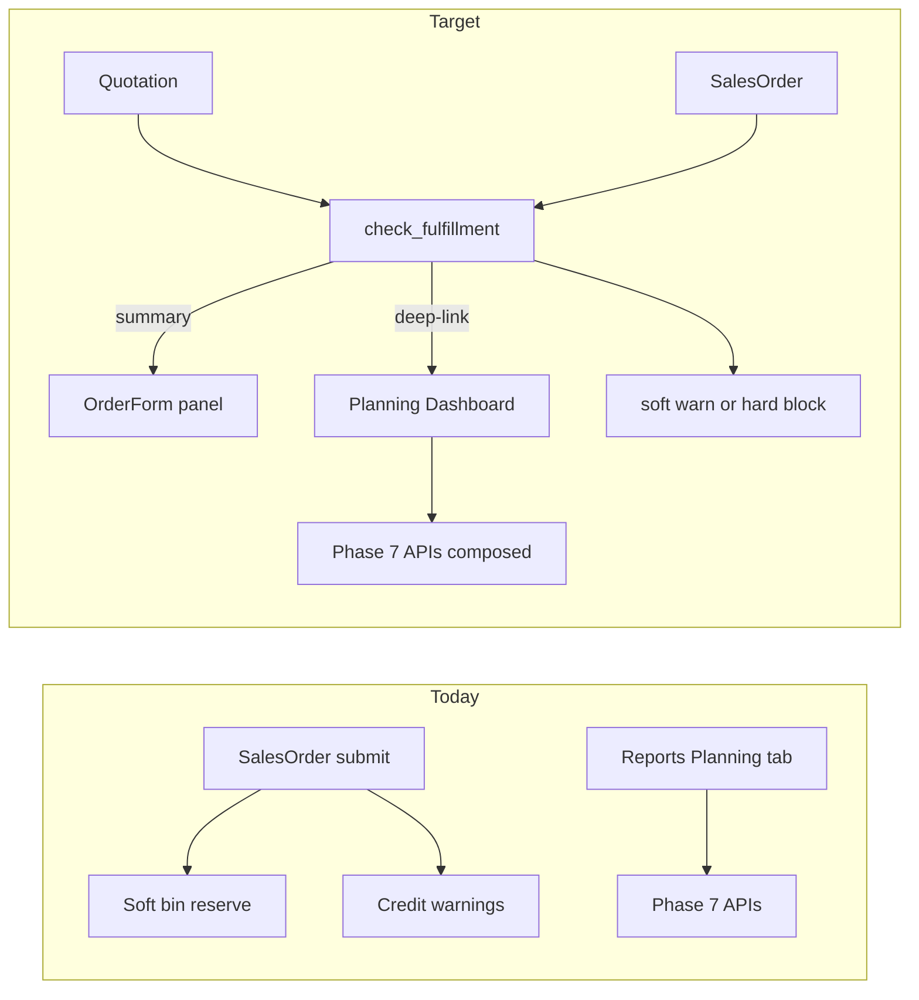

# Manufacturing Planning Dashboard + SO/Quotation Fulfillment

## Decisions locked

- **Submit gate:** company setting, default **soft warn**; optional **hard block** when delivery is not feasible / BOM missing.
- **Surfaces:** Quotation + Sales Order get a Check Fulfillment panel (summary); deep-link into the Planning Dashboard for full planner detail.

## Current baseline (reuse, don’t rebuild)

Phase 7 already exposes the engines under `/api/v1/manufacturing-reports/*`:

| Panel needed | Existing API / service |
|---|---|
| Demand | Pegging demand side + `demand-forecast` ([`pegging.py`](backend/app/services/pegging.py), [`mfg_planning.py`](backend/app/services/mfg_planning.py)) |
| Supply | Pegging supply (stock / WO / MR) |
| Capacity | `capacity-board` |
| Timeline | `pegging` + `reverse-schedule` ([`lead_time.py`](backend/app/services/lead_time.py)) |
| Decision support | `capable-to-promise`, `what-if-ctp` |

UI today is buried in [`ManufacturingReportsView.vue`](frontend/src/views/manufacturing/ManufacturingReportsView.vue) tab `planning`. SO submit only returns credit-limit warnings ([`sales_order.py`](backend/app/services/sales_order.py)); Quotation has no fulfillment path.



---

## Phase A — Planning Dashboard (compose existing APIs)

### A1. New route + nav

- Route: `/manufacturing-planning` → new [`ManufacturingPlanningView.vue`](frontend/src/views/manufacturing/ManufacturingPlanningView.vue)
- Query context: `?context=item|sales-order|production-plan&id=…&qty=…&delivery=…`
- Nav: add **Planning Dashboard** as primary Manufacturing sidebar/card link in [`workspaces.ts`](frontend/src/config/workspaces.ts); keep classic reports; remove/redirect the Reports “Planning” tab content into this page (thin redirect or “Open in Planning Dashboard” link to avoid two UIs)

### A2. Context selector → resolve FG lines

| Context | Resolve to |
|---|---|
| Finished Item | `item_id` + qty (user) + optional delivery |
| Sales Order | load SO lines with `include_item_in_manufacturing` / stock items → list of `{item_id, qty, delivery_date, warehouse}` |
| Production Plan | load plan items → same shape |

Small backend helper preferred over N frontend calls:

- `GET /manufacturing-planning/context?type=&id=` in new thin router (or under existing manufacturing workspace) that returns resolved lines + header meta. Logic in a new service [`mfg_planning_dashboard.py`](backend/app/services/mfg_planning_dashboard.py) (4-layer rule).

### A3. Five panels (one composition)

For the **selected line** (or aggregate header KPIs when multi-line):

1. **Demand** — open SO qty for item + forecast strip (`demand-forecast`)
2. **Supply** — pegging supply rows (on-hand, open WO, Manufacture MR, optionally open PO if already in pegging)
3. **Capacity** — capacity-board filtered to workstations used by the item’s default BOM ops
4. **Timeline** — pegging rows + reverse-schedule milestones when delivery is set
5. **Decision support** — CTP result, on-time vs late, what-if controls, **recommended actions** (create/open Production Plan, raise MR, adjust delivery to `earliest_promise_date`)

Actions (links only in v1 — no auto-create unless one-click already exists):

- “Open / Create Production Plan for this SO”
- “Open Work Orders”
- “Apply promise date to clipboard / copy suggested delivery”

Extract shared result tables from the current Reports planning tab into small presentational components under `frontend/src/components/manufacturing/` so Reports stay thin if retained.

**Out of scope (unchanged):** true finite APS / Gantt drag-drop.

---

## Phase B — Fulfillment + cost service (SO & Quotation)

### B1. New service: `check_order_fulfillment`

File: [`backend/app/services/order_fulfillment.py`](backend/app/services/order_fulfillment.py)

For each stock / manufacturable line:

1. Resolve default BOM (`default_bom_id` or active default).
2. Call `estimate_lead_time` / `reverse_schedule` vs line/header `delivery_date` (Quotation: use `valid_till` or a required delivery field when present; if no date, return CTP-only with `on_time=null`).
3. **Cost-to-serve (estimate):** `BOM.cost_per_unit × qty` (raw + operating from current BOM rollup). Line **selling amount** vs estimated cost → **estimated margin** / margin %.
4. Shortfalls: component shortfall qty × component valuation/rate as **extra buy cost hint** (additive note, not GL).

Aggregate response:

```text
OrderFulfillmentOut {
  can_fulfill_on_time: bool | null
  earliest_promise_date: date | null   # max across late/driving lines
  estimated_cost: Decimal
  estimated_margin: Decimal
  estimated_margin_pct: Decimal | null
  lines: [{ item, qty, on_time, promise_date, bom_cost, selling_amount, margin, notes, shortfalls[] }]
  warnings: string[]
  hard_block_reasons: string[]         # populated only when mode=hard
  planning_dashboard_url: str          # e.g. /manufacturing-planning?context=sales-order&id=…
}
```

Use **projected-aware availability** for this check only if cheap: prefer `actual − reserved` (or stock projected) so SO check does not ignore existing reservations. Align `item_available_qty` usage carefully; if a one-line change in [`manufacturing_common.py`](backend/app/services/manufacturing_common.py) would break WO CTP semantics, add a parameter `include_reserved: bool = False` defaulting to current behavior, and pass `True` from order fulfillment.

### B2. Company setting

Extend Manufacturing Settings blob in [`manufacturing_common.py`](backend/app/services/manufacturing_common.py):

- `order_fulfillment_mode`: `"off" | "warn" | "block"` — **default `"warn"`**
- Surface toggle on [`ManufacturingSettingsView.vue`](frontend/src/views/manufacturing/ManufacturingSettingsView.vue)

### B3. API hooks

| Endpoint | Behavior |
|---|---|
| `POST /sales-orders/{id}/check-fulfillment` | Preview for saved draft/submitted |
| `POST /sales-orders/check-fulfillment` | Body = create/preview payload (pre-save) |
| Same pair under `/quotations/...` | Shared service |
| Wire into `submit_sales_order` / `submit_quotation` | Append warnings; if mode=`block` and `hard_block_reasons`, raise 422 envelope |

Reuse existing submit `warnings[]` pattern in [`OrderFormView.vue`](frontend/src/views/trade/OrderFormView.vue).

### B4. Frontend on Order / Quotation form

In [`OrderFormView.vue`](frontend/src/views/trade/OrderFormView.vue) (both kinds):

- **Check fulfillment** button (draft): calls preview endpoint; shows panel: on-time yes/no, earliest promise, estimated cost, margin, per-line table.
- Deep-link: “Open in Planning Dashboard” with `context=sales-order|…&id=`.
- On submit: show fulfillment warnings alongside credit warnings; if 422 hard-block, surface `detail` and do not navigate away.
- Optional: “Use suggested delivery” sets header/line dates from `earliest_promise_date` (client-side only).

---

## Phase C — Docs / seed / verify

- Update [`docs/MANUFACTURING_GAP_AND_PLAN.md`](docs/MANUFACTURING_GAP_AND_PLAN.md) with Phase 8 (Planning Dashboard + order fulfillment) and mark Planning Board visual Gantt still deferred.
- Extend FG-GEARBOX seed narrative if needed so Quotation path is demoable.
- Tests: unit tests for `check_order_fulfillment` (on-time / late / no-BOM / warn vs block); light API tests for submit gate.
- Verify: `ruff` + `pytest tests/unit` for new modules; smoke Planning Dashboard + SO Check Fulfillment in UI.

---

## Implementation order

1. Settings + `order_fulfillment` service + SO/QTN endpoints + submit gate  
2. OrderForm fulfillment panel + deep-link query params  
3. Planning Dashboard page composing Phase 7 APIs + context resolver  
4. Nav / Reports tab cleanup + docs + tests  

## Non-goals

- Finite-capacity APS / drag-drop Gantt  
- Persisting what-if scenarios  
- Auto-creating Production Plans on SO submit  
- Replacing commercial pricing with manufacturing cost (cost is advisory margin only)