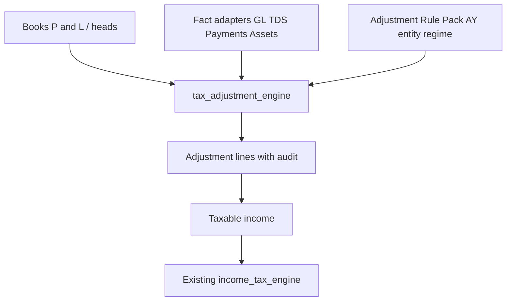

# Tax Adjustment Engine Redesign

## Verdict on the current model

[`TaxAdjustmentCategory`](backend/app/models/compliance.py) (`code` / `name` / `Add|Deduct`) plus manual [`IncomeTaxAdjustmentLine`](backend/app/models/compliance.py) amounts is a **register**, not a compliance engine. The tax-math stack is already policy-driven ([`income_tax_engine/`](backend/app/services/income_tax_engine/)); the books→taxable bridge is not. Seeded `_ADJ_SPECS` in [`income_tax_masters.py`](backend/app/services/income_tax_masters.py) oversimplifies nearly every section it names, mixes PGBP disallowances with Chapter VI-A, and never evaluates thresholds, % disallowance, payment timing, caps, or reversals.

**Locked delivery posture:** design and seed a **full provision catalogue + rule engine**; implement auto-evaluators where OptiReach already has facts (GL, TDS withholding, payments); leave other provisions as `Manual` / `NeedsInput` with correct statutory parameters so CAs can complete them without code changes. **EntityBooks is the primary consumer in v1**; the rule model is mode-aware so IndividualHeads can retire the lump `chapter_via_deduction` in a follow-on phase without another redesign.

---

## Critical gap analysis (current 14 vs Act)

| Seed code | What the Act actually requires | Current oversimplification |
|---|---|---|
| `40(a)(i)` | Disallow expense if TDS on NR payment not deducted/paid; allow in year of compliance; DTAA / 195 interplay | Flat 100% manual Add; no TDS linkage or timing |
| `40(a)(ia)` | **30%** disallowance (residents) if TDS not deducted/paid by return due date; **reversal** in year of payment; Form 26A / payee PAN exceptions | Treated as full Add like (i); no %; no reversal |
| `40A(3)` | Cash > ₹10k (₹35k transporters) per day/person; **Rule 6DD** exceptions | Flat Add; no threshold/mode-of-payment facts |
| `43B` | Deduction only on payment; unpaid at FY-end added back if not paid by return due date; **next-year Deduct** when paid; covers tax, duty, cess, PF/ESI employer, bonus, interest to banks, etc. | Single Add line; no payment-date engine; no prior-year reversal |
| `37-personal` | Fact-specific disallowance (personal/capital/CSR expl. / penalty) | Correctly manual in spirit—but no evidence / schedule structure |
| `Dep-add` / `Dep-ded` | **IT Act block-of-assets WDV** (Appendix I rates) vs Companies Act books dep | Manual plug; Assets module has only company-law dep ([`assets.py`](backend/app/models/assets.py))—no tax block register |
| `ICDS` | **Ten separate ICDS** (I–X), each with recognition/measurement rules and Form 3CD disclosures | One bucket labeled “ICDS” |
| `Prov-exp` | Provisions vs ascertained liabilities; year of crystallization | Flat Add |
| `Int-tax` | Confuses **40(a)(ii)** (IT interest disallowed in PGBP) with **234A/B/C** (interest on tax shortfall—post-tax) | Mis-scoped as a generic PGBP Add |
| `80G` | 50%/100%, with/without **10% of AGI** qualifying limit; donee approval; donation schedule | Full donated amount as Deduct; lives in same list as PGBP |
| `80JJAA` | 30% of additional employee cost × 3 years; salary/ tenure / headcount eligibility | Manual Deduct |
| `35` | Multiple sub-clauses; weighted deduction largely curtailed; approval / in-house R&D conditions | Generic “weighted Deduct” |
| `Exempt-inc` | Many s.10 / other-head carve-outs; some still affect other calcs | One Deduct |

**Major Act areas missing entirely from the catalogue:** `36(1)(va)`, `14A`/Rule 8D, `40A(2)`, `40(b)`, CSR disallowance, cash credits `68`/`69`, thin-cap `94B`, loss set-off/carry-forward (`70`–`74`), full Chapter VI-A (`80C`–`80U`), capital-gains schedule (beyond special-rate lines), **MAT `115JB` / AMT `115JC`**, ICDS-wise lines, tax depreciation blocks.

---

## Target architecture

Mirror the proven Tax Policy pattern: **algorithms in Python strategies; every statutory number and eligibility flag in AY-versioned masters.**



### Masters (replace / supersede category-only model)

1. **`TaxAdjustmentProvision`** — immutable statutory identity (section taxonomy)
   - `section_code` (e.g. `40(a)(ia)`), `title`, `act_reference`
   - `stage`: `PGBP` | `ICDS` | `ChapterVIA` | `SetOff` | `MAT` | `Other`
   - `default_effect`: `Add` | `Deduct` | `Informational`
   - `applies_to_modes`: EntityBooks / IndividualHeads / Both
   - `regime_scope`: Normal / New / Both (e.g. many VI-A blocked in New regime)
   - `itr_schedule_hint` (BP, OI, VIA, ICDS, …)
   - Not a place for rates/thresholds (those go on rules)

2. **`TaxAdjustmentRulePack`** — router like [`TaxPolicy`](backend/app/models/compliance.py)
   - `(company_id, assessment_year, entity_type, filing_regime)` + `effective_from`/`to`
   - Ordered child **`TaxAdjustmentRule`** rows

3. **`TaxAdjustmentRule`** — configurable evaluation
   - FK → provision
   - `evaluation_method` (strategy key — see below)
   - `parameters` JSONB (thresholds, %, caps, due-date offsets, eligibility flags)
   - `source_type` + `source_config` JSONB (account maps, withholding categories, schedule keys)
   - `depends_on` (section codes / rule codes) for ordered eval (e.g. 80G needs AGI after PGBP)
   - `allow_manual_override`, `disabled`, `sequence`

4. **Deprecate lean use of `TaxAdjustmentCategory`**
   - Migration path: keep table as a thin compatibility view / alias keyed to `section_code`, or migrate FKs on lines → `provision_id` and stop seeding the old descriptor as the source of truth
   - Descriptor CRUD moves to Provision + Rule Pack (machine-first for packs; heavy eval stays in services)

### Enhanced computation lines

Extend `IncomeTaxAdjustmentLine` (or replace with `IncomeTaxAdjustmentResultLine`):

- `provision_id`, `rule_id` (snapshot FKs)
- `section_code` denormalized for export
- `stage`, `direction`
- `base_amount`, `computed_amount`, `override_amount`, `final_amount`
- `status`: `Computed` | `Manual` | `Overridden` | `NeedsInput` | `Skipped`
- `explanation` JSONB (human + machine audit: formula, %, caps applied, exceptions)
- `inputs` JSONB (facts snapshot)
- `prior_year_line_id` (43B / 40(a)(ia) reversals)
- `source_refs` JSONB (GL entry ids, payment ids, asset ids)

On submit, extend `tax_breakdown` with `"adjustments": [...]` (parity with tax steps).

### Evaluation methods (code strategies; params in JSON)

| Method | Used for | Parameters (examples) |
|---|---|---|
| `Manual` | Judgment items (37 personal, many 68/69) | `required_evidence: bool` |
| `PercentOfBase` | 40(a)(ia) 30%, 80JJAA 30% | `rate_percent`, `base_key` |
| `ThresholdDisallow` | 40A(3) | `threshold_amount`, `aggregate_grain`, `exception_codes` |
| `PaymentTiming` | 43B, 40(a) payment cure | `due_date_rule`, `liability_accounts`, `reversal_mode` |
| `DiffTwoSources` | Books dep vs IT dep | `source_a`, `source_b`, `sign_rule` |
| `ScheduleCap` | 80G with/without qualifying limit | `deduction_rate`, `qualifying_limit_pct_of`, `cap_base_key` |
| `FormulaSafe` | Small statutory formulas (reuse CM planning safe-eval pattern if needed) | `expression`, `allowed_vars` |
| `PriorYearReversal` | Auto Deduct of prior Add when cured | `match_section`, `match_keys` |
| `Composite` | ICDS pack / multi-step | `child_rule_codes` |

**Non-negotiable:** no statutory ₹ / % / AY ceilings hardcoded in services—only in rule `parameters` + seed (same rule as the tax engine refactor).

### Fact adapters (read-only; no new GL posting)

Under `backend/app/services/tax_adjustment_engine/adapters/`:

- `gl_balances` — P&L / expense accounts (reuse books seed readers)
- `tds_withholding` — [`TaxWithholdingCategory`](backend/app/models/accounts/masters.py) + invoice TDS facts for 40(a)
- `payments` — mode of payment / unpaid statutory dues for 40A(3) / 43B (best-effort from Payment Entry + liability accounts; gaps → `NeedsInput`)
- `assets_books_dep` — posted company-law depreciation
- `assets_tax_block` — **new** lean tax WDV block master (Phase B; until then Dep rules stay Manual/NeedsInput with structured inputs)
- `prior_computation` — last AY submitted lines for reversals

### Pipeline hook

In [`income_tax_computation.py`](backend/app/services/income_tax_computation.py) `_pack_from_doc` / create-update:

1. Resolve `TaxAdjustmentRulePack` for AY/entity/regime (parallel to `resolve_policy`)
2. `run_adjustment_engine(ctx)` → lines (persist on draft; never overwrite submitted)
3. Feed `(direction, final_amount)` into existing [`run_pipeline`](backend/app/services/income_tax_engine/pipeline.py)
4. Do **not** put adjustment logic inside Flat/Slab/RuleBased tax strategies

```
backend/app/services/tax_adjustment_engine/
  __init__.py          # run_adjustment_engine
  context.py           # facts + resolved pack
  resolve.py           # pack resolution + effective dating
  pipeline.py          # dependency order, net by stage
  methods/             # one module per evaluation_method
  adapters/            # ERP fact readers
  catalogue_seed.py    # provision + rule JSON/YAML packs (or extend income_tax_masters)
```

---

## Catalogue seed (production-shaped, not 14 labels)

Seed provisions + default rules for AY `2024-25`…`2026-27` covering at least:

**PGBP:** 37 (penalty/CSR/personal templates), 36(1)(va), 40(a)(i)/(ia)/(ii)/(iib), 40A(2)/(3)/(7), 43B (split by due-type), Dep books↔IT, Prov-exp, Exempt/other-head carve-out, 14A placeholder, 40(b) for Firm/LLP.

**ICDS:** one provision per ICDS I–X (`ICDS-I`…`ICDS-X`), default `Manual`/`NeedsInput` with disclosure metadata—not a single `ICDS` Add.

**Chapter VIA:** 80C, 80CCD, 80D, 80G (50/100 ± limit), 80JJAA, 80TTA/TTB, etc., with `regime_scope` so New-regime packs skip ineligible sections.

**Set-off / MAT:** provision stubs + `Informational` or `NeedsInput` rules (full MAT engine is a later slice; catalogue must not pretend they don’t exist).

Store seed as versioned JSON under `backend/data/tax_adjustment_packs/` (like CM templates) loaded by seed—so legislative updates are data PRs.

---

## Phased implementation

### Phase A — Engine foundation (this plan’s primary ship)
- Models + migration (`0084_tax_adjustment_engine` or next head)
- Provision / RulePack / Rule masters + descriptors
- Enhanced adjustment lines + `tax_breakdown.adjustments`
- Engine package with `Manual`, `PercentOfBase`, `ScheduleCap`, `PriorYearReversal` (minimal), `PaymentTiming` (skeleton + NeedsInput)
- Seed full catalogue; migrate old 14 categories → provisions
- Wire EntityBooks: “Recompute adjustments” action + auto-run on create when `seed_from_books`
- UI: stage-grouped adjustment worksheet (PGBP / ICDS / VIA), status badges, override, explanation drawer
- Unit tests for method math + pack resolution; update [`docs/ITR_GAP_AND_PLAN.md`](docs/ITR_GAP_AND_PLAN.md) + save plan under [`docs/plans/`](docs/plans/README.md)

### Phase B — ERP-backed PGBP evaluators
- 40(a)(ia) 30% from TDS gaps; 43B unpaid + next-year reversal; 40A(3) from payment mode where data exists
- Tax depreciation **block** master + DiffTwoSources for Dep-add/ded
- Form 3CD-oriented export fields on explanation JSON

### Phase C — Chapter VI-A schedules + IndividualHeads unification
- Replace lump `chapter_via_deduction` with VIA-stage rule lines
- Donation / 80JJAA input schedules on the computation

### Phase D — ICDS worksheets, loss set-off, MAT/AMT
- Per-ICDS working screens; set-off engine; 115JB book-profit bridge (separate from ordinary taxable)

---

## Frontend / API

- Taxation workspace: Provision catalogue (read-mostly) + Rule Pack admin at `/m/...`
- [`IncomeTaxView.vue`](frontend/src/views/compliance/IncomeTaxView.vue): replace flat Add/Deduct table with stage sections; show computed vs override; “Needs input” callouts
- API: `POST /income-tax-computations/{id}/recompute-adjustments`; keep nested lines on create/update
- Export ([`itr_export.py`](backend/app/services/itr_export.py)): include `section_code`, `stage`, `final_amount`, explanation summary

---

## Explicit non-goals (v1)

- Live income-tax portal / CPC schema parity for every schedule
- Fully automatic ICDS measurement from contracts/inventory
- Replacing the existing tax-rate engine (already done)
- Perfect 40A(3)/43B when payment mode or due-date facts are missing—surface `NeedsInput` instead of inventing numbers

---

## Key files to touch

| Area | Files |
|---|---|
| Models / migration | [`backend/app/models/compliance.py`](backend/app/models/compliance.py), new `0084_…py` |
| Engine | new `backend/app/services/tax_adjustment_engine/**` |
| Wire-up | [`income_tax_computation.py`](backend/app/services/income_tax_computation.py), [`pipeline.py`](backend/app/services/income_tax_engine/pipeline.py) (consume finals only) |
| Seed | [`income_tax_masters.py`](backend/app/services/income_tax_masters.py), `backend/data/tax_adjustment_packs/` |
| Registry | [`descriptors.py`](backend/app/registry/descriptors.py) |
| UI / types | `IncomeTaxView.vue`, `compliance.ts`, workspaces |
| Docs / tests | `docs/ITR_GAP_AND_PLAN.md`, `docs/plans/tax_adjustment_engine.plan.md`, new unit tests |

---

## Success criteria

1. No new Act section requires a service rewrite—only seed/rule JSON (+ optional new method module if a genuinely new algorithm appears).
2. Every seeded provision has correct stage, effect, regime scope, and either a working evaluator or an honest `Manual`/`NeedsInput` status.
3. 40(a)(ia) cannot be configured as 100% Add by default; 80G cannot ignore qualifying-limit parameters; 43B supports prior-year reversal in the data model.
4. Submitted computations snapshot rule ids + explanations so master edits do not rewrite history.
5. Existing tax pipeline behavior for a computation with only manual lines remains unchanged (parity tests).
