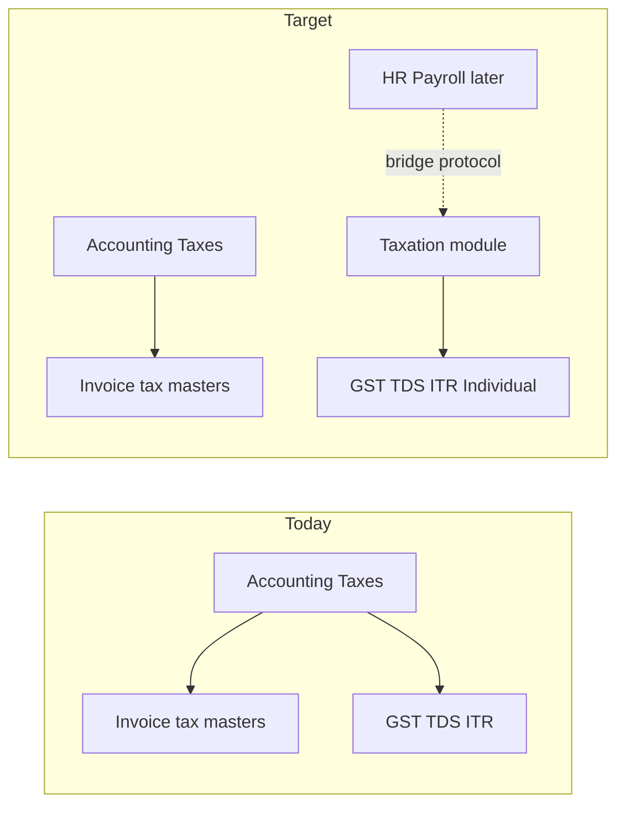

# Taxation Module + Individual ITR

**Decisions locked:**
- **1C** — Proprietor/Individual **slab tax** **and** salaried **ITR-1 / Form 16** (manual entry now; Payroll hooks for later auto-seed).
- **2** — Taxation module = **filing only**. Invoice tax templates / categories stay under Accounting.

## Current state

- Entity ITR only: Company→ITR-6, Proprietor→ITR-3, Firm/LLP→ITR-5; Proprietor uses a **flat 30%** proxy ([`income_tax_masters.py`](backend/app/services/income_tax_masters.py)).
- Tax math is flat `%` in [`compute_tax_pack`](backend/app/services/income_tax_computation.py).
- GST / TDS returns / Income Tax UIs live under **Accounting → Taxes** ([`workspaces.ts`](frontend/src/config/workspaces.ts)); backend already under [`api/v1/compliance/`](backend/app/api/v1/compliance/).



---

## Part 1 — Taxation module (filing only)

Mirror Manufacturing’s workspace + flag. **Do not rename** backend `compliance/` this pass (API URLs stay stable).

**Move into Taxation** (sidebar + workspace cards):

- GST Settings, GST Returns (GSTR-1/3B)
- TDS Returns (26Q / 16A)
- Income Tax Settings, Computation, Rate Table, Tax Adjustment Category

**Stay in Accounting → Taxes:**

- Tax Template, Item Tax Template, Tax Category, TDS/TCS Category

**Touch points:**

| Layer | Change |
|--------|--------|
| [`workspaces.ts`](frontend/src/config/workspaces.ts) | Add `TAXATION` config; strip filing links from Accounting Taxes |
| [`router/index.ts`](frontend/src/router/index.ts) | `/taxation` → `ModuleWorkspace` `moduleKey: "taxation"` |
| Lean API | `GET /taxation/workspace` (counts: draft ITR, GST settings present) so `ModuleWorkspace` does not 404 |
| [`LauncherView.vue`](frontend/src/views/dashboard/LauncherView.vue) / [`AppShell.vue`](frontend/src/layouts/AppShell.vue) | Tile + nav with `flag: "taxation"` |
| [`module_flags.py`](backend/app/services/module_flags.py) + Pydantic `ModuleFlags` + Pinia | `taxation: true` default + `setTaxation` |
| Thin settings | `/taxation-settings` toggle (same pattern as [`ManufacturingSettingsView.vue`](frontend/src/views/manufacturing/ManufacturingSettingsView.vue)) |
| [`SettingsView.vue`](frontend/src/views/core/SettingsView.vue) | Retarget “GST / India Compliance” → Taxation workspace |

E-invoice / e-way buttons stay on Sales Invoice (Accounts). No compliance router package rename.

---

## Part 2 — Individual ITR (both tracks)

### 2a — Entity types + form map

Extend [`ENTITY_TYPES`](backend/app/schemas/compliance.py):

`Company | Proprietor | Individual | Firm | LLP`

| entity_type | Tax engine | Default ITR pack |
|-------------|------------|------------------|
| Company | Flat rate table | ITR-6 |
| Firm / LLP | Flat rate table | ITR-5 |
| Proprietor | **Slabs** | ITR-3 (books → PGBP) |
| Individual | **Slabs** | **ITR-1** when `assessee_mode=IndividualHeads`; ITR-3 when `EntityBooks` |

Settings UI ([`IncomeTaxSettingsView.vue`](frontend/src/views/compliance/IncomeTaxSettingsView.vue)) gains `Individual`. Update rate-table descriptor Select options.

### 2b — Slab engine (Track A + shared)

- Migration: child table `income_tax_slab_lines` (`rate_table_id`, `idx`, `from_amount`, `to_amount` nullable = open band, `rate`).
- Flat `tax_rate` remains for Company/Firm/LLP.
- When slab lines exist, [`compute_tax_pack`](backend/app/services/income_tax_computation.py) applies progressive tax; surcharge/cess from parent row (lean: cess 4%; surcharge 0 until brackets).
- Seed AY `2024-25`…`2026-27` × Individual + Proprietor × Normal + New with lean statutory slab bands (note source year in remarks).
- Unit-test pure slab math (no DB).

### 2c — Individual computation + Form 16 (Track B)

Extend [`IncomeTaxComputation`](backend/app/models/compliance.py) (same or follow-on migration):

- `assessee_mode`: `EntityBooks` | `IndividualHeads` (default: Individual → IndividualHeads, else EntityBooks).
- Income heads: `salary_income`, `house_property_income`, `other_sources_income`, `capital_gains_income`, `chapter_via_deduction`, `standard_deduction`.
- Credits: keep `tds_credit` / `advance_tax_paid`; add `salary_tds` into credit total for IndividualHeads.
- Form 16 lean fields (manual now): `employer_name`, `employer_tan`, `employer_address`, `employee_name`, `employee_pan`, `gross_salary`, `exemptions_total`, `taxable_salary`, `tax_deducted`.
- **Payroll bridge columns** (nullable, unused until HR): see Part 3.

Taxable income (IndividualHeads) = sum(heads) − chapter_via − standard_deduction; then slabs + lean **87A** rebate (constant per regime/AY in service).

EntityBooks path unchanged except Proprietor (and Individual+books) use slabs.

**UI** ([`IncomeTaxView.vue`](frontend/src/views/compliance/IncomeTaxView.vue)): branch by `assessee_mode` — books/adjustments vs heads + Form 16 block. Show a short note when `seed_source=Manual`: “When Payroll is enabled, use Seed from Payroll.”

### 2d — Export

- [`entity_form_for`](backend/app/services/itr_export.py) / `build_itr_pack`: IndividualHeads → **ITR-1** JSON/CSV; EntityBooks Individual/Proprietor → ITR-3.
- Print format [`backend/print_formats/form_16.html`](backend/print_formats/form_16.html) + `GET /income-tax-computations/{id}/form-16.pdf` (WeasyPrint). Lean Part A/B handoff — not CPC XML.
- Existing `/itr` + e-file stub keep working.

**Out of scope this pass:** full portal ITR-1 schedules, ITR-2 detail, capital-gains schedules, real DSC, employer bulk Form 16 for all employees (needs Payroll).

---

## Part 3 — Payroll ↔ ITR bridge (build now, wire later)

Goal: when HR/Payroll lands, ITR/Form 16 can be **auto-seeded** without redesigning Taxation.

### 3a — Columns on `income_tax_computations` (ship in Part 2c migration)

| Column | Purpose |
|--------|---------|
| `seed_source` | `Manual` (default) \| `Payroll` \| `Books` |
| `employee_id` | UUID nullable FK — reserved for future `employees.id` (no FK constraint until Employee table exists; store UUID + comment) |
| `payroll_entry_id` | UUID nullable — reserved for future Payroll Entry |
| `salary_slip_ids` | JSONB array of UUIDs (empty `[]`) — slips that fed this worksheet |

Do **not** create Employee/Salary Slip tables now.

### 3b — Service protocol (new file)

Add [`backend/app/services/payroll_income_tax_bridge.py`](backend/app/services/payroll_income_tax_bridge.py) with a documented contract and stubs:

```python
# CONTRACT for HR/Payroll implementers (do not remove):
# 1. On Salary Slip submit: append Form16Slice to FY bucket for (company_id, employee_id, assessment_year).
# 2. On "Seed from Payroll" (or Payroll Entry close): call seed_individual_computation_from_payroll(...).
# 3. Map: gross → gross_salary/salary_income; exemptions → exemptions_total;
#    taxable → taxable_salary; TDS → tax_deducted/salary_tds; employer TAN/name from Company or Payroll Settings.
# 4. Set seed_source="Payroll", employee_id, payroll_entry_id, salary_slip_ids; leave draft for review.
# 5. Never overwrite a Submitted computation; cancel+recreate or refuse if docstatus=1.
```

Concrete API surface to implement now (callable, mostly raising `NotImplementedError` or no-op with clear docstring until Payroll exists):

- `Form16Slice` dataclass — fields matching Form 16 columns above.
- `async def seed_individual_computation_from_payroll(db, *, company_id, assessment_year, employee_id, slices, payroll_entry_id, user) -> IncomeTaxComputation` — creates/updates **draft** IndividualHeads computation from slices; sets bridge columns.
- `async def form16_slices_from_salary_slips(...)` — stub that Payroll will fill; returns `[]` today.
- Router: `POST /income-tax-computations/seed-from-payroll` with body `{ assessment_year, employee_id?, payroll_entry_id? }` — returns **501** or `ValidationError` with code `PAYROLL_NOT_ENABLED` until Payroll module exists; documents the contract in OpenAPI description.

### 3c — Docs / agent instructions (required deliverable)

Update [`docs/ITR_GAP_AND_PLAN.md`](docs/ITR_GAP_AND_PLAN.md) with a **“Payroll linkage”** section:

1. Employee Form 16 / 24Q was out of scope; now IndividualHeads + bridge columns exist.
2. When building HRMS Payroll, **must**:
   - Call `seed_individual_computation_from_payroll` (or fill `form16_slices_from_salary_slips`) on Payroll Entry close / explicit Seed action.
   - Prefer one computation per `(company, AY, employee)` for IndividualHeads; company-level EntityBooks stays one per `(company, AY)`.
   - Reuse slab engine — do not reimplement tax math in Payroll.
3. Add a short **IMPLEMENTATION CHECKLIST** bullet list in that doc (and a one-line pointer in [`PROJECT.md`](PROJECT.md) under HR & Payroll remaining work).

Optional: `docs/PAYROLL_ITR_BRIDGE.md` one-pager if the ITR doc gets too long — either is fine; prefer a subsection in ITR_GAP to avoid doc sprawl.

### 3d — Unique constraint note

Today: one active computation per `(company_id, assessment_year)`. IndividualHeads for **multiple employees** needs a migration tweak:

- Keep EntityBooks uniqueness as today (one per company × AY).
- For IndividualHeads: unique on `(company_id, assessment_year, employee_id)` where `assessee_mode = 'IndividualHeads'` and `docstatus <> 2` (partial unique indexes).
- Manual IndividualHeads without `employee_id`: allow one “unassigned” draft per company × AY (`employee_id IS NULL`).

---

## Implementation order

1. Taxation workspace + flag + lean workspace stats (UI-only, shippable alone).
2. Slab model + seed + `compute_tax_pack` + Proprietor/Individual rate rows.
3. Computation columns (heads + Form 16 + bridge) + unique indexes + schemas/API + UI branch.
4. `payroll_income_tax_bridge.py` + `seed-from-payroll` stub endpoint + docs checklist.
5. ITR-1 pack + Form 16 PDF.
6. Tests + PROJECT.md / ITR_GAP updates.

## Verify

- `cd backend && ruff check . && pytest tests/unit` (extend `test_income_tax_computation.py` + bridge stub tests).
- `cd frontend && npm run build`.
- Manual: Taxation in launcher; Accounting Taxes = invoice masters only; Individual → heads → ITR-1 + Form 16 PDF; Seed from Payroll returns clear “Payroll not enabled” error.
